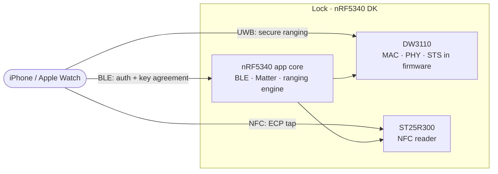

<h1 align="center">openaliro</h1>

<p align="center">
  <b>An Aliro digital key lock: an iPhone or Apple Watch unlocks it on approach
  (ultra-wideband ranging) or on tap (NFC).</b>
</p>

<p align="center">
  <a href="#quick-start">Quick start</a> ·
  <a href="#hardware">Hardware</a> ·
  <a href="#how-it-works">How it works</a> ·
  <a href="#status">Status</a> ·
  <a href="#documentation">Documentation</a> ·
  <a href="#license">License</a>
</p>

<p align="center">
  <a href="https://github.com/asxeem/openaliro/actions/workflows/host-tests.yml"></a>
  <a href="https://github.com/asxeem/openaliro/actions/workflows/sanitizers.yml"></a>
  <a href="https://github.com/asxeem/openaliro/actions/workflows/patch-drift.yml"></a>
  <a href="https://github.com/asxeem/openaliro/actions/workflows/tooling.yml"></a>
  <a href="https://github.com/asxeem/openaliro/actions/workflows/format.yml"></a>
</p>

<p align="center">
  
  
  
  
  
</p>

<p align="center">
  
</p>

<p align="center"><sub>Real unlock on hardware: iPhone on approach.</sub></p>

---

openaliro implements the lock side of an [Aliro](https://csa-iot.org/all-solutions/aliro/)
digital key. The phone authenticates over Bluetooth LE and measures its distance over
ultra-wideband: the door unlocks as the phone approaches and relocks as it leaves. A plain
NFC tap unlocks it as well. No app, no button.

## Features

- **Hands-free unlock**: unlocks on approach, relocks on departure.
- **Tap to unlock**: hold an iPhone or Apple Watch to the reader (Express Mode, no Face ID).
- **Credential-bound ranging**: the distance measurement is bound to the key, so a recorded
  signal cannot replay an unlock.
- **No UWB coprocessor**: the entire secure ranging stack runs in firmware on a bare
  Qorvo DW3110.

## Quick start

```bash
nrfutil sdk-manager toolchain install --ncs-version v3.3.0   # once per machine

make bootstrap     # fetch NCS v3.3.0 + the Nordic add-on (~6.5 GB) into ./workspace
make build         # → ./build/merged.hex
make flash-erase   # first flash of a net-core image
make flash         # every flash after that
```

Also available: `make test` (host test suite, no toolchain or hardware required),
`make coverage`, `make selftest` (boot self-test, no iPhone required), `make rebuild`,
`make term`, and `make clean`. Run `make` alone for the full grouped list. Options pass
as variables: `make build PRETTY=1 CHIP=dw3720` (also `PRISTINE=1`, `SELFTEST=1`).

## Hardware

| Part | Role |
|---|---|
| nRF5340 DK | Host SoC: BLE + Matter and the ranging engine |
| DWM3000EVB (DW3110) | UWB radio, on the Arduino header (SPIM4) |
| X-NUCLEO-NFC12A1 (ST25R300) | NFC reader front end for tap (SPIM2) |

Pin assignments live in
[`integration/overlays/dw3000-nfc.overlay`](integration/overlays/dw3000-nfc.overlay).

## How it works

The whole transaction rides on BLE; UWB carries no application data, only the distance
measurement. Both sides independently derive the ranging key from the authentication, so
ranging cannot be replayed from sniffed BLE traffic. The lock opens inside a configured
distance threshold and relocks past a hysteresis margin.



## Status

| Capability | State |
|---|---|
| NFC ECP tap unlock | Working |
| BLE auth + key agreement | Working |
| On-air ranging setup | Working |
| Secure UWB ranging (distance) | Working, validated on hardware |
| Distance-gated unlock / relock | Working |

The full image builds, links, and fits, and approach unlock has been driven end to end on
an nRF5340 DK with a live iPhone. Releases are gated on the manual
[hardware validation checklist](docs/hardware-validation.md). An experimental ESP32-S3
port of the UWB engine lives in [`ports/`](ports/).

## Documentation

- [`docs/README.md`](docs/README.md): generated code map of the repository, with
  per-module API references in [`docs/architecture/`](docs/architecture/).
- [`docs/ARCHITECTURE.md`](docs/ARCHITECTURE.md): how the pieces fit together.
- [`docs/protocol-notes.md`](docs/protocol-notes.md): firmware time-sync and
  credential-validity behavior observed on real hardware.
- [`docs/protocol-research.md`](docs/protocol-research.md): reverse-engineering report on
  the BLE + UWB proximity-unlock protocol.
- [`docs/troubleshooting.md`](docs/troubleshooting.md): common build, flash, unlock, and
  wiring issues.

Project practices: [`CONTRIBUTING.md`](CONTRIBUTING.md) ·
[`SECURITY.md`](SECURITY.md) · [`CHANGELOG.md`](CHANGELOG.md) ·
[`docs/RELEASING.md`](docs/RELEASING.md)

<details>
<summary><b>Under the hood</b> (why this is hard, and how it is built)</summary>

### The hard part

Most UWB projects rely on a turnkey ranging module that hides the radio behind a friendly
API. This one does not. It runs on a bare Qorvo DW3110 (a DWM3000EVB) with no UWB
coprocessor, so the entire secure ranging stack, the MAC, the PHY framing, and the STS
(scrambled timestamp sequence) are implemented in firmware on the nRF5340 app core,
directly over the [`deps/dw3000`](deps/dw3000) driver. Getting a phone to trust the
distance it measures means getting every byte of that right.

### Architecture

A layered stack; each layer is optional and depends only on the one below it:

- **`modules/woz_uwb/`**: the UWB engine (`src/`, split into
  `driver/ fira/ ccc/ aliro/ facade/ shell/`): the CCC key ladder, MAC, STS, and DS-TWR
  responder, driving `deps/dw3000` directly. The M1-M4 ranging-setup codec is in
  `src/aliro/`, and the Nordic add-on calls in through `facade/woz_uwb_facade.c`.
- **`modules/woz_aliro_ecp/`**: NFC ECP emitter for the Express Mode (no Face ID) tap.
- **`deps/dw3000/`**: Bruno Randolf's DW3000 decadriver (ISC).

The Nordic add-on owns BLE / Matter and hands the engine a plaintext ranging key; the
engine handles UWB from there. Integration onto the fetched add-on is layered and never
edited in place: patches in `integration/patches/`, configuration in
`integration/overlays/`, modules in `modules/` + `deps/`.

</details>

## Credits

- **Nordic Semiconductor** for the nRF Connect SDK and the door-lock add-on this firmware
  extends.
- **Bruno Randolf** for the ISC-licensed [`dw3000` decadriver](deps/dw3000) that drives
  the radio.
- [@kormax](https://github.com/kormax/) for ideas on ECP and UWB.
- [@rednblkx](https://github.com/rednblkx/) for ideas on HomeKey.
- [@scottjg](https://github.com/scottjg/) for help with UWB chipset ideas.

## License

The project's own code (`modules/woz_uwb/`, `modules/woz_aliro_ecp/` except as noted
below, build scripts, docs) is ISC; see [`LICENSE`](LICENSE). The tree as a whole is
mixed-license, not uniformly ISC:

- [`deps/dw3000/`](deps/dw3000) is the Qorvo/Decawave driver under `LicenseRef-QORVO-2`
  (usable only with a Qorvo IC, no reverse engineering).
- `modules/woz_aliro_ecp/src/nfc_prop_ecp.cpp` is `LicenseRef-Nordic-5-Clause`
  (Nordic Semiconductor).

The per-file `SPDX-License-Identifier` headers are the source of truth. Because of those
vendor terms, the repository as a whole is source-available, not open source in the OSI
sense.

---

<p align="center"><sub>
Independent personal project. Not affiliated with or endorsed by any vendor or standards
body.<br/>
Provided as is, without warranty. Do not rely on it to secure anything of value.
</sub></p>
