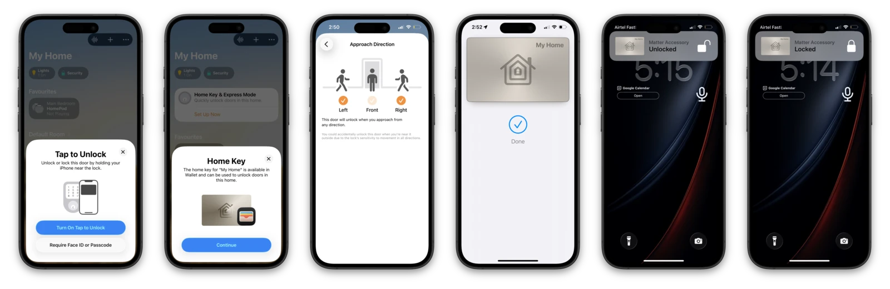
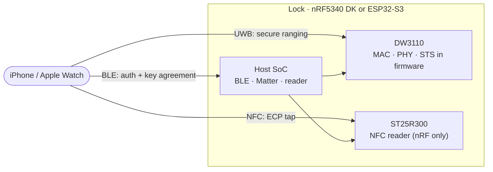

<h1 align="center">openaliro</h1>

<p align="center">
  <b>An Aliro digital key lock: an iPhone or Apple Watch unlocks it on approach
  (ultra-wideband ranging) or on tap (NFC).</b>
</p>

<p align="center">
  <a href="#targets">Targets</a> ·
  <a href="#quick-start">Quick start</a> ·
  <a href="#hardware">Hardware</a> ·
  <a href="#how-it-works">How it works</a> ·
  <a href="#status">Status</a> ·
  <a href="#documentation">Documentation</a> ·
  <a href="#license">License</a>
</p>

<p align="center">
  <a href="https://github.com/asxeem/openaliro/actions/workflows/host-tests.yml"></a>
  <a href="https://github.com/asxeem/openaliro/actions/workflows/sanitizers.yml"></a>
  <a href="https://github.com/asxeem/openaliro/actions/workflows/patch-drift.yml"></a>
  <a href="https://github.com/asxeem/openaliro/actions/workflows/tooling.yml"></a>
  <a href="https://github.com/asxeem/openaliro/actions/workflows/format.yml"></a>
</p>

<p align="center">
  
  
  
  
  
</p>

<p align="center">
  
</p>

<p align="center"><sub>Real unlock on hardware: iPhone on approach.</sub></p>

---

openaliro implements the lock side of an [Aliro](https://csa-iot.org/all-solutions/aliro/)
digital key. The phone authenticates over Bluetooth LE and measures its distance over
ultra-wideband: the door unlocks as the phone approaches and relocks as it leaves. A plain
NFC tap unlocks it as well. No app, no button.

## Features

- **Hands-free unlock**: unlocks on approach, relocks on departure.
- **Tap to unlock**: hold an iPhone or Apple Watch to the reader (Express Mode, no Face ID).
- **Credential-bound ranging**: the distance measurement is bound to the key, so a recorded
  signal cannot replay an unlock.
- **No UWB coprocessor**: the entire secure ranging stack runs in firmware on a bare
  Qorvo DW3110.
- **Two SoCs**: the same ranging engine runs on Nordic and on Espressif silicon.

<p align="center">
  
</p>
<p align="center"><sub>Key setup · Approach Direction · provisioning · lock and unlock states, all against live hardware</sub></p>


## Targets

Both targets unlock on approach against a live iPhone, and both have been validated on
hardware. They share the UWB engine in `modules/woz_uwb` byte-for-byte.

| Target | What it is | Where |
|---|---|---|
| **nRF5340 DK** | The primary build. Approach unlock plus the NFC tap path, on top of the Nordic door-lock add-on. | [`ports/nrf5340dk/`](ports/nrf5340dk/) (built from the repo root: `make build`) |
| **ESP32-S3** | A Matter door lock built from a reader stack written from scratch: BLE transport, credential authentication, and ranging-key derivation. Approach unlock only, no NFC tap. | [`ports/esp32/`](ports/esp32/) |

The ESP32 port is not a recompile. The reference design delegates credential
authentication and ranging-key derivation to a closed vendor library that ships only as
an ARM binary, so nothing links it on Xtensa. That whole layer is reimplemented here.

## Quick start

**nRF5340 DK:**

```bash
nrfutil sdk-manager toolchain install --ncs-version v3.3.0   # once per machine

make bootstrap     # fetch NCS v3.3.0 + the Nordic add-on (~6.5 GB) into ./workspace
make build         # → ./build/merged.hex
make flash-erase   # first flash of a net-core image
make flash         # every flash after that
```

Also available: `make test` (host test suite, no toolchain or hardware required),
`make coverage`, `make selftest` (boot self-test, no iPhone required), `make rebuild`,
`make term`, and `make clean`. Run `make` alone for the full grouped list. Options pass
as variables: `make build PRETTY=1 CHIP=dw3720` (also `PRISTINE=1`, `SELFTEST=1`).

`HA=1` builds an optional Home Assistant variant that surfaces lock operations and
UWB proximity over Matter. It has to be set on both steps
(`make bootstrap HA=1 && make build HA=1`) and is not hardware-validated; default
builds are unaffected. See
[`integration/homeassistant/`](integration/homeassistant/README.md), which also
documents a console-to-MQTT bridge that needs no firmware change at all.

**ESP32-S3** (needs ESP-IDF and esp-matter on the machine):

```bash
cd ports/esp32/apps/matter-lock
make set-target    # once per checkout
make go            # build + flash + monitor
```

**No hardware** (laptop only — run the whole host-side gate):

```bash
make test          # 574-assertion KAT suite, plain cc, sub-second
make test-port     # ESP32 port suite (crypto KATs, codec, provisioning)
make verify        # everything: test + sanitizers + fuzz + CBMC
```

See [`ports/README.md`](ports/README.md) for the port index, and
[`docs/esp32-bringup.md`](docs/esp32-bringup.md) to wire the radio up.

## Repository map

```
Makefile           every entry point (build, flash, test, docs); run `make` for the list
scripts/           the machinery behind it (bootstrap, build, docs, workspace seeding)
modules/
  woz_port/        THE PORTING SEAM: woz_port.h + woz_log.h, the whole platform contract
  woz_uwb/         UWB engine: driver, FiRa MAC, CCC STS, M1-M4 codec (shared, all targets)
  woz_aliro/       Aliro credential auth: key schedule, secure channels, wire codec, reader
  woz_aliro_ecp/   NFC ECP emitter for Express Mode tap (Nordic-licensed)
ports/
  nrf5340dk/       primary target: patches + overlays laid over the fetched Nordic add-on
  esp32/           ESP32-S3: shared components + two apps (matter-lock, bench reader) + tests
deps/dw3000/       vendored Qorvo/Decawave DW3000 driver, compiled unchanged by every target
integration/       Home Assistant MQTT bridge (no firmware change needed)
tests/             host KAT suite, sanitizers, fuzzing, CBMC proofs, tooling tests
docs/              guides (protocol research, bring-up, porting) + generated reference
```

## Hardware

**nRF5340 DK:**

| Part | Role |
|---|---|
| nRF5340 DK | Host SoC: BLE + Matter and the ranging engine |
| DWM3000EVB (DW3110) | UWB radio, on the Arduino header (SPIM4) |
| X-NUCLEO-NFC12A1 (ST25R300) | NFC reader front end for tap (SPIM2) |

Pin assignments live in
[`ports/nrf5340dk/overlays/dw3000-nfc.overlay`](ports/nrf5340dk/overlays/dw3000-nfc.overlay).

**ESP32-S3:**

| Part | Role |
|---|---|
| ESP32-S3 dev board | Host SoC: BLE + Matter over Wi-Fi and the ranging engine |
| DWM3000EVB (DW3110) | UWB radio on SPI2, eleven jumpers |

Pin assignments live in
[`ports/esp32/components/woz_uwb/port/board_pins.h`](ports/esp32/components/woz_uwb/port/board_pins.h);
the wiring table is in [`docs/esp32-bringup.md`](docs/esp32-bringup.md).

## How it works

The whole transaction rides on BLE; UWB carries no application data, only the distance
measurement. Both sides independently derive the ranging key from the authentication, so
ranging cannot be replayed from sniffed BLE traffic. The lock opens inside a configured
distance threshold and relocks past a hysteresis margin.



## Status

| Capability | nRF5340 DK | ESP32-S3 |
|---|---|---|
| Matter commissioning + key provisioned to Wallet | Working | Working |
| BLE auth + ranging-key agreement | Working (via the add-on's vendor library) | Working (reimplemented) |
| On-air ranging setup (M1-M4) | Working | Working |
| Secure UWB ranging (distance) | Working | Working |
| Distance-gated unlock / relock | Working | Working |
| NFC ECP tap unlock | Working | Not implemented |

Both targets have been driven end to end against a live iPhone: the Wallet unlock
animation plays on approach and the bolt relocks on departure. Releases are gated on the
manual [hardware validation checklist](docs/hardware-validation.md).

## Documentation

- [`docs/protocol-research.md`](docs/protocol-research.md): reverse-engineering report on
  the BLE + UWB proximity-unlock protocol.
- [`docs/protocol-notes.md`](docs/protocol-notes.md): firmware time-sync and
  credential-validity behavior observed on real hardware.
- [`docs/troubleshooting.md`](docs/troubleshooting.md): common build, flash, unlock, and
  wiring issues, both targets.
- [`ports/README.md`](ports/README.md): the ESP32-S3 port, and
  [`docs/esp32-gotchas.md`](docs/esp32-gotchas.md), a long log of every
  non-obvious trap that bring-up hit, with symptom and fix. It is the most useful thing
  here if you are building your own reader.
- [`docs/porting-esp32.md`](docs/porting-esp32.md): how the port was planned and how it
  actually went.
- [`docs/README.md`](docs/README.md): generated code map of the repository, with
  per-module API references in [`docs/architecture/`](docs/architecture/), and
  [`docs/ARCHITECTURE.md`](docs/ARCHITECTURE.md) for how the pieces fit together.

Project practices: [`CONTRIBUTING.md`](CONTRIBUTING.md) ·
[`SECURITY.md`](SECURITY.md) · [`CHANGELOG.md`](CHANGELOG.md) ·
[`docs/RELEASING.md`](docs/RELEASING.md)

<details>
<summary><b>Under the hood</b> (why this is hard, and how it is built)</summary>

### The hard part

Most UWB projects rely on a turnkey ranging module that hides the radio behind a friendly
API. This one does not. It runs on a bare Qorvo DW3110 (a DWM3000EVB) with no UWB
coprocessor, so the entire secure ranging stack, the MAC, the PHY framing, and the STS
(scrambled timestamp sequence) are implemented in firmware on the host SoC, directly over
the [`deps/dw3000`](deps/dw3000) driver. Getting a phone to trust the distance it
measures means getting every byte of that right.

On ESP32 there is a second hard part. The reference design hands credential
authentication and ranging-key derivation to a closed vendor library, so on Xtensa that
layer had to be reimplemented: the key schedule, the two secure channels, the wire codec,
and the reader identity. And the DS-TWR responder has to arm each frame inside a 2 ms
slot on a target with slower SPI and jitterier callback dispatch than the nRF, which is
its own separate fight.

### Architecture

A layered stack; each layer is optional and depends only on the one below it:

- **`modules/woz_port/`**: the platform contract — `woz_port.h` (eight functions + a
  mutex) and `woz_log.h`. Every other layer is written against these two headers, which
  is what makes the engine portable; see [`docs/porting.md`](docs/porting.md).
- **`modules/woz_uwb/`**: the UWB engine (`src/`, split into
  `driver/ fira/ ccc/ aliro/ facade/ shell/`): the CCC key ladder, MAC, STS, and DS-TWR
  responder, driving `deps/dw3000` directly. The M1-M4 ranging-setup codec is in
  `src/aliro/`, and callers come in through `facade/woz_uwb_facade.c`.
- **`modules/woz_aliro/`**: the Aliro credential-auth reader — key schedule, secure
  channels, wire codec, provisioning — shared source between the targets.
- **`modules/woz_aliro_ecp/`**: NFC ECP emitter for the Express Mode (no Face ID) tap.
- **`deps/dw3000/`**: Bruno Randolf's DW3000 decadriver (ISC).
- **`ports/`**: one directory per target. `nrf5340dk/` is patches + overlays over the
  Nordic add-on; `esp32/` compiles the modules above unchanged, adds an ESP-IDF DW3000
  backend, and supplies its own reader stack in place of the Nordic add-on.

On nRF the Nordic add-on owns BLE and Matter and hands the engine a plaintext ranging
key; on ESP32 the port's own reader derives that key and hands it over at the same seam.
Integration onto the fetched add-on is layered and never edited in place: patches in
`ports/nrf5340dk/patches/`, configuration in `ports/nrf5340dk/overlays/`, modules in `modules/` +
`deps/`.

</details>

## Credits

- **Nordic Semiconductor** for the nRF Connect SDK and the door-lock add-on this firmware
  extends.
- **Espressif** for ESP-IDF and esp-matter, which the ESP32-S3 port is built on.
- **Bruno Randolf** for the ISC-licensed [`dw3000` decadriver](deps/dw3000) that drives
  the radio.
- [@kormax](https://github.com/kormax/) for ideas on ECP and UWB.
- [@rednblkx](https://github.com/rednblkx/) for ideas on HomeKey.
- [@scottjg](https://github.com/scottjg/) for help with UWB chipset ideas.

## License

The project's own code (`modules/woz_uwb/`, `ports/`, `modules/woz_aliro_ecp/` except as
noted below, build scripts, docs) is ISC; see [`LICENSE`](LICENSE). The tree as a whole
is mixed-license, not uniformly ISC:

- [`deps/dw3000/`](deps/dw3000) is the Qorvo/Decawave driver under `LicenseRef-QORVO-2`
  (usable only with a Qorvo IC, no reverse engineering).
- `modules/woz_aliro_ecp/src/nfc_prop_ecp.cpp` is `LicenseRef-Nordic-5-Clause`
  (Nordic Semiconductor).

The per-file `SPDX-License-Identifier` headers are the source of truth. Because of those
vendor terms, the repository as a whole is source-available, not open source in the OSI
sense.

---

<p align="center"><sub>
Independent personal project. Not affiliated with or endorsed by any vendor or standards
body.<br/>
Provided as is, without warranty. Do not rely on it to secure anything of value.
</sub></p>
