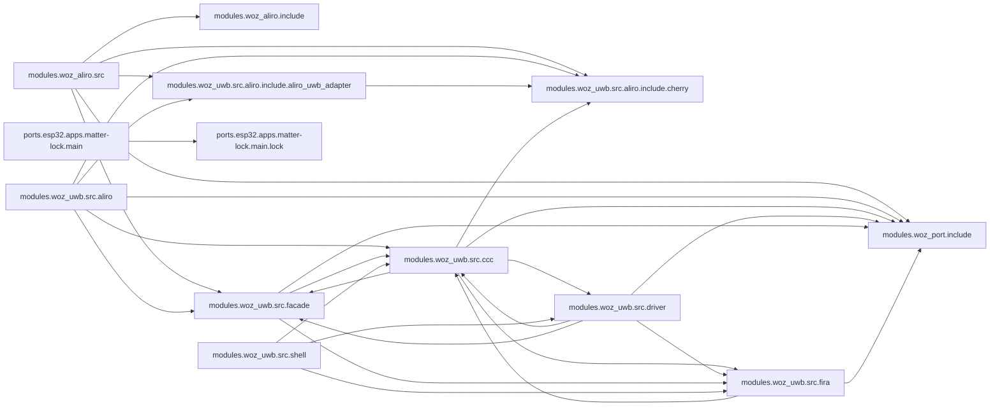

<!-- generated documentation — edit the source, not this file -->
# openaliro — architecture

Every subsystem on one page, in reading order: entry points (nothing imports them) first, then the machinery they drive. Each section is the subsystem's own prose, what it exposes, and how the pieces depend on each other; headings link to the full per-module reference under [`architecture/`](architecture/).

## `modules/woz_uwb/src/aliro/`

### [`modules/woz_uwb/src/aliro/aliro_uwb_msg.c`](architecture/modules.woz_uwb.src.aliro/aliro_uwb_msg.c.md)

@file aliro_uwb_msg.c — setup/notification message codec.

**depends on** [`modules/woz_port/include/woz_log.h`](architecture/modules.woz_port.include/woz_log.h.md), [`modules/woz_uwb/src/aliro/aliro_uwb_msg.h`](architecture/modules.woz_uwb.src.aliro/aliro_uwb_msg.h.md), [`modules/woz_uwb/src/aliro/aliro_uwb_msg_builder.h`](architecture/modules.woz_uwb.src.aliro/aliro_uwb_msg_builder.h.md), [`modules/woz_uwb/src/aliro/aliro_uwb_msg_parser.h`](architecture/modules.woz_uwb.src.aliro/aliro_uwb_msg_parser.h.md), [`modules/woz_uwb/src/aliro/aliro_uwb_msg_spec.h`](architecture/modules.woz_uwb.src.aliro/aliro_uwb_msg_spec.h.md), [`modules/woz_uwb/src/aliro/include/aliro_uwb_adapter/aliro_uwb_adapter.h`](architecture/modules.woz_uwb.src.aliro.include.aliro_uwb_adapter/aliro_uwb_adapter.h.md), [`modules/woz_uwb/src/ccc/aliro_round_config.h`](architecture/modules.woz_uwb.src.ccc/aliro_round_config.h.md), [`modules/woz_uwb/src/facade/woz_alloc.h`](architecture/modules.woz_uwb.src.facade/woz_alloc.h.md), [`modules/woz_uwb/src/facade/woz_util.h`](architecture/modules.woz_uwb.src.facade/woz_util.h.md)

### [`modules/woz_uwb/src/aliro/aliro_uwb_session.c`](architecture/modules.woz_uwb.src.aliro/aliro_uwb_session.c.md)

@file aliro_uwb_session.c — per-session lifecycle and state machine.

**depends on** [`modules/woz_port/include/woz_log.h`](architecture/modules.woz_port.include/woz_log.h.md), [`modules/woz_uwb/src/aliro/aliro_uwb_internal.h`](architecture/modules.woz_uwb.src.aliro/aliro_uwb_internal.h.md), [`modules/woz_uwb/src/aliro/aliro_uwb_msg.h`](architecture/modules.woz_uwb.src.aliro/aliro_uwb_msg.h.md), [`modules/woz_uwb/src/aliro/aliro_uwb_msg_spec.h`](architecture/modules.woz_uwb.src.aliro/aliro_uwb_msg_spec.h.md), [`modules/woz_uwb/src/aliro/include/aliro_uwb_adapter/aliro_uwb_session.h`](architecture/modules.woz_uwb.src.aliro.include.aliro_uwb_adapter/aliro_uwb_session.h.md), [`modules/woz_uwb/src/aliro/include/cherry/cherry_ccc.h`](architecture/modules.woz_uwb.src.aliro.include.cherry/cherry_ccc.h.md), [`modules/woz_uwb/src/facade/woz_alloc.h`](architecture/modules.woz_uwb.src.facade/woz_alloc.h.md)

### [`modules/woz_uwb/src/aliro/aliro_uwb_adapter.c`](architecture/modules.woz_uwb.src.aliro/aliro_uwb_adapter.c.md)

@file aliro_uwb_adapter.c — reader-context lifecycle.

**depends on** [`modules/woz_port/include/woz_log.h`](architecture/modules.woz_port.include/woz_log.h.md), [`modules/woz_uwb/src/aliro/aliro_uwb_internal.h`](architecture/modules.woz_uwb.src.aliro/aliro_uwb_internal.h.md), [`modules/woz_uwb/src/aliro/include/aliro_uwb_adapter/aliro_uwb_adapter.h`](architecture/modules.woz_uwb.src.aliro.include.aliro_uwb_adapter/aliro_uwb_adapter.h.md), [`modules/woz_uwb/src/aliro/include/cherry/cherry_ccc.h`](architecture/modules.woz_uwb.src.aliro.include.cherry/cherry_ccc.h.md), [`modules/woz_uwb/src/facade/woz_alloc.h`](architecture/modules.woz_uwb.src.facade/woz_alloc.h.md)

### [`modules/woz_uwb/src/aliro/aliro_uwb_msg_builder.c`](architecture/modules.woz_uwb.src.aliro/aliro_uwb_msg_builder.c.md)

@file aliro_uwb_msg_builder.c — big-endian TLV message builder.

**depends on** [`modules/woz_uwb/src/aliro/aliro_uwb_msg_builder.h`](architecture/modules.woz_uwb.src.aliro/aliro_uwb_msg_builder.h.md), [`modules/woz_uwb/src/facade/woz_alloc.h`](architecture/modules.woz_uwb.src.facade/woz_alloc.h.md)

### [`modules/woz_uwb/src/aliro/aliro_uwb_msg_parser.c`](architecture/modules.woz_uwb.src.aliro/aliro_uwb_msg_parser.c.md)

@file aliro_uwb_msg_parser.c — TLV attribute parser and big-endian reads.

**depends on** [`modules/woz_port/include/woz_log.h`](architecture/modules.woz_port.include/woz_log.h.md), [`modules/woz_uwb/src/aliro/aliro_uwb_msg_parser.h`](architecture/modules.woz_uwb.src.aliro/aliro_uwb_msg_parser.h.md)

### [`modules/woz_uwb/src/aliro/aliro_uwb_msg.h`](architecture/modules.woz_uwb.src.aliro/aliro_uwb_msg.h.md)

@file aliro_uwb_msg.h — message framing accessors, dispatch and builders.

**depends on** [`modules/woz_uwb/src/aliro/aliro_uwb_internal.h`](architecture/modules.woz_uwb.src.aliro/aliro_uwb_internal.h.md), [`modules/woz_uwb/src/aliro/include/aliro_uwb_adapter/aliro_uwb_session.h`](architecture/modules.woz_uwb.src.aliro.include.aliro_uwb_adapter/aliro_uwb_session.h.md)  ·  **used by** [`modules/woz_uwb/src/aliro/aliro_uwb_msg.c`](architecture/modules.woz_uwb.src.aliro/aliro_uwb_msg.c.md), [`modules/woz_uwb/src/aliro/aliro_uwb_session.c`](architecture/modules.woz_uwb.src.aliro/aliro_uwb_session.c.md)

### [`modules/woz_uwb/src/aliro/aliro_uwb_msg_builder.h`](architecture/modules.woz_uwb.src.aliro/aliro_uwb_msg_builder.h.md)

@file aliro_uwb_msg_builder.h — big-endian TLV message builder.

**depends on** [`modules/woz_uwb/src/aliro/aliro_uwb_msg_spec.h`](architecture/modules.woz_uwb.src.aliro/aliro_uwb_msg_spec.h.md), [`modules/woz_uwb/src/aliro/include/aliro_uwb_adapter/aliro_uwb_session.h`](architecture/modules.woz_uwb.src.aliro.include.aliro_uwb_adapter/aliro_uwb_session.h.md)  ·  **used by** [`modules/woz_uwb/src/aliro/aliro_uwb_msg.c`](architecture/modules.woz_uwb.src.aliro/aliro_uwb_msg.c.md), [`modules/woz_uwb/src/aliro/aliro_uwb_msg_builder.c`](architecture/modules.woz_uwb.src.aliro/aliro_uwb_msg_builder.c.md)

### [`modules/woz_uwb/src/aliro/aliro_uwb_msg_parser.h`](architecture/modules.woz_uwb.src.aliro/aliro_uwb_msg_parser.h.md)

@file aliro_uwb_msg_parser.h — TLV attribute iteration and big-endian reads.

**depends on** [`modules/woz_uwb/src/aliro/aliro_uwb_msg_spec.h`](architecture/modules.woz_uwb.src.aliro/aliro_uwb_msg_spec.h.md), [`modules/woz_uwb/src/aliro/include/aliro_uwb_adapter/aliro_uwb_session.h`](architecture/modules.woz_uwb.src.aliro.include.aliro_uwb_adapter/aliro_uwb_session.h.md)  ·  **used by** [`modules/woz_uwb/src/aliro/aliro_uwb_msg.c`](architecture/modules.woz_uwb.src.aliro/aliro_uwb_msg.c.md), [`modules/woz_uwb/src/aliro/aliro_uwb_msg_parser.c`](architecture/modules.woz_uwb.src.aliro/aliro_uwb_msg_parser.c.md)

### [`modules/woz_uwb/src/aliro/aliro_uwb_msg_spec.h`](architecture/modules.woz_uwb.src.aliro/aliro_uwb_msg_spec.h.md)

@file aliro_uwb_msg_spec.h — UWB ranging-service framing constants.

**used by** [`modules/woz_uwb/src/aliro/aliro_uwb_msg.c`](architecture/modules.woz_uwb.src.aliro/aliro_uwb_msg.c.md), [`modules/woz_uwb/src/aliro/aliro_uwb_msg_builder.h`](architecture/modules.woz_uwb.src.aliro/aliro_uwb_msg_builder.h.md), [`modules/woz_uwb/src/aliro/aliro_uwb_msg_parser.h`](architecture/modules.woz_uwb.src.aliro/aliro_uwb_msg_parser.h.md), [`modules/woz_uwb/src/aliro/aliro_uwb_session.c`](architecture/modules.woz_uwb.src.aliro/aliro_uwb_session.c.md)

### [`modules/woz_uwb/src/aliro/aliro_uwb_internal.h`](architecture/modules.woz_uwb.src.aliro/aliro_uwb_internal.h.md)

@file aliro_uwb_internal.h — private context types and shared helpers.

**depends on** [`modules/woz_uwb/src/aliro/include/aliro_uwb_adapter/aliro_uwb_adapter.h`](architecture/modules.woz_uwb.src.aliro.include.aliro_uwb_adapter/aliro_uwb_adapter.h.md), [`modules/woz_uwb/src/aliro/include/aliro_uwb_adapter/aliro_uwb_session.h`](architecture/modules.woz_uwb.src.aliro.include.aliro_uwb_adapter/aliro_uwb_session.h.md), [`modules/woz_uwb/src/aliro/include/cherry/cherry.h`](architecture/modules.woz_uwb.src.aliro.include.cherry/cherry.h.md), [`modules/woz_uwb/src/aliro/include/cherry/cherry_ccc.h`](architecture/modules.woz_uwb.src.aliro.include.cherry/cherry_ccc.h.md)  ·  **used by** [`modules/woz_uwb/src/aliro/aliro_uwb_adapter.c`](architecture/modules.woz_uwb.src.aliro/aliro_uwb_adapter.c.md), [`modules/woz_uwb/src/aliro/aliro_uwb_msg.h`](architecture/modules.woz_uwb.src.aliro/aliro_uwb_msg.h.md), [`modules/woz_uwb/src/aliro/aliro_uwb_session.c`](architecture/modules.woz_uwb.src.aliro/aliro_uwb_session.c.md)

## `modules/woz_aliro/src/`

### [`modules/woz_aliro/src/aliro_ranging.c`](architecture/modules.woz_aliro.src/aliro_ranging.c.md)

UWB ranging bring-up and lifecycle for the Aliro reader: initializes the reader's UWB
adapter and Cherry CCC context once, then arms, feeds, and tears down per-connection ranging
sessions driven by the M1-M4 setup exchanged over the peer's L2CAP channel.
Maintains process-wide singletons for the Cherry context and adapter (set up once via
aliro_ranging_init) and for the single active ranging session (the DW3000 supports only one
session at a time), tracking its owning secure channel for send/receive framing.

**depends on** [`modules/woz_aliro/include/aliro_ble.h`](architecture/modules.woz_aliro.include/aliro_ble.h.md), [`modules/woz_aliro/include/aliro_crypto.h`](architecture/modules.woz_aliro.include/aliro_crypto.h.md), [`modules/woz_aliro/include/aliro_lat.h`](architecture/modules.woz_aliro.include/aliro_lat.h.md), [`modules/woz_aliro/src/aliro_ranging.h`](architecture/modules.woz_aliro.src/aliro_ranging.h.md), [`modules/woz_port/include/woz_log.h`](architecture/modules.woz_port.include/woz_log.h.md), [`modules/woz_uwb/src/aliro/include/aliro_uwb_adapter/aliro_uwb_adapter.h`](architecture/modules.woz_uwb.src.aliro.include.aliro_uwb_adapter/aliro_uwb_adapter.h.md), [`modules/woz_uwb/src/aliro/include/aliro_uwb_adapter/aliro_uwb_session.h`](architecture/modules.woz_uwb.src.aliro.include.aliro_uwb_adapter/aliro_uwb_session.h.md), [`modules/woz_uwb/src/aliro/include/cherry/cherry.h`](architecture/modules.woz_uwb.src.aliro.include.cherry/cherry.h.md), [`modules/woz_uwb/src/aliro/include/cherry/cherry_ccc.h`](architecture/modules.woz_uwb.src.aliro.include.cherry/cherry_ccc.h.md), [`modules/woz_uwb/src/facade/woz_uwb_facade.h`](architecture/modules.woz_uwb.src.facade/woz_uwb_facade.h.md)

### [`modules/woz_aliro/src/aliro_reader.c`](architecture/modules.woz_aliro.src/aliro_reader.c.md)

Aliro reader engine: drives the Access Protocol (AUTH0/AUTH1/EXCHANGE) handshake over BLE,
manages reader identity and credential trust provisioning in NVS, and arms UWB ranging once
a session is authenticated. Maintains a fixed-size table of per-connection sessions tracking
transaction phase and secure-channel state, and exposes start/attach entry points for both
standalone and Matter-attached BLE transports, plus provisioning and diagnostic APIs used by
Matter commissioning and the bench console.

**depends on** [`modules/woz_aliro/include/aliro_ble.h`](architecture/modules.woz_aliro.include/aliro_ble.h.md), [`modules/woz_aliro/include/aliro_crypto.h`](architecture/modules.woz_aliro.include/aliro_crypto.h.md), [`modules/woz_aliro/include/aliro_lat.h`](architecture/modules.woz_aliro.include/aliro_lat.h.md), [`modules/woz_aliro/include/aliro_prim.h`](architecture/modules.woz_aliro.include/aliro_prim.h.md), [`modules/woz_aliro/include/aliro_prov.h`](architecture/modules.woz_aliro.include/aliro_prov.h.md), [`modules/woz_aliro/include/aliro_reader.h`](architecture/modules.woz_aliro.include/aliro_reader.h.md), [`modules/woz_aliro/src/aliro_apdu.h`](architecture/modules.woz_aliro.src/aliro_apdu.h.md), [`modules/woz_aliro/src/aliro_ranging.h`](architecture/modules.woz_aliro.src/aliro_ranging.h.md), [`modules/woz_port/include/woz_log.h`](architecture/modules.woz_port.include/woz_log.h.md), [`modules/woz_port/include/woz_port.h`](architecture/modules.woz_port.include/woz_port.h.md)

### [`modules/woz_aliro/src/aliro_crypto.c`](architecture/modules.woz_aliro.src/aliro_crypto.c.md)

Aliro cryptographic primitives: key derivation (KDF/HKDF), key-block splitting, AES-GCM secure
channels, and wire message framing built on a pluggable crypto backend (aliro_prim_*).
Implements the Aliro key-derivation chain (ECDH shared secret -> z -> 160-byte key block -> split
session keys / URSK / BLE ranging keys), per-direction AES-256-GCM secure channels with monotonic
message counters, and the seal/open framing used to carry engine plaintext over the wire.

**depends on** [`modules/woz_aliro/include/aliro_crypto.h`](architecture/modules.woz_aliro.include/aliro_crypto.h.md), [`modules/woz_aliro/include/aliro_prim.h`](architecture/modules.woz_aliro.include/aliro_prim.h.md), [`modules/woz_aliro/src/aliro_hash.h`](architecture/modules.woz_aliro.src/aliro_hash.h.md)

### [`modules/woz_aliro/src/aliro_lat.c`](architecture/modules.woz_aliro.src/aliro_lat.c.md)

Walk-up latency trace: first-hit phase timestamps + the consolidated budget line.

**depends on** [`modules/woz_aliro/include/aliro_lat.h`](architecture/modules.woz_aliro.include/aliro_lat.h.md), [`modules/woz_port/include/woz_log.h`](architecture/modules.woz_port.include/woz_log.h.md), [`modules/woz_port/include/woz_port.h`](architecture/modules.woz_port.include/woz_port.h.md)

### [`modules/woz_aliro/src/aliro_apdu.c`](architecture/modules.woz_aliro.src/aliro_apdu.c.md)

Aliro APDU TLV codec: builds command payloads (AUTH0, AUTH1, AuthData, EXCHANGE) and parses
response APDUs, plus BLE envelope framing/unframing and ISO7816 APDU wrap/status-word stripping.
Provides a minimal BER-TLV writer (aliro_tlv_w_init/put/finish) used to assemble command
payloads, and TLV/APDU parsing helpers used to extract fields from device responses.

**depends on** [`modules/woz_aliro/src/aliro_apdu.h`](architecture/modules.woz_aliro.src/aliro_apdu.h.md)

### [`modules/woz_aliro/src/aliro_hash.c`](architecture/modules.woz_aliro.src/aliro_hash.c.md)

Self-contained SHA-256, HMAC-SHA256, HKDF, and ANSI-X9.63 KDF implementation for the ESP32-IDF
Aliro crypto port, with no external crypto library dependency.

**depends on** [`modules/woz_aliro/src/aliro_hash.h`](architecture/modules.woz_aliro.src/aliro_hash.h.md)

### [`modules/woz_aliro/src/aliro_prim_psa.c`](architecture/modules.woz_aliro.src/aliro_prim_psa.c.md)

Aliro crypto primitive backend implemented on Arm PSA Crypto: random generation, AES-256-GCM
encrypt/decrypt, and NIST P-256 key generation, ECDH, and ECDSA sign/verify.
Provides the aliro_prim_* / aliro_* primitive functions consumed by the higher-level Aliro KDF
and secure-channel code in aliro_crypto.c; callers must call aliro_prim_init before using any
other function in this file.

**depends on** [`modules/woz_aliro/include/aliro_prim.h`](architecture/modules.woz_aliro.include/aliro_prim.h.md)

### [`modules/woz_aliro/src/aliro_prov.c`](architecture/modules.woz_aliro.src/aliro_prov.c.md)

Aliro reader provisioning state: default dev identity, and serialization/deserialization of the
reader identity plus trusted-credential store to/from a self-describing binary blob.
Also implements the trust-store membership check and add-with-dedup operations used to decide
whether a presented credential public key is trusted.

**depends on** [`modules/woz_aliro/include/aliro_prov.h`](architecture/modules.woz_aliro.include/aliro_prov.h.md)

### [`modules/woz_aliro/src/aliro_ranging.h`](architecture/modules.woz_aliro.src/aliro_ranging.h.md)

Aliro M1-M4 ranging-setup interface: negotiates UWB ranging parameters with the device and
produces the BLE ranging-control secure channel used to carry the M1-M4 exchange.

**used by** [`modules/woz_aliro/src/aliro_ranging.c`](architecture/modules.woz_aliro.src/aliro_ranging.c.md), [`modules/woz_aliro/src/aliro_reader.c`](architecture/modules.woz_aliro.src/aliro_reader.c.md)

### [`modules/woz_aliro/src/aliro_apdu.h`](architecture/modules.woz_aliro.src/aliro_apdu.h.md)

APDU framing and parsing for the Aliro Access Protocol: builds outbound command APDUs via a
TLV writer and parses the AUTH0/AUTH1 response APDUs exchanged during the reader-device
handshake.

**used by** [`modules/woz_aliro/src/aliro_apdu.c`](architecture/modules.woz_aliro.src/aliro_apdu.c.md), [`modules/woz_aliro/src/aliro_reader.c`](architecture/modules.woz_aliro.src/aliro_reader.c.md)

### [`modules/woz_aliro/src/aliro_hash.h`](architecture/modules.woz_aliro.src/aliro_hash.h.md)

Streaming SHA-256 (FIPS 180-4) implementation used by the Aliro crypto layer.
Declares struct aliro_sha256, the incremental hash context used across init/update/finish
calls.

**used by** [`modules/woz_aliro/src/aliro_crypto.c`](architecture/modules.woz_aliro.src/aliro_crypto.c.md), [`modules/woz_aliro/src/aliro_hash.c`](architecture/modules.woz_aliro.src/aliro_hash.c.md)

## `modules/woz_uwb/src/ccc/`

### [`modules/woz_uwb/src/ccc/ccc_shim_rx.c`](architecture/modules.woz_uwb.src.ccc/ccc_shim_rx.c.md)

@file ccc_shim_rx.c — responder-RX CCC STS substitution (ld --wrap=dwt_rxenable) programming the
CCC STS on each RX-arm; target only.

**depends on** [`modules/woz_port/include/woz_log.h`](architecture/modules.woz_port.include/woz_log.h.md), [`modules/woz_port/include/woz_port.h`](architecture/modules.woz_port.include/woz_port.h.md), [`modules/woz_uwb/src/ccc/aliro_round_config.h`](architecture/modules.woz_uwb.src.ccc/aliro_round_config.h.md), [`modules/woz_uwb/src/ccc/ccc_kdf.h`](architecture/modules.woz_uwb.src.ccc/ccc_kdf.h.md), [`modules/woz_uwb/src/ccc/ccc_mac.h`](architecture/modules.woz_uwb.src.ccc/ccc_mac.h.md), [`modules/woz_uwb/src/ccc/ccc_shim.h`](architecture/modules.woz_uwb.src.ccc/ccc_shim.h.md), [`modules/woz_uwb/src/driver/uwb_min.h`](architecture/modules.woz_uwb.src.driver/uwb_min.h.md), [`modules/woz_uwb/src/driver/uwb_rxdiag.h`](architecture/modules.woz_uwb.src.driver/uwb_rxdiag.h.md), [`modules/woz_uwb/src/facade/woz_bytes.h`](architecture/modules.woz_uwb.src.facade/woz_bytes.h.md), [`modules/woz_uwb/src/facade/woz_diag.h`](architecture/modules.woz_uwb.src.facade/woz_diag.h.md), [`modules/woz_uwb/src/fira/fira_session.h`](architecture/modules.woz_uwb.src.fira/fira_session.h.md)

### [`modules/woz_uwb/src/ccc/cherry_ccc_shim.c`](architecture/modules.woz_uwb.src.ccc/cherry_ccc_shim.c.md)

@file cherry_ccc_shim.c — cherry_ccc_* seam (Aliro responder) implemented over the lock-native
FiRa MAC; maps each call onto woz_uwb_facade.

**depends on** [`modules/woz_port/include/woz_log.h`](architecture/modules.woz_port.include/woz_log.h.md), [`modules/woz_uwb/src/aliro/include/cherry/cherry.h`](architecture/modules.woz_uwb.src.aliro.include.cherry/cherry.h.md), [`modules/woz_uwb/src/aliro/include/cherry/cherry_ccc.h`](architecture/modules.woz_uwb.src.aliro.include.cherry/cherry_ccc.h.md), [`modules/woz_uwb/src/aliro/include/cherry/cherry_session.h`](architecture/modules.woz_uwb.src.aliro.include.cherry/cherry_session.h.md), [`modules/woz_uwb/src/ccc/aliro_round_config.h`](architecture/modules.woz_uwb.src.ccc/aliro_round_config.h.md), [`modules/woz_uwb/src/facade/woz_alloc.h`](architecture/modules.woz_uwb.src.facade/woz_alloc.h.md), [`modules/woz_uwb/src/facade/woz_util.h`](architecture/modules.woz_uwb.src.facade/woz_util.h.md), [`modules/woz_uwb/src/facade/woz_uwb_facade.h`](architecture/modules.woz_uwb.src.facade/woz_uwb_facade.h.md)

### [`modules/woz_uwb/src/ccc/ccc_shim_wrap.c`](architecture/modules.woz_uwb.src.ccc/ccc_shim_wrap.c.md)

@file ccc_shim_wrap.c — per-frame STS interception (ld --wrap=dwt_configurestsiv) substituting
CCC STS for the FiRa MAC; target only.

**depends on** [`modules/woz_port/include/woz_log.h`](architecture/modules.woz_port.include/woz_log.h.md), [`modules/woz_uwb/src/ccc/ccc_shim.h`](architecture/modules.woz_uwb.src.ccc/ccc_shim.h.md), [`modules/woz_uwb/src/facade/woz_bytes.h`](architecture/modules.woz_uwb.src.facade/woz_bytes.h.md)

### [`modules/woz_uwb/src/ccc/ccc_session.c`](architecture/modules.woz_uwb.src.ccc/ccc_session.c.md)

@file ccc_session.c — Aliro/CCC ranging seam implementation. See ccc_session.h.

**depends on** [`modules/woz_uwb/src/ccc/ccc_session.h`](architecture/modules.woz_uwb.src.ccc/ccc_session.h.md)

### [`modules/woz_uwb/src/ccc/ccc_sts.c`](architecture/modules.woz_uwb.src.ccc/ccc_sts.c.md)

@file ccc_sts.c — DW3000 STS register load for the CCC ranging path.

**depends on** [`modules/woz_uwb/src/ccc/ccc_sts.h`](architecture/modules.woz_uwb.src.ccc/ccc_sts.h.md), [`modules/woz_uwb/src/facade/woz_bytes.h`](architecture/modules.woz_uwb.src.facade/woz_bytes.h.md)

### [`modules/woz_uwb/src/ccc/ccc_mac.c`](architecture/modules.woz_uwb.src.ccc/ccc_mac.c.md)

@file ccc_mac.c — UWB MAC: hopping sequence, SP0 frame codec, ranging schedule.

**depends on** [`modules/woz_uwb/src/ccc/ccc_mac.h`](architecture/modules.woz_uwb.src.ccc/ccc_mac.h.md)

### [`modules/woz_uwb/src/ccc/ccc_shim.c`](architecture/modules.woz_uwb.src.ccc/ccc_shim.c.md)

@file ccc_shim.c — CCC STS substitution core (implementation).

**depends on** [`modules/woz_uwb/src/ccc/ccc_shim.h`](architecture/modules.woz_uwb.src.ccc/ccc_shim.h.md)

### [`modules/woz_uwb/src/ccc/ccc_crypto_mbedtls.c`](architecture/modules.woz_uwb.src.ccc/ccc_crypto_mbedtls.c.md)

@file ccc_crypto_mbedtls.c — AES-ECB block via mbedTLS, backing the CCC key schedule on SoCs
without a PSA provider (e.g. ESP32-S3).

**depends on** [`modules/woz_uwb/src/ccc/ccc_kdf.h`](architecture/modules.woz_uwb.src.ccc/ccc_kdf.h.md)

### [`modules/woz_uwb/src/ccc/ccc_crypto_psa.c`](architecture/modules.woz_uwb.src.ccc/ccc_crypto_psa.c.md)

@file ccc_crypto_psa.c — On-target AES-ECB block (PSA/CC312) backing the CCC key schedule.

**depends on** [`modules/woz_uwb/src/ccc/ccc_kdf.h`](architecture/modules.woz_uwb.src.ccc/ccc_kdf.h.md)

### [`modules/woz_uwb/src/ccc/ccc_kdf.c`](architecture/modules.woz_uwb.src.ccc/ccc_kdf.c.md)

@file ccc_kdf.c — UWB key schedule + SP0 Pre-POLL frame codec.

**depends on** [`modules/woz_uwb/src/ccc/ccc_kdf.h`](architecture/modules.woz_uwb.src.ccc/ccc_kdf.h.md)

### [`modules/woz_uwb/src/ccc/aliro_round_config.h`](architecture/modules.woz_uwb.src.ccc/aliro_round_config.h.md)

@file aliro_round_config.h — one knob for the CCC ranging round's responder count.

**used by** [`modules/woz_uwb/src/aliro/aliro_uwb_msg.c`](architecture/modules.woz_uwb.src.aliro/aliro_uwb_msg.c.md), [`modules/woz_uwb/src/ccc/ccc_shim_rx.c`](architecture/modules.woz_uwb.src.ccc/ccc_shim_rx.c.md), [`modules/woz_uwb/src/ccc/cherry_ccc_shim.c`](architecture/modules.woz_uwb.src.ccc/cherry_ccc_shim.c.md)

### [`modules/woz_uwb/src/ccc/ccc_kdf.h`](architecture/modules.woz_uwb.src.ccc/ccc_kdf.h.md)

@file ccc_kdf.h
@brief UWB ranging key schedule + SP0 frame crypto (CONFIG_WOZ_ALIRO).
Turns the 32-byte URSK into the per-ranging-cycle keys the DW3000 STS engine
and the SP0 frames consume, over a single AES block-encrypt primitive.

**used by** [`modules/woz_uwb/src/ccc/ccc_crypto_mbedtls.c`](architecture/modules.woz_uwb.src.ccc/ccc_crypto_mbedtls.c.md), [`modules/woz_uwb/src/ccc/ccc_crypto_psa.c`](architecture/modules.woz_uwb.src.ccc/ccc_crypto_psa.c.md), [`modules/woz_uwb/src/ccc/ccc_kdf.c`](architecture/modules.woz_uwb.src.ccc/ccc_kdf.c.md), [`modules/woz_uwb/src/ccc/ccc_mac.h`](architecture/modules.woz_uwb.src.ccc/ccc_mac.h.md), [`modules/woz_uwb/src/ccc/ccc_shim.h`](architecture/modules.woz_uwb.src.ccc/ccc_shim.h.md), [`modules/woz_uwb/src/ccc/ccc_shim_rx.c`](architecture/modules.woz_uwb.src.ccc/ccc_shim_rx.c.md), [`modules/woz_uwb/src/ccc/ccc_sts.h`](architecture/modules.woz_uwb.src.ccc/ccc_sts.h.md)

### [`modules/woz_uwb/src/ccc/ccc_mac.h`](architecture/modules.woz_uwb.src.ccc/ccc_mac.h.md)

@file ccc_mac.h — CCC UWB MAC layer: ranging-round scheduling, SP0 frame codec, DS-TWR.

**depends on** [`modules/woz_uwb/src/ccc/ccc_kdf.h`](architecture/modules.woz_uwb.src.ccc/ccc_kdf.h.md)  ·  **used by** [`modules/woz_uwb/src/ccc/ccc_mac.c`](architecture/modules.woz_uwb.src.ccc/ccc_mac.c.md), [`modules/woz_uwb/src/ccc/ccc_session.h`](architecture/modules.woz_uwb.src.ccc/ccc_session.h.md), [`modules/woz_uwb/src/ccc/ccc_shim_rx.c`](architecture/modules.woz_uwb.src.ccc/ccc_shim_rx.c.md)

### [`modules/woz_uwb/src/ccc/ccc_shim.h`](architecture/modules.woz_uwb.src.ccc/ccc_shim.h.md)

@file ccc_shim.h — map a per-frame STS index to the (dURSK, STS-V) pair the DW3000 STS engine
loads.

**depends on** [`modules/woz_uwb/src/ccc/ccc_kdf.h`](architecture/modules.woz_uwb.src.ccc/ccc_kdf.h.md)  ·  **used by** [`modules/woz_uwb/src/ccc/ccc_shim.c`](architecture/modules.woz_uwb.src.ccc/ccc_shim.c.md), [`modules/woz_uwb/src/ccc/ccc_shim_rx.c`](architecture/modules.woz_uwb.src.ccc/ccc_shim_rx.c.md), [`modules/woz_uwb/src/ccc/ccc_shim_wrap.c`](architecture/modules.woz_uwb.src.ccc/ccc_shim_wrap.c.md), [`modules/woz_uwb/src/driver/uwb_rxdiag.c`](architecture/modules.woz_uwb.src.driver/uwb_rxdiag.c.md), [`modules/woz_uwb/src/driver/uwb_selftest.c`](architecture/modules.woz_uwb.src.driver/uwb_selftest.c.md), [`modules/woz_uwb/src/facade/woz_uwb_facade.c`](architecture/modules.woz_uwb.src.facade/woz_uwb_facade.c.md), [`modules/woz_uwb/src/shell/aliro_shell.c`](architecture/modules.woz_uwb.src.shell/aliro_shell.c.md)

### [`modules/woz_uwb/src/ccc/aliro_kdf.h`](architecture/modules.woz_uwb.src.ccc/aliro_kdf.h.md)

@file aliro_kdf.h — UWB Ranging Secret Key (URSK) length.

**used by** [`modules/woz_uwb/src/facade/woz_uwb_facade.c`](architecture/modules.woz_uwb.src.facade/woz_uwb_facade.c.md), [`modules/woz_uwb/src/fira/fira_session.c`](architecture/modules.woz_uwb.src.fira/fira_session.c.md)

### [`modules/woz_uwb/src/ccc/ccc_session.h`](architecture/modules.woz_uwb.src.ccc/ccc_session.h.md)

@file ccc_session.h — Aliro/CCC ranging seam: map an Aliro session's URSK + M1-M4 setup to
ccc_ran_params.

**depends on** [`modules/woz_uwb/src/ccc/ccc_mac.h`](architecture/modules.woz_uwb.src.ccc/ccc_mac.h.md)  ·  **used by** [`modules/woz_uwb/src/ccc/ccc_session.c`](architecture/modules.woz_uwb.src.ccc/ccc_session.c.md)

### [`modules/woz_uwb/src/ccc/ccc_sts.h`](architecture/modules.woz_uwb.src.ccc/ccc_sts.h.md)

@file ccc_sts.h — load a CCC ranging PPDU's STS key + IV into the DW3000 STS engine.

**depends on** [`modules/woz_uwb/src/ccc/ccc_kdf.h`](architecture/modules.woz_uwb.src.ccc/ccc_kdf.h.md)  ·  **used by** [`modules/woz_uwb/src/ccc/ccc_sts.c`](architecture/modules.woz_uwb.src.ccc/ccc_sts.c.md)

## `modules/woz_uwb/src/driver/`

### [`modules/woz_uwb/src/driver/uwb_rxdiag.c`](architecture/modules.woz_uwb.src.driver/uwb_rxdiag.c.md)

@file uwb_rxdiag.c — Diagnostic RX/TX event tallies + ranging heartbeat.

**depends on** [`modules/woz_uwb/src/ccc/ccc_shim.h`](architecture/modules.woz_uwb.src.ccc/ccc_shim.h.md), [`modules/woz_uwb/src/driver/uwb_rxdiag.h`](architecture/modules.woz_uwb.src.driver/uwb_rxdiag.h.md), [`modules/woz_uwb/src/facade/woz_alloc.h`](architecture/modules.woz_uwb.src.facade/woz_alloc.h.md), [`modules/woz_uwb/src/facade/woz_diag.h`](architecture/modules.woz_uwb.src.facade/woz_diag.h.md), [`modules/woz_uwb/src/fira/fira_session.h`](architecture/modules.woz_uwb.src.fira/fira_session.h.md)

### [`modules/woz_uwb/src/driver/uwb_isr.c`](architecture/modules.woz_uwb.src.driver/uwb_isr.c.md)

@file uwb_isr.c — DW3000 interrupt-callback registration (implementation).

**depends on** [`modules/woz_port/include/woz_log.h`](architecture/modules.woz_port.include/woz_log.h.md), [`modules/woz_port/include/woz_port.h`](architecture/modules.woz_port.include/woz_port.h.md), [`modules/woz_uwb/src/driver/uwb_isr.h`](architecture/modules.woz_uwb.src.driver/uwb_isr.h.md), [`modules/woz_uwb/src/facade/trace.h`](architecture/modules.woz_uwb.src.facade/trace.h.md)

### [`modules/woz_uwb/src/driver/uwb_min.c`](architecture/modules.woz_uwb.src.driver/uwb_min.c.md)

@file uwb_min.c — DW3110 bring-up driver (implementation).

**depends on** [`modules/woz_port/include/woz_log.h`](architecture/modules.woz_port.include/woz_log.h.md), [`modules/woz_port/include/woz_port.h`](architecture/modules.woz_port.include/woz_port.h.md), [`modules/woz_uwb/src/driver/uwb_min.h`](architecture/modules.woz_uwb.src.driver/uwb_min.h.md)

### [`modules/woz_uwb/src/driver/uwb_selftest.c`](architecture/modules.woz_uwb.src.driver/uwb_selftest.c.md)

@file uwb_selftest.c — Kconfig-gated one-shot UWB init self-test (no iPhone).

**depends on** [`modules/woz_uwb/src/ccc/ccc_shim.h`](architecture/modules.woz_uwb.src.ccc/ccc_shim.h.md), [`modules/woz_uwb/src/facade/woz_uwb_facade.h`](architecture/modules.woz_uwb.src.facade/woz_uwb_facade.h.md)

### [`modules/woz_uwb/src/driver/uwb_min.h`](architecture/modules.woz_uwb.src.driver/uwb_min.h.md)

@file uwb_min.h — Minimal DW3110 (DWM3000EVB) hardware bring-up driver.

**used by** [`modules/woz_uwb/src/ccc/ccc_shim_rx.c`](architecture/modules.woz_uwb.src.ccc/ccc_shim_rx.c.md), [`modules/woz_uwb/src/driver/uwb_min.c`](architecture/modules.woz_uwb.src.driver/uwb_min.c.md), [`modules/woz_uwb/src/shell/aliro_shell.c`](architecture/modules.woz_uwb.src.shell/aliro_shell.c.md)

### [`modules/woz_uwb/src/driver/uwb_rxdiag.h`](architecture/modules.woz_uwb.src.driver/uwb_rxdiag.h.md)

@file uwb_rxdiag.h — Read-side accessors for the RX event tallies + log stream.

**used by** [`modules/woz_uwb/src/ccc/ccc_shim_rx.c`](architecture/modules.woz_uwb.src.ccc/ccc_shim_rx.c.md), [`modules/woz_uwb/src/driver/uwb_rxdiag.c`](architecture/modules.woz_uwb.src.driver/uwb_rxdiag.c.md), [`modules/woz_uwb/src/shell/aliro_shell.c`](architecture/modules.woz_uwb.src.shell/aliro_shell.c.md)

### [`modules/woz_uwb/src/driver/uwb_isr.h`](architecture/modules.woz_uwb.src.driver/uwb_isr.h.md)

@file uwb_isr.h — DW3000 interrupt-callback registration (public surface).

**used by** [`modules/woz_uwb/src/driver/uwb_isr.c`](architecture/modules.woz_uwb.src.driver/uwb_isr.c.md)

## `modules/woz_uwb/src/facade/`

### [`modules/woz_uwb/src/facade/woz_uwb_facade.c`](architecture/modules.woz_uwb.src.facade/woz_uwb_facade.c.md)

UWB facade: binds the CCC credential-based STS engine to the DW3000 radio, exposes Aliro DS-TWR
responder start/stop and range query, and manages platform dependencies (HFCLK boost, SPI init,
callbacks).

**depends on** [`modules/woz_uwb/src/ccc/aliro_kdf.h`](architecture/modules.woz_uwb.src.ccc/aliro_kdf.h.md), [`modules/woz_uwb/src/ccc/ccc_shim.h`](architecture/modules.woz_uwb.src.ccc/ccc_shim.h.md), [`modules/woz_uwb/src/facade/woz_uwb_facade.h`](architecture/modules.woz_uwb.src.facade/woz_uwb_facade.h.md), [`modules/woz_uwb/src/fira/fira_session.h`](architecture/modules.woz_uwb.src.fira/fira_session.h.md)

### [`modules/woz_uwb/src/facade/woz_alloc.h`](architecture/modules.woz_uwb.src.facade/woz_alloc.h.md)

Memory allocation and timing facade: qmalloc, qcalloc, qfree wrap the platform heap;
qrtc_get_us returns monotonic microseconds since boot.

**depends on** [`modules/woz_port/include/woz_port.h`](architecture/modules.woz_port.include/woz_port.h.md)  ·  **used by** [`modules/woz_uwb/src/aliro/aliro_uwb_adapter.c`](architecture/modules.woz_uwb.src.aliro/aliro_uwb_adapter.c.md), [`modules/woz_uwb/src/aliro/aliro_uwb_msg.c`](architecture/modules.woz_uwb.src.aliro/aliro_uwb_msg.c.md), [`modules/woz_uwb/src/aliro/aliro_uwb_msg_builder.c`](architecture/modules.woz_uwb.src.aliro/aliro_uwb_msg_builder.c.md), [`modules/woz_uwb/src/aliro/aliro_uwb_session.c`](architecture/modules.woz_uwb.src.aliro/aliro_uwb_session.c.md), [`modules/woz_uwb/src/ccc/cherry_ccc_shim.c`](architecture/modules.woz_uwb.src.ccc/cherry_ccc_shim.c.md), [`modules/woz_uwb/src/driver/uwb_rxdiag.c`](architecture/modules.woz_uwb.src.driver/uwb_rxdiag.c.md)

### [`modules/woz_uwb/src/facade/woz_util.h`](architecture/modules.woz_uwb.src.facade/woz_util.h.md)

*No module docstring. First commit: "port: replace the Zephyr compat shims with a neutral woz_port.h contract".*

**used by** [`modules/woz_uwb/src/aliro/aliro_uwb_msg.c`](architecture/modules.woz_uwb.src.aliro/aliro_uwb_msg.c.md), [`modules/woz_uwb/src/ccc/cherry_ccc_shim.c`](architecture/modules.woz_uwb.src.ccc/cherry_ccc_shim.c.md)

### [`modules/woz_uwb/src/facade/woz_uwb_facade.h`](architecture/modules.woz_uwb.src.facade/woz_uwb_facade.h.md)

Public header for UWB facade: exposes Aliro DS-TWR responder lifecycle and range query; the CCC
engine is bound and unbound via internal ursk and stop calls.

**used by** [`modules/woz_aliro/src/aliro_ranging.c`](architecture/modules.woz_aliro.src/aliro_ranging.c.md), [`modules/woz_uwb/src/ccc/cherry_ccc_shim.c`](architecture/modules.woz_uwb.src.ccc/cherry_ccc_shim.c.md), [`modules/woz_uwb/src/driver/uwb_selftest.c`](architecture/modules.woz_uwb.src.driver/uwb_selftest.c.md), [`modules/woz_uwb/src/facade/woz_uwb_facade.c`](architecture/modules.woz_uwb.src.facade/woz_uwb_facade.c.md)

### [`modules/woz_uwb/src/facade/woz_bytes.h`](architecture/modules.woz_uwb.src.facade/woz_bytes.h.md)

*No module docstring. First commit: "port: replace the Zephyr compat shims with a neutral woz_port.h contract".*

**used by** [`modules/woz_uwb/src/ccc/ccc_shim_rx.c`](architecture/modules.woz_uwb.src.ccc/ccc_shim_rx.c.md), [`modules/woz_uwb/src/ccc/ccc_shim_wrap.c`](architecture/modules.woz_uwb.src.ccc/ccc_shim_wrap.c.md), [`modules/woz_uwb/src/ccc/ccc_sts.c`](architecture/modules.woz_uwb.src.ccc/ccc_sts.c.md)

### [`modules/woz_uwb/src/facade/woz_diag.h`](architecture/modules.woz_uwb.src.facade/woz_diag.h.md)

@file woz_diag.h — DIAGK(): gate for verbose UWB bring-up diagnostics.

**depends on** [`modules/woz_port/include/woz_log.h`](architecture/modules.woz_port.include/woz_log.h.md)  ·  **used by** [`modules/woz_uwb/src/ccc/ccc_shim_rx.c`](architecture/modules.woz_uwb.src.ccc/ccc_shim_rx.c.md), [`modules/woz_uwb/src/driver/uwb_rxdiag.c`](architecture/modules.woz_uwb.src.driver/uwb_rxdiag.c.md)

### [`modules/woz_uwb/src/facade/trace.h`](architecture/modules.woz_uwb.src.facade/trace.h.md)

@file trace.h — Structured [WOZ_TRACE] emit helpers, gated on CONFIG_WOZ_E2E_TRACE.

**depends on** [`modules/woz_port/include/woz_log.h`](architecture/modules.woz_port.include/woz_log.h.md)  ·  **used by** [`modules/woz_uwb/src/driver/uwb_isr.c`](architecture/modules.woz_uwb.src.driver/uwb_isr.c.md)

### [`modules/woz_uwb/src/facade/woz_logfmt.c`](architecture/modules.woz_uwb.src.facade/woz_logfmt.c.md)

@file woz_logfmt.c — PRETTY-gated high-res timestamp + compact colored log line.

### [`modules/woz_uwb/src/facade/woz_logquiet.c`](architecture/modules.woz_uwb.src.facade/woz_logquiet.c.md)

@file woz_logquiet.c — PRETTY-gated runtime muting of benign upstream error spam.
The stock Matter/BLE stack logs several non-fatal conditions at LOG_ERR/LOG_WRN
(red/yellow): mDNS advertiser "incorrect state" churn, "Long dispatch time"
perf notes, unsupported-attribute reads, the "No valid legacy adv to stop" BLE
double-stop, and the empty-slot "Failed to get Access Document at index: 0" the
access layer emits on first contact. All are expected on this bare DK bring-up
and every one is proven benign by the healthy unlock that follows.
A compile-time level cut can't remove just these: each noisy source shares its
CONFIG_*_LOG_LEVEL with a source whose INFO lines drive the demo narrative
(access_document shares CONFIG_DOOR_LOCK_APP_LOG_LEVEL with access_manager's
"ACCESS GRANTED"/ranging lines; bt_adv shares CONFIG_BT_HCI_CORE_LOG_LEVEL),
and a threshold below ERR still lets ERR through. So mute per-source at runtime.
Reversible: compiled only under CONFIG_WOZ_PRETTY_SHELL (PRETTY=1). Drop PRETTY
and every one of these lines returns for raw diagnosis. Needs
CONFIG_LOG_RUNTIME_FILTERING=y (set in ports/nrf5340dk/overlays/woz-pretty.conf).

## `modules/woz_uwb/src/shell/`

### [`modules/woz_uwb/src/shell/aliro_shell.c`](architecture/modules.woz_uwb.src.shell/aliro_shell.c.md)

@file aliro_shell.c — `aliro` UART shell command: colored console over the UWB engine.

**depends on** [`modules/woz_uwb/src/ccc/ccc_shim.h`](architecture/modules.woz_uwb.src.ccc/ccc_shim.h.md), [`modules/woz_uwb/src/driver/uwb_min.h`](architecture/modules.woz_uwb.src.driver/uwb_min.h.md), [`modules/woz_uwb/src/driver/uwb_rxdiag.h`](architecture/modules.woz_uwb.src.driver/uwb_rxdiag.h.md), [`modules/woz_uwb/src/fira/fira_session.h`](architecture/modules.woz_uwb.src.fira/fira_session.h.md)

## `ports/esp32/apps/matter-lock/main/`

### [`ports/esp32/apps/matter-lock/main/app_main.cpp`](architecture/ports.esp32.apps.matter-lock.main/app_main.cpp.md)

Matter application main: door lock endpoint setup, Matter lifecycle event handling, and (when
CONFIG_ENABLE_ALIRO_BLE_UWB is set) startup/coexistence wiring for the Aliro BLE+UWB reader
alongside the Matter BLE commissioning transport.
Owns the Aliro reader background task (started once on commissioning-complete or at boot if
already commissioned) and the Matter attribute/identify/device-event callbacks required by
esp-matter's node/cluster framework.

**depends on** [`ports/esp32/apps/matter-lock/main/app_priv.h`](architecture/ports.esp32.apps.matter-lock.main/app_priv.h.md), [`ports/esp32/apps/matter-lock/main/app_shell.h`](architecture/ports.esp32.apps.matter-lock.main/app_shell.h.md), [`ports/esp32/apps/matter-lock/main/lock/aliro_reader_delegate.h`](architecture/ports.esp32.apps.matter-lock.main.lock/aliro_reader_delegate.h.md), [`ports/esp32/apps/matter-lock/main/lock/door_lock_manager.h`](architecture/ports.esp32.apps.matter-lock.main.lock/door_lock_manager.h.md)

### [`ports/esp32/apps/matter-lock/main/app_driver.cpp`](architecture/ports.esp32.apps.matter-lock.main/app_driver.cpp.md)

Board driver glue for the ESP32 Matter port: button input, WS2812 lock-status LED, and the
Matter attribute-update hook wired into the app's driver layer.

**depends on** [`ports/esp32/apps/matter-lock/main/app_priv.h`](architecture/ports.esp32.apps.matter-lock.main/app_priv.h.md), [`ports/esp32/apps/matter-lock/main/lock_led.h`](architecture/ports.esp32.apps.matter-lock.main/lock_led.h.md)

### [`ports/esp32/apps/matter-lock/main/app_shell.cpp`](architecture/ports.esp32.apps.matter-lock.main/app_shell.cpp.md)

ESP32-IDF console shell for the Aliro Matter door lock app: registers status, range, aliro, lock/unlock, codes, factoryreset, and clear commands and runs the REPL.

**depends on** [`ports/esp32/apps/matter-lock/main/app_shell.h`](architecture/ports.esp32.apps.matter-lock.main/app_shell.h.md), [`ports/esp32/apps/matter-lock/main/lock/door_lock_manager.h`](architecture/ports.esp32.apps.matter-lock.main.lock/door_lock_manager.h.md)

### [`ports/esp32/apps/matter-lock/main/lock_led.c`](architecture/ports.esp32.apps.matter-lock.main/lock_led.c.md)

Lock-state indicator LED: maps lock state (and Aliro activity) to an RGB colour for the single
status pixel.
Locked always extinguishes the indicator; unlocked shows blue during active UWB/Aliro engagement
and a different colour otherwise, per lock_led_color.

**depends on** [`ports/esp32/apps/matter-lock/main/lock_led.h`](architecture/ports.esp32.apps.matter-lock.main/lock_led.h.md)

### [`ports/esp32/apps/matter-lock/main/app_priv.h`](architecture/ports.esp32.apps.matter-lock.main/app_priv.h.md)

**used by** [`ports/esp32/apps/matter-lock/main/app_driver.cpp`](architecture/ports.esp32.apps.matter-lock.main/app_driver.cpp.md), [`ports/esp32/apps/matter-lock/main/app_main.cpp`](architecture/ports.esp32.apps.matter-lock.main/app_main.cpp.md)

### [`ports/esp32/apps/matter-lock/main/app_shell.h`](architecture/ports.esp32.apps.matter-lock.main/app_shell.h.md)

**used by** [`ports/esp32/apps/matter-lock/main/app_main.cpp`](architecture/ports.esp32.apps.matter-lock.main/app_main.cpp.md), [`ports/esp32/apps/matter-lock/main/app_shell.cpp`](architecture/ports.esp32.apps.matter-lock.main/app_shell.cpp.md)

### [`ports/esp32/apps/matter-lock/main/lock_led.h`](architecture/ports.esp32.apps.matter-lock.main/lock_led.h.md)

Lock status LED color mapping: derives the RGB color for the lock indicator from the
current locked and Aliro-ranging state.

**used by** [`ports/esp32/apps/matter-lock/main/app_driver.cpp`](architecture/ports.esp32.apps.matter-lock.main/app_driver.cpp.md), [`ports/esp32/apps/matter-lock/main/lock_led.c`](architecture/ports.esp32.apps.matter-lock.main/lock_led.c.md)

## `modules/woz_uwb/src/fira/`

### [`modules/woz_uwb/src/fira/fira_session.c`](architecture/modules.woz_uwb.src.fira/fira_session.c.md)

@file fira_session.c — Range + URSK store for the CCC Pre-POLL responder.

**depends on** [`modules/woz_port/include/woz_port.h`](architecture/modules.woz_port.include/woz_port.h.md), [`modules/woz_uwb/src/ccc/aliro_kdf.h`](architecture/modules.woz_uwb.src.ccc/aliro_kdf.h.md), [`modules/woz_uwb/src/fira/fira_session.h`](architecture/modules.woz_uwb.src.fira/fira_session.h.md)

### [`modules/woz_uwb/src/fira/fira_session.h`](architecture/modules.woz_uwb.src.fira/fira_session.h.md)

@file fira_session.h — Range + URSK store for the CCC Pre-POLL responder.

**used by** [`modules/woz_uwb/src/ccc/ccc_shim_rx.c`](architecture/modules.woz_uwb.src.ccc/ccc_shim_rx.c.md), [`modules/woz_uwb/src/driver/uwb_rxdiag.c`](architecture/modules.woz_uwb.src.driver/uwb_rxdiag.c.md), [`modules/woz_uwb/src/facade/woz_uwb_facade.c`](architecture/modules.woz_uwb.src.facade/woz_uwb_facade.c.md), [`modules/woz_uwb/src/fira/fira_session.c`](architecture/modules.woz_uwb.src.fira/fira_session.c.md), [`modules/woz_uwb/src/shell/aliro_shell.c`](architecture/modules.woz_uwb.src.shell/aliro_shell.c.md)

### [`modules/woz_uwb/src/fira/fira_device_config.h`](architecture/modules.woz_uwb.src.fira/fira_device_config.h.md)

@file fira_device_config.h — FiRa DS-TWR device/session parameter bag consumed by
fira_session.c.

## `ports/esp32/apps/matter-lock/main/lock/`

### [`ports/esp32/apps/matter-lock/main/lock/aliro_reader_delegate.cpp`](architecture/ports.esp32.apps.matter-lock.main.lock/aliro_reader_delegate.cpp.md)

AliroReaderDelegate: implements the Aliro reader-provisioning and BLE-UWB portions of the Matter
DoorLock::Delegate interface, backing the controller-facing GetAliro*/SetAliroReaderConfig
commands and persisting the provisioned reader identity via aliro_reader_provision_identity.
Bridges Matter cluster commands to the underlying aliro_reader NVS-backed identity/trust store
and to the BLE advertising layer (refreshed when the group resolving key changes).

**depends on** [`ports/esp32/apps/matter-lock/main/lock/aliro_reader_delegate.h`](architecture/ports.esp32.apps.matter-lock.main.lock/aliro_reader_delegate.h.md)

### [`ports/esp32/apps/matter-lock/main/lock/door_lock_callbacks.cpp`](architecture/ports.esp32.apps.matter-lock.main.lock/door_lock_callbacks.cpp.md)

Matter DoorLock cluster plugin callbacks: wires the ESP32 port's BoltLockManager into the
Matter DoorLock cluster's lock/unlock commands, user and credential storage, schedule
storage, cluster init, and auto-relock notification hooks.

**depends on** [`ports/esp32/apps/matter-lock/main/lock/door_lock_manager.h`](architecture/ports.esp32.apps.matter-lock.main.lock/door_lock_manager.h.md)

### [`ports/esp32/apps/matter-lock/main/lock/door_lock_manager.cpp`](architecture/ports.esp32.apps.matter-lock.main.lock/door_lock_manager.cpp.md)

BoltLockManager: Matter door lock cluster backing store for the ESP32 port. Implements the DoorLock cluster's user, credential, and weekday/yearday/holiday schedule get/set callbacks over fixed-size in-memory tables mirrored to NVM (ESP32Config blobs), plus lock/unlock actuation and PIN validation. Cluster indices are one-indexed by Matter and decremented internally before bounds-checking against this platform's fixed capacity limits.

**depends on** [`ports/esp32/apps/matter-lock/main/lock/door_lock_manager.h`](architecture/ports.esp32.apps.matter-lock.main.lock/door_lock_manager.h.md)

### [`ports/esp32/apps/matter-lock/main/lock/aliro_reader_delegate.h`](architecture/ports.esp32.apps.matter-lock.main.lock/aliro_reader_delegate.h.md)

Declares AliroReaderDelegate, the Aliro (Apple Home Key) reader-provisioning and BLE-UWB half of
the Matter DoorLock cluster delegate, bridging controller commands to the on-device reader
identity, trust store, and BLE advertising state.

**used by** [`ports/esp32/apps/matter-lock/main/app_main.cpp`](architecture/ports.esp32.apps.matter-lock.main/app_main.cpp.md), [`ports/esp32/apps/matter-lock/main/lock/aliro_reader_delegate.cpp`](architecture/ports.esp32.apps.matter-lock.main.lock/aliro_reader_delegate.cpp.md)

### [`ports/esp32/apps/matter-lock/main/lock/door_lock_manager.h`](architecture/ports.esp32.apps.matter-lock.main.lock/door_lock_manager.h.md)

Door lock manager for the Matter DoorLock cluster: owns bolt lock state plus the users,
credentials, and weekday/yearday/holiday schedules backing the cluster's server attributes.
Declares BoltLockManager (accessed via the BoltLockMgr() singleton) and the
LockInitParams::LockParam/ParamBuilder types used to configure it from zap-derived capacity
attributes at init time.

**used by** [`ports/esp32/apps/matter-lock/main/app_main.cpp`](architecture/ports.esp32.apps.matter-lock.main/app_main.cpp.md), [`ports/esp32/apps/matter-lock/main/app_shell.cpp`](architecture/ports.esp32.apps.matter-lock.main/app_shell.cpp.md), [`ports/esp32/apps/matter-lock/main/lock/door_lock_callbacks.cpp`](architecture/ports.esp32.apps.matter-lock.main.lock/door_lock_callbacks.cpp.md), [`ports/esp32/apps/matter-lock/main/lock/door_lock_manager.cpp`](architecture/ports.esp32.apps.matter-lock.main.lock/door_lock_manager.cpp.md)

## `ports/esp32/apps/reader/main/`

### [`ports/esp32/apps/reader/main/app_shell.c`](architecture/ports.esp32.apps.reader.main/app_shell.c.md)

ESP32-IDF console shell for the standalone Aliro UWB responder bench app: registers status, range, aliro-start/stop, provisioning, trust, and clear commands and runs the linenoise-based REPL.

**depends on** [`ports/esp32/apps/reader/main/app_shell.h`](architecture/ports.esp32.apps.reader.main/app_shell.h.md)

### [`ports/esp32/apps/reader/main/main.c`](architecture/ports.esp32.apps.reader.main/main.c.md)

Woz UWB ranging engine on ESP32-S3 (ESP-IDF) — minimal bring-up app.
Binds a canned URSK and starts the CCC DS-TWR responder on the DW3000, then
polls for a range. With no iPhone/initiator present this proves the SPI +
DW3000 + CCC init path comes up on ESP32-S3; a live range needs a peer that
drives the DS-TWR exchange (an Aliro Wallet, or a second board as initiator).
The demo responder lifecycle + interactive console live in app_shell.c.

**depends on** [`ports/esp32/apps/reader/main/app_shell.h`](architecture/ports.esp32.apps.reader.main/app_shell.h.md)

### [`ports/esp32/apps/reader/main/app_shell.h`](architecture/ports.esp32.apps.reader.main/app_shell.h.md)

**used by** [`ports/esp32/apps/reader/main/app_shell.c`](architecture/ports.esp32.apps.reader.main/app_shell.c.md), [`ports/esp32/apps/reader/main/main.c`](architecture/ports.esp32.apps.reader.main/main.c.md)

## `ports/esp32/components/woz_uwb/port/`

### [`ports/esp32/components/woz_uwb/port/dw3000_hw.c`](architecture/ports.esp32.components.woz_uwb.port/dw3000_hw.c.md)

ESP-IDF GPIO/IRQ backend for the DW3000 decadriver — implements dw3000_hw.h.
Replaces the Zephyr deps/dw3000/platform/dw3000_hw.c (not compiled here).
IRQ mirrors the Zephyr design: the GPIO ISR wakes a dedicated high-priority
task (pinned to core 1) that calls dwt_isr() while the IRQ line stays high —
dwt_isr does SPI, so it cannot run in true ISR context. Also provides the
cycle-counter diag symbols that dwt_uwb_driver/dw3000/dw3000_device.c
references (Xtensa CCOUNT via esp_cpu_get_cycle_count).

**depends on** [`ports/esp32/components/woz_uwb/port/board_pins.h`](architecture/ports.esp32.components.woz_uwb.port/board_pins.h.md)

### [`ports/esp32/components/woz_uwb/port/dw3000_spi.c`](architecture/ports.esp32.components.woz_uwb.port/dw3000_spi.c.md)

ESP-IDF SPI backend for the DW3000 decadriver — implements dw3000_spi.h.
Replaces the Zephyr deps/dw3000/platform/dw3000_spi.c (not compiled here).
CS is a plain GPIO (spics_io_num = -1), matching the Zephyr cs-gpios model, so
the wakeup path can hold CS low ~500us. Each DW3000 command is one CS-low
full-duplex transfer: header + body assembled in a DMA-capable, word-aligned
bounce buffer; on reads the body slice of the RX buffer is copied back.

**depends on** [`ports/esp32/components/woz_uwb/port/board_pins.h`](architecture/ports.esp32.components.woz_uwb.port/board_pins.h.md)

### [`ports/esp32/components/woz_uwb/port/board_pins.h`](architecture/ports.esp32.components.woz_uwb.port/board_pins.h.md)

DW3000 (DWM3000EVB) wiring on ESP32-S3, SPI2/FSPI. Source of truth for the
wiring table in docs/esp32-bringup.md. Change to match how the DWM3000EVB is
soldered to your board.

**used by** [`ports/esp32/components/woz_uwb/port/dw3000_hw.c`](architecture/ports.esp32.components.woz_uwb.port/dw3000_hw.c.md), [`ports/esp32/components/woz_uwb/port/dw3000_spi.c`](architecture/ports.esp32.components.woz_uwb.port/dw3000_spi.c.md)

### [`ports/esp32/components/woz_uwb/port/woz_wrap_stubs.c`](architecture/ports.esp32.components.woz_uwb.port/woz_wrap_stubs.c.md)

Minimal ESP-IDF port of the essential RX-callback shim.
The Nordic build routes DW3000 RX events through uwb_rxdiag.c's
__wrap_dwt_setcallbacks -> shim_rxok, which (after the blob's own
prepoll_rx_rearm arms the SP3 POLL window) calls ccc_shim_rx_try_prepoll to
decrypt+warm the NEXT block's STS.  That bootstrap warm is what flips
g_warm_valid true so the POLL window ever gets armed and Response_0 sent.
This port omits uwb_rxdiag.c wholesale (its heartbeat needs Zephyr k_work,
which the compat layer does not provide), so without this shim dwt_setcallbacks
installs prepoll_rx_rearm directly, ccc_shim_rx_try_prepoll is never reached,
g_warm_valid stays false, and the responder receives Pre-POLLs but never
replies.  Re-create only the essential chain here (no k_work, no diagnostics).
Also keeps the dwt_configurestsmode pass-through the essential RX path needs.

## `modules/woz_port/include/`

### [`modules/woz_port/include/woz_log.h`](architecture/modules.woz_port.include/woz_log.h.md)

*No module docstring. First commit: "modules: promote the platform contract to modules/woz_port".*

**used by** [`modules/woz_aliro/src/aliro_lat.c`](architecture/modules.woz_aliro.src/aliro_lat.c.md), [`modules/woz_aliro/src/aliro_ranging.c`](architecture/modules.woz_aliro.src/aliro_ranging.c.md), [`modules/woz_aliro/src/aliro_reader.c`](architecture/modules.woz_aliro.src/aliro_reader.c.md), [`modules/woz_uwb/src/aliro/aliro_uwb_adapter.c`](architecture/modules.woz_uwb.src.aliro/aliro_uwb_adapter.c.md), [`modules/woz_uwb/src/aliro/aliro_uwb_msg.c`](architecture/modules.woz_uwb.src.aliro/aliro_uwb_msg.c.md), [`modules/woz_uwb/src/aliro/aliro_uwb_msg_parser.c`](architecture/modules.woz_uwb.src.aliro/aliro_uwb_msg_parser.c.md), [`modules/woz_uwb/src/aliro/aliro_uwb_session.c`](architecture/modules.woz_uwb.src.aliro/aliro_uwb_session.c.md), [`modules/woz_uwb/src/ccc/ccc_shim_rx.c`](architecture/modules.woz_uwb.src.ccc/ccc_shim_rx.c.md), [`modules/woz_uwb/src/ccc/ccc_shim_wrap.c`](architecture/modules.woz_uwb.src.ccc/ccc_shim_wrap.c.md), [`modules/woz_uwb/src/ccc/cherry_ccc_shim.c`](architecture/modules.woz_uwb.src.ccc/cherry_ccc_shim.c.md), [`modules/woz_uwb/src/driver/uwb_isr.c`](architecture/modules.woz_uwb.src.driver/uwb_isr.c.md), [`modules/woz_uwb/src/driver/uwb_min.c`](architecture/modules.woz_uwb.src.driver/uwb_min.c.md), [`modules/woz_uwb/src/facade/trace.h`](architecture/modules.woz_uwb.src.facade/trace.h.md), [`modules/woz_uwb/src/facade/woz_diag.h`](architecture/modules.woz_uwb.src.facade/woz_diag.h.md)

### [`modules/woz_port/include/woz_port.h`](architecture/modules.woz_port.include/woz_port.h.md)

*No module docstring. First commit: "modules: promote the platform contract to modules/woz_port".*

**used by** [`modules/woz_aliro/src/aliro_lat.c`](architecture/modules.woz_aliro.src/aliro_lat.c.md), [`modules/woz_aliro/src/aliro_reader.c`](architecture/modules.woz_aliro.src/aliro_reader.c.md), [`modules/woz_uwb/src/ccc/ccc_shim_rx.c`](architecture/modules.woz_uwb.src.ccc/ccc_shim_rx.c.md), [`modules/woz_uwb/src/driver/uwb_isr.c`](architecture/modules.woz_uwb.src.driver/uwb_isr.c.md), [`modules/woz_uwb/src/driver/uwb_min.c`](architecture/modules.woz_uwb.src.driver/uwb_min.c.md), [`modules/woz_uwb/src/facade/woz_alloc.h`](architecture/modules.woz_uwb.src.facade/woz_alloc.h.md), [`modules/woz_uwb/src/fira/fira_session.c`](architecture/modules.woz_uwb.src.fira/fira_session.c.md)

## `modules/woz_uwb/src/aliro/include/aliro_uwb_adapter/`

### [`modules/woz_uwb/src/aliro/include/aliro_uwb_adapter/aliro_uwb_adapter.h`](architecture/modules.woz_uwb.src.aliro.include.aliro_uwb_adapter/aliro_uwb_adapter.h.md)

@file aliro_uwb_adapter.h — reader-device public interface.

**depends on** [`modules/woz_uwb/src/aliro/include/cherry/cherry.h`](architecture/modules.woz_uwb.src.aliro.include.cherry/cherry.h.md), [`modules/woz_uwb/src/aliro/include/cherry/cherry_ccc.h`](architecture/modules.woz_uwb.src.aliro.include.cherry/cherry_ccc.h.md)  ·  **used by** [`modules/woz_aliro/src/aliro_ranging.c`](architecture/modules.woz_aliro.src/aliro_ranging.c.md), [`modules/woz_uwb/src/aliro/aliro_uwb_adapter.c`](architecture/modules.woz_uwb.src.aliro/aliro_uwb_adapter.c.md), [`modules/woz_uwb/src/aliro/aliro_uwb_internal.h`](architecture/modules.woz_uwb.src.aliro/aliro_uwb_internal.h.md), [`modules/woz_uwb/src/aliro/aliro_uwb_msg.c`](architecture/modules.woz_uwb.src.aliro/aliro_uwb_msg.c.md)

### [`modules/woz_uwb/src/aliro/include/aliro_uwb_adapter/aliro_uwb_session.h`](architecture/modules.woz_uwb.src.aliro.include.aliro_uwb_adapter/aliro_uwb_session.h.md)

@file aliro_uwb_session.h — per-session public interface.

**depends on** [`modules/woz_uwb/src/aliro/include/cherry/cherry.h`](architecture/modules.woz_uwb.src.aliro.include.cherry/cherry.h.md), [`modules/woz_uwb/src/aliro/include/cherry/cherry_ccc.h`](architecture/modules.woz_uwb.src.aliro.include.cherry/cherry_ccc.h.md)  ·  **used by** [`modules/woz_aliro/src/aliro_ranging.c`](architecture/modules.woz_aliro.src/aliro_ranging.c.md), [`modules/woz_uwb/src/aliro/aliro_uwb_internal.h`](architecture/modules.woz_uwb.src.aliro/aliro_uwb_internal.h.md), [`modules/woz_uwb/src/aliro/aliro_uwb_msg.h`](architecture/modules.woz_uwb.src.aliro/aliro_uwb_msg.h.md), [`modules/woz_uwb/src/aliro/aliro_uwb_msg_builder.h`](architecture/modules.woz_uwb.src.aliro/aliro_uwb_msg_builder.h.md), [`modules/woz_uwb/src/aliro/aliro_uwb_msg_parser.h`](architecture/modules.woz_uwb.src.aliro/aliro_uwb_msg_parser.h.md), [`modules/woz_uwb/src/aliro/aliro_uwb_session.c`](architecture/modules.woz_uwb.src.aliro/aliro_uwb_session.c.md)

## `modules/woz_aliro/include/`

### [`modules/woz_aliro/include/aliro_ble.h`](architecture/modules.woz_aliro.include/aliro_ble.h.md)

Aliro BLE-UWB reader transport: GATT service definition, advertised feature flags, and transport
callbacks connecting the BLE peripheral role to the Aliro protocol handler in aliro_reader.
Callers configure the transport via aliro_ble_prepare (which builds the READ characteristic
payload without touching NimBLE), then register the GATT service returned by
aliro_ble_service_def with the host's combined service table.

**used by** [`modules/woz_aliro/src/aliro_ranging.c`](architecture/modules.woz_aliro.src/aliro_ranging.c.md), [`modules/woz_aliro/src/aliro_reader.c`](architecture/modules.woz_aliro.src/aliro_reader.c.md)

### [`modules/woz_aliro/include/aliro_crypto.h`](architecture/modules.woz_aliro.include/aliro_crypto.h.md)

Aliro crypto public API: key derivation, AES-GCM secure channels, and wire message
seal/open framing shared by the reader and device sides of an Aliro session.

**used by** [`modules/woz_aliro/src/aliro_crypto.c`](architecture/modules.woz_aliro.src/aliro_crypto.c.md), [`modules/woz_aliro/src/aliro_ranging.c`](architecture/modules.woz_aliro.src/aliro_ranging.c.md), [`modules/woz_aliro/src/aliro_reader.c`](architecture/modules.woz_aliro.src/aliro_reader.c.md)

### [`modules/woz_aliro/include/aliro_lat.h`](architecture/modules.woz_aliro.include/aliro_lat.h.md)

*No module docstring. First commit: "Cut ESP32 walk-up unlock latency: instrument, unblock, and precompute".*

**used by** [`modules/woz_aliro/src/aliro_lat.c`](architecture/modules.woz_aliro.src/aliro_lat.c.md), [`modules/woz_aliro/src/aliro_ranging.c`](architecture/modules.woz_aliro.src/aliro_ranging.c.md), [`modules/woz_aliro/src/aliro_reader.c`](architecture/modules.woz_aliro.src/aliro_reader.c.md)

### [`modules/woz_aliro/include/aliro_prim.h`](architecture/modules.woz_aliro.include/aliro_prim.h.md)

**used by** [`modules/woz_aliro/src/aliro_crypto.c`](architecture/modules.woz_aliro.src/aliro_crypto.c.md), [`modules/woz_aliro/src/aliro_prim_psa.c`](architecture/modules.woz_aliro.src/aliro_prim_psa.c.md), [`modules/woz_aliro/src/aliro_reader.c`](architecture/modules.woz_aliro.src/aliro_reader.c.md)

### [`modules/woz_aliro/include/aliro_prov.h`](architecture/modules.woz_aliro.include/aliro_prov.h.md)

Persistent reader provisioning storage: identity and credential trust anchors saved to and
loaded from NVS.
Declares aliro_prov_store for committing an identity/trust pair to NVS, and struct
aliro_trust_store, the set of trusted credential public keys against which a presented
credential is authenticated.

**used by** [`modules/woz_aliro/src/aliro_prov.c`](architecture/modules.woz_aliro.src/aliro_prov.c.md), [`modules/woz_aliro/src/aliro_reader.c`](architecture/modules.woz_aliro.src/aliro_reader.c.md)

### [`modules/woz_aliro/include/aliro_reader.h`](architecture/modules.woz_aliro.include/aliro_reader.h.md)

**used by** [`modules/woz_aliro/src/aliro_reader.c`](architecture/modules.woz_aliro.src/aliro_reader.c.md)

## `modules/woz_uwb/src/aliro/include/cherry/`

### [`modules/woz_uwb/src/aliro/include/cherry/cherry.h`](architecture/modules.woz_uwb.src.aliro.include.cherry/cherry.h.md)

@file cherry.h — Cherry core (context + device-capabilities) interface.

**depends on** [`modules/woz_uwb/src/aliro/include/cherry/cherry_common.h`](architecture/modules.woz_uwb.src.aliro.include.cherry/cherry_common.h.md)  ·  **used by** [`modules/woz_aliro/src/aliro_ranging.c`](architecture/modules.woz_aliro.src/aliro_ranging.c.md), [`modules/woz_uwb/src/aliro/aliro_uwb_internal.h`](architecture/modules.woz_uwb.src.aliro/aliro_uwb_internal.h.md), [`modules/woz_uwb/src/aliro/include/aliro_uwb_adapter/aliro_uwb_adapter.h`](architecture/modules.woz_uwb.src.aliro.include.aliro_uwb_adapter/aliro_uwb_adapter.h.md), [`modules/woz_uwb/src/aliro/include/aliro_uwb_adapter/aliro_uwb_session.h`](architecture/modules.woz_uwb.src.aliro.include.aliro_uwb_adapter/aliro_uwb_session.h.md), [`modules/woz_uwb/src/aliro/include/cherry/cherry_ccc.h`](architecture/modules.woz_uwb.src.aliro.include.cherry/cherry_ccc.h.md), [`modules/woz_uwb/src/aliro/include/cherry/cherry_session.h`](architecture/modules.woz_uwb.src.aliro.include.cherry/cherry_session.h.md), [`modules/woz_uwb/src/ccc/cherry_ccc_shim.c`](architecture/modules.woz_uwb.src.ccc/cherry_ccc_shim.c.md)

### [`modules/woz_uwb/src/aliro/include/cherry/cherry_ccc.h`](architecture/modules.woz_uwb.src.aliro.include.cherry/cherry_ccc.h.md)

@file cherry_ccc.h — CCC/Aliro-session interface (seam the adapter drives).

**depends on** [`modules/woz_uwb/src/aliro/include/cherry/cherry.h`](architecture/modules.woz_uwb.src.aliro.include.cherry/cherry.h.md), [`modules/woz_uwb/src/aliro/include/cherry/cherry_common.h`](architecture/modules.woz_uwb.src.aliro.include.cherry/cherry_common.h.md), [`modules/woz_uwb/src/aliro/include/cherry/cherry_session.h`](architecture/modules.woz_uwb.src.aliro.include.cherry/cherry_session.h.md)  ·  **used by** [`modules/woz_aliro/src/aliro_ranging.c`](architecture/modules.woz_aliro.src/aliro_ranging.c.md), [`modules/woz_uwb/src/aliro/aliro_uwb_adapter.c`](architecture/modules.woz_uwb.src.aliro/aliro_uwb_adapter.c.md), [`modules/woz_uwb/src/aliro/aliro_uwb_internal.h`](architecture/modules.woz_uwb.src.aliro/aliro_uwb_internal.h.md), [`modules/woz_uwb/src/aliro/aliro_uwb_session.c`](architecture/modules.woz_uwb.src.aliro/aliro_uwb_session.c.md), [`modules/woz_uwb/src/aliro/include/aliro_uwb_adapter/aliro_uwb_adapter.h`](architecture/modules.woz_uwb.src.aliro.include.aliro_uwb_adapter/aliro_uwb_adapter.h.md), [`modules/woz_uwb/src/aliro/include/aliro_uwb_adapter/aliro_uwb_session.h`](architecture/modules.woz_uwb.src.aliro.include.aliro_uwb_adapter/aliro_uwb_session.h.md), [`modules/woz_uwb/src/ccc/cherry_ccc_shim.c`](architecture/modules.woz_uwb.src.ccc/cherry_ccc_shim.c.md)

### [`modules/woz_uwb/src/aliro/include/cherry/cherry_session.h`](architecture/modules.woz_uwb.src.aliro.include.cherry/cherry_session.h.md)

@file cherry_session.h — generic base-session interface.

**depends on** [`modules/woz_uwb/src/aliro/include/cherry/cherry.h`](architecture/modules.woz_uwb.src.aliro.include.cherry/cherry.h.md), [`modules/woz_uwb/src/aliro/include/cherry/cherry_common.h`](architecture/modules.woz_uwb.src.aliro.include.cherry/cherry_common.h.md)  ·  **used by** [`modules/woz_uwb/src/aliro/include/cherry/cherry_ccc.h`](architecture/modules.woz_uwb.src.aliro.include.cherry/cherry_ccc.h.md), [`modules/woz_uwb/src/ccc/cherry_ccc_shim.c`](architecture/modules.woz_uwb.src.ccc/cherry_ccc_shim.c.md)

### [`modules/woz_uwb/src/aliro/include/cherry/cherry_common.h`](architecture/modules.woz_uwb.src.aliro.include.cherry/cherry_common.h.md)

@file cherry_common.h — diagnostics config struct and report forward decl.

**used by** [`modules/woz_uwb/src/aliro/include/cherry/cherry.h`](architecture/modules.woz_uwb.src.aliro.include.cherry/cherry.h.md), [`modules/woz_uwb/src/aliro/include/cherry/cherry_ccc.h`](architecture/modules.woz_uwb.src.aliro.include.cherry/cherry_ccc.h.md), [`modules/woz_uwb/src/aliro/include/cherry/cherry_session.h`](architecture/modules.woz_uwb.src.aliro.include.cherry/cherry_session.h.md)

## `integration/homeassistant/`

### [`integration/homeassistant/aliro_mqtt_bridge.py`](architecture/integration.homeassistant/aliro_mqtt_bridge.md)

Republish the lock's console log to MQTT as Home Assistant entities.

Usage: aliro_mqtt_bridge.py --port /dev/tty.usbmodem1234 [--broker HOST] [--node NAME]
       aliro_mqtt_bridge.py --port - --dry-run < captured.log

Reads the UWB console line by line, extracts the per-block range line and the
access verdict, and publishes them as two MQTT Discovery entities: a distance
sensor in millimetres and an access event carrying granted/denied. Lines
matching neither pattern are ignored.

The range line is gated on the firmware side behind CONFIG_WOZ_PRETTY_SHELL and
uwb_rxdiag_rng_get(), so it only appears once `aliro frames on` has been issued
on the shell. Without that, the access events still flow but distance stays
unpublished.

Reading from '-' takes the log on stdin, which with --dry-run exercises the
parser and the payloads without a broker or a board attached. paho-mqtt is
imported only when publishing, pyserial only for a real port, so neither is
needed for a dry run.

## `modules/woz_aliro_ecp/src/`

### [`modules/woz_aliro_ecp/src/nfc_prop_ecp.cpp`](architecture/modules.woz_aliro_ecp.src/nfc_prop_ecp.cpp.md)

NFC Type A proprietary callback implementation for Aliro Express unlock (tap-to-unlock without
Face ID). Emits a CRC_A–checksummed ECP frame carrying the reader identifier.

## `ports/esp32/components/aliro_ble/`

### [`ports/esp32/components/aliro_ble/aliro_ble.c`](architecture/ports.esp32.components.aliro_ble/aliro_ble.c.md)

NimBLE-backed BLE transport for the Aliro reader: GAP advertising, the Aliro GATT service,
and an L2CAP connection-oriented channel (CoC) used to carry Aliro protocol messages.
Supports two bring-up modes: a standalone NimBLE host (aliro_ble_start) and attachment to a
host already owned and synced by another stack such as esp-matter (aliro_ble_prepare +
aliro_ble_start_attached). Tracks CoC channels per connection handle in a fixed-size table
and exposes send/receive plus reader-status notification helpers to the rest of the Aliro
reader.

## `ports/esp32/components/aliro_reader/`

### [`ports/esp32/components/aliro_reader/aliro_prov_nvs.c`](architecture/ports.esp32.components.aliro_reader/aliro_prov_nvs.c.md)

NVS-backed persistence for Aliro reader provisioning: loads and stores the serialized reader
identity and trust store built by aliro_prov.c.
Lazily initializes NVS on first use; safe to call alongside aliro_ble's own nvs_flash_init.

## `release/esp32-matter-lock/`

### [`release/esp32-matter-lock/flash.sh`](architecture/release.esp32-matter-lock/flash.sh.md)

flash.sh — program the openaliro ESP32-S3 Matter lock (single merged image at
offset 0x0) with esptool. See FLASH.md for wiring and first run.
Usage:  bash flash.sh [PORT]       e.g.  bash flash.sh /dev/ttyACM0

## `release/nrf5340dk/`

### [`release/nrf5340dk/flash.sh`](architecture/release.nrf5340dk/flash.sh.md)

flash.sh — program the openaliro nRF5340 DK firmware (both cores) over the
DK's on-board J-Link, using nrfutil. See FLASH.md for setup and first run.
Usage:  bash flash.sh [JLINK_SERIAL_NUMBER]

## `scripts/`

### [`scripts/bootstrap.sh`](architecture/scripts/bootstrap.sh.md)

bootstrap.sh — build a self-contained west workspace, PRISTINE from upstream.
Fetches everything the build needs from public GitHub into ./workspace
(git-ignored), then applies our integration patches on top. It never reads from
any other local checkout — a clean upstream fetch every time.
Fetches (all public):
- Nordic add-on  ncs-door-lock-and-access-control @ the pin below
- NCS v3.3.0 + Zephyr + every module (via the add-on's own west manifest)
Prereq (once per machine): nRF Connect SDK v3.3.0 toolchain
nrfutil sdk-manager toolchain install --ncs-version v3.3.0
Usage:  scripts/bootstrap.sh                       # workspace in ./workspace
ALIRO_WS=/big/disk/ws scripts/bootstrap.sh # put the multi-GB workspace elsewhere

### [`scripts/build.sh`](architecture/scripts/build.sh.md)

build.sh {build|rebuild|flash|flash-erase|build-flash} — build the Aliro
NFC+UWB image from the self-contained ./workspace. Run scripts/bootstrap.sh first.
Layers our modules + ISC dw3000 onto the fetched add-on via out-of-tree
overlays. Output → ./build (git-ignored).
Incremental by default — a full from-scratch (pristine) build runs only when it
has to: first build, changed build flags (UWB chip / self-test / config), or
when you ask for one. A preflight first checks the workspace is bootstrapped.
scripts/build.sh build                  # incremental where safe (fast)
scripts/build.sh rebuild                # force a clean pristine build
PRISTINE=1 scripts/build.sh build       # same as rebuild
UWB_SELFTEST=1 scripts/build.sh build   # one-shot boot self-test, no iPhone (diagnostic)
PRETTY=1 scripts/build.sh build         # curated/clean console (reversible; default verbose)
UWB_CHIP=dw3720 scripts/build.sh build  # select the plugged-in UWB chip (default: dw3000)

### [`scripts/docs-publish.sh`](architecture/scripts/docs-publish.sh.md)

docs-publish.sh — snapshot the rendered site/ onto the local gh-pages branch.
The site is a build artifact and never lives on main; what gets published is a
snapshot branch that holds site/'s contents at its root. This script only moves
the LOCAL gh-pages ref — pushing it (`git push origin gh-pages`) stays a human
step on purpose. Run it through `make docs-publish`, which rebuilds the site
first so a stale or partial tree can never be snapshotted.
Guards, in order:
- site/index.html and site/.nojekyll must exist (the build completed);
- docs/ must be clean: if the rebuild just changed the committed pages, they
must be committed first, so every snapshot corresponds to a commit;
- an existing gh-pages branch is reused only when it is one of our
snapshots ("docs site …") — a real branch by that name is never eaten;
- the snapshot must actually contain index.html and .nojekyll;
- each snapshot chains to the previous one, so the push fast-forwards.
Nothing here checks out a branch or touches the working tree: the snapshot is
built through a throwaway index, so it is safe to run from any worktree, with
any branch checked out, dirty or not.

### [`scripts/docs.sh`](architecture/scripts/docs.sh.md)

docs.sh — build the documentation site into site/.
Two generators write into the same output directory, in this order:
1. the subsystem tree + guides + search shell   -> site/*.html
2. doxygen (docs/Doxyfile)                      -> site/api/
then a link pass rewrites cross-document links so the published site has no
dead ends, and the freshness gate confirms the committed docs/ tree matches
the source. Run it through `make docs`.
Nothing here needs the NCS toolchain or hardware.

### [`scripts/flash_html.py`](architecture/scripts/flash_html.md)

Render a release FLASH.md into a self-contained FLASH.html.

The markdown file stays the single source of truth; this wraps its rendered
body in an embedded stylesheet (light + dark, no external assets) so the
bundle ships a guide that reads well in a browser. The output is committed
next to its source, so regenerate after editing a FLASH.md:

    pip install markdown==3.8
    python3 scripts/flash_html.py release/*/FLASH.md

Output is deterministic (no timestamps): it only changes when the source does.

### [`scripts/ws-seed.sh`](architecture/scripts/ws-seed.sh.md)

ws-seed.sh — give this git worktree its own NCS workspace, cheaply.
Frequent branch-bouncing over a single shared workspace is a trap: the tree
holds one patch state at a time (last bootstrap wins), so a build from the
wrong worktree silently compiles another branch's patches. This seeds a
per-worktree workspace at the default path ($TREE/workspace) so build.sh picks
it up with no env var, and each worktree stays self-contained.
Cheap because it uses an APFS copy-on-write clone (cp -c): the clone shares
every block with the primary and costs ~0 extra disk until a patched file
diverges. Cleanup is automatic — the workspace lives inside the worktree, so
deleting the worktree deletes it (see `make ws-clean`).

## `tools/`

### [`tools/docs_3d.py`](architecture/tools/docs_3d.md)

Render the whole code surface as a flyable 3D graph: site/graph3d.html.

The architecture page's 2D graphs show the curated module clusters. This pass
builds the immersive counterpart over the entire tree — every source file the
docs cover, from the reader engine to the flash scripts — as a 3D force graph
you can orbit, filter and fly through. Clicking a file opens a panel with its
description, its imports both ways, and its API symbols, each linking into the
reference tree.

Everything is mined from what the repo already publishes, no extra analysis:

  * docs/architecture/<group>/<file>.md — one node per page: the H1 carries
    the source path, the first paragraph the description, the "**depends on**"
    row the outgoing edges. Reversing those edges gives "used by".
  * site/nav.js — the search index built earlier in the pipeline; its
    function/class/macro entries, keyed by page slug, become each node's
    symbol list with working anchors.
  * architecture.html's gv-slots marker — the cluster -> color slot map the
    2D graphs persisted, so both views and the sidebar dots stay color-keyed
    alike; directories beyond the curated clusters get slots from an extended
    palette.

The renderer is the 3d-force-graph bundle (MIT), vendored under
internal/vendor/ (gitignored) and copied into site/; when the vendor copy is
missing it is fetched once from unpkg. Offline with no vendor copy, the pass
skips cleanly: no page, no entry button, the 2D graphs stand alone.

The stage is always dark — same rule as the site's code panels — while the
page chrome follows the reader's theme (dm-theme, then the OS preference).

Run from the repo root, after the reference fill (the symbol index must be
complete) and before the link pass (which validates the links minted here).

### [`tools/docs_api.py`](architecture/tools/docs_api.md)

Fill the reference pages the page generator leaves bare.

The generator documents code where it is defined: functions with bodies,
structs, inline helpers. A header that only *declares* things — prototypes,
macros, enums — renders as a hero line and a "used by" row, which reads as
an empty page even when every declaration in the file carries a doc comment.

This pass parses those headers straight from the working tree and appends
the missing declarations in the generator's own api-entry markup, so the
"On this page" rail and the search palette treat them like any other entry:

  * function prototypes (with their /** brief */ if present),
  * documented #defines, plus undocumented value-carrying ones — a pin map
    is worth listing even uncommented; include guards are not,
  * enum/struct/union declarations the page does not already show.

Anything the page already renders is skipped by anchor id, so running after
the generator adds only what it left out. New entries are also appended to
the search index in nav.js. Run from the repo root, after docs_graph.py and
before the link pass.

### [`tools/docs_cmds.py`](architecture/tools/docs_cmds.md)

Render runnable command blocks as one copy chip per command.

A guide's bash block renders as a plain <pre>: the trailing `# comment` sits
in the same monospace run as the command, and the block-level copy button
copies comments and all. For a block of commands the reader wants the
opposite: each command on its own row, the comment visibly muted, and a Copy
button that yields exactly the command — the chip treatment the landing
page's quick start already uses. The chip CSS and the .js-copycmd handler
ship on every page, so the rewrite is markup only.

Only blocks that are unambiguously command sequences are touched: every
non-blank line must start with an allowlisted command (optionally prefixed
with VAR=value assignments). Device logs, pseudocode and C fragments never
match and render as before.

Run from the repo root, after docs_nav.py and before the link pass.

### [`tools/docs_github.py`](architecture/tools/docs_github.md)

Point the rendered site back at its GitHub repository.

The page generator renders prose, navigation and reference pages; it does not
know where the source lives. This pass adds that context, with the repository
URL derived from the origin remote at build time, never hardcoded:

  * every top-level page gets a repository chip in the top bar: the GitHub
    mark, the owner/repo name, and live star/fork counts fetched client-side
    from the GitHub API (cached in localStorage for an hour; the counts stay
    hidden if the API is unreachable, the link still works).
  * the landing page's hero gets a GitHub button next to the existing calls
    to action, and a "Get running" section under the demo figure: clone to
    flashed board in five copyable steps, mirroring the README quickstart.

Idempotent for the same reason docs_media.py is: when the page generator is
not configured, the earlier passes run over a site/ kept from a previous
build, so a page may already carry the injections. Run from the repo root,
after docs_media.py and before the link pass.

### [`tools/docs_graph.py`](architecture/tools/docs_graph.md)

Make the architecture page's dependency graph legible.

The page generator emits the module import graph as one flat flowchart and a
zoomable shell around it. At this repo's size that renders as an unreadable
crop: dozens of modules, self-loop artifacts (a module importing its own
header), and a natural width several times the shell's, so the default 1:1
view shows two boxes and a tangle of splines.

This pass restructures the presentation, deriving everything from the page
itself so nothing is hand-curated to drift:

  * self-loop edges are dropped — at module level they are import artifacts,
    not information.
  * each module is assigned to its source directory, read from the page's own
    per-module headings, and the flat graph becomes clustered subgraphs.
  * a subsystem-level overview graph — one node per directory cluster, one
    arrow per aggregated dependency — goes above it. Small enough to be
    crisp at natural size, it answers the layering question at a glance.
  * every page with diagrams gets two script shims around the generator's
    nav.js: one tightens mermaid's layout spacing and bumps its font before
    the first render, the other clicks each diagram's own Fit control when
    the rendered graph overflows its shell, so big graphs open showing their
    whole shape instead of a random crop — and makes the shells direct:
    drag pans, cmd/ctrl+scroll (and trackpad pinch) zooms around the
    cursor, and plain or shift+scroll stays native, so the shell scrolls
    vertically or horizontally like any scrollable pane.
  * the per-module sections lose their visual noise: headings show the file
    name with the directory as a small eyebrow above it instead of one long
    path, the "depends on" rows become compact base-name chips (full path
    on hover) instead of comma-separated full paths, and the blurbs drop
    the "@file <name> — " prefix that would repeat the heading above them.
    The chip and prefix tidy also runs on every module reference page,
    whose "used by" rows and hero blurbs carry the same noise.
  * then the whole flat run of sections folds into one collapsed drill-down
    per directory cluster — color-dotted to match the graphs, a compact
    link row per module — so the page ends at a screenful instead of a
    hundred sections.
  * every graph gets a full-screen control: the wrap pins over the viewport
    with the same drag/zoom behavior, and Esc or the button collapses it.
  * a sitewide sidebar shim regroups the flat guide list under the same
    topic captions the landing page derives, and marks each reference
    directory group with its cluster's color dot from the graphs.

Idempotent for the same reason docs_media.py is: when the page generator is
not configured, the earlier passes run over a site/ kept from a previous
build, so a page may already carry the injections. Run from the repo root,
after docs_github.py and before the link pass.

### [`tools/docs_links.py`](architecture/tools/docs_links.md)

Repair cross-document links in the rendered site, then assert none are left broken.

The guide pages are authored as markdown that must also read correctly on GitHub,
so they link to other documents as `other.md` and to sources as `../modules/x.c`.
Neither form resolves once the pages are rendered into site/:

  * `other.md`            -> `other.html`, when that page was rendered
  * `../modules/x.c`      -> the file on GitHub, since sources are not published

Anything still unresolved after the rewrite is a genuine broken link and fails
the build. Run from the repo root, after both generators.

### [`tools/docs_media.py`](architecture/tools/docs_media.md)

Add the repo's imagery to the rendered site: demo screenshots and a share card.

The page generator renders prose, navigation and reference pages; it does not
publish images. This repo has three it wants on the site:

  * assets/grid-demo-light.webp / assets/grid-demo-dark.webp — one demo grid of
    the lock in use, in a light and a dark rendering (the README keeps its own,
    separate grid in assets/grid-demo.webp). Injected into the landing
    page as a figure that follows the site's theme: the toggle's `data-theme`
    attribute wins, the OS preference is the fallback — the same precedence
    the site's own stylesheet uses.
  * assets/social-preview.png — the share card. Every top-level page gets
    Open Graph / Twitter meta pointing at it, with an absolute URL derived
    from the origin remote (link scrapers ignore relative image URLs).

Idempotent on purpose: when the page generator is not configured, the earlier
passes run over a site/ kept from a previous build, so a page may already carry
the injections. Run from the repo root, after the generators and before the
link pass.

### [`tools/docs_nav.py`](architecture/tools/docs_nav.md)

Give the rendered site one curated reading order.

The generator ranks the guide list by keyword buckets, which is a reasonable
default and a poor journey: install and configure material was scattered, and
a reader finishing one page got no pointer to the next. This pass owns the
order in one place:

  * the landing page's Guides section is rebuilt into curated buckets
    (Set up first, deep dives after) — and because the sidebar shim mirrors
    the landing page's buckets, the sidebar follows automatically,
  * every page on the journey gets a prev/next pager, so there is always a
    next page and it is always the right one,
  * each guide's hero eyebrow names its bucket instead of the generic
    "Guide".

The buckets and the journey are the same list, so they cannot drift apart.
A guide added without a place in it fails the build here, on purpose: the
author decides where it belongs, or this pass would silently undo the point
of having a curated order.

Run from the repo root, after docs_start.py (start.html must exist to lead
the journey) and before docs_graph.py (whose sidebar shim reads the landing
page's buckets as rebuilt here).

### [`tools/docs_start.py`](architecture/tools/docs_start.md)

Give the rendered site a real "Get started" landing.

The hero's Get-started button used to deep-link straight into the ESP32
bring-up checklist — an fine first page for exactly one kind of reader.
This pass builds start.html instead: one landing that holds every track
(hardware, toolchain, build and test, firmware internals, protocol
research, project and CI), each a card that drills down in place to the
commands, installs and guides that track needs. The page is assembled from
an existing rendered guide page, so it always carries the current shell —
sidebar, palette, theme toggle and the other passes' injections.

Also part of wayfinding, on every page:

  * the sidebar gains a Get-started entry next to Overview,
  * the search button gets the visual weight a primary control deserves
    (accent tint, a couple of attention pings on load) and the palette a
    springier open — search is how readers actually move around, so it
    should not look like chrome.

Run from the repo root, after docs_github.py and before docs_graph.py, so
the page exists before the sitewide shims and the link pass run.

### [`tools/docs_theme.py`](architecture/tools/docs_theme.md)

Retheme the rendered site: warm paper surfaces, serif display headings.

The page generator ships a neutral blue-on-gray look. This pass restyles the
rendered output — never the generator — into the warm editorial style the
project wants: ivory paper backgrounds, near-black ink, a terracotta accent,
tan links in dark mode, and a serif display face over the headings. Two files
carry the whole theme:

  * site/style.css — every generated page links it, and every earlier pass
    styles its injections through the sheet's custom properties (--ground,
    --ink, --accent, …). Appending a redefinition of those properties at the
    end of the sheet wins the cascade everywhere at once, so the sidebar, the
    landing cards, the command chips and the search palette all follow without
    touching a single HTML file. A short component layer after the variables
    covers what variables cannot express: heading typefaces and the always-dark
    code panels.
  * site/api/doxygen-awesome.css — the reference tree's stylesheet exposes the
    same kind of seam (--page-background-color, --primary-color, …), so the
    API pages get the matching palette and headline face.

The display face is Source Serif 4 from Google Fonts, pulled with @import —
which CSS requires ahead of every rule, so the import is prepended while the
overrides are appended. Body text stays on the system sans stack.

Idempotent like the other passes: a marker comment guards both files, so
re-running over a kept site/ changes nothing. Run from the repo root, any time
after the generators; it edits only the two stylesheets, no page markup.

### [`tools/docs_title.py`](architecture/tools/docs_title.md)

Title the generated pages after the repository, not after the checkout directory.

Older page-generator releases took the project name from the basename of the
directory they ran in. In a linked worktree that name is the worktree
directory's, not the repository's, which put the wrong title on every page and
in the committed docs/ tree. The current release derives the name from git
itself, so this pass is a safety net that normally rewrites nothing.

The net only looks where a title can actually sit: the <title> tag, the
sidebar brand, and h1 headings in the rendered pages; the markdown H1 lines in
the two committed docs/ pages. It must not look anywhere else. A checkout can
be named after an ordinary word of the prose — a worktree named after, say,
the very thing this site is — and a blanket replacement would then rename that
word through running text, the generator's own ownership stamp (breaking its
regeneration), and the reference tree's rendered source listings. The
reference tree is excluded entirely: doxygen takes its project name from
docs/Doxyfile, never from the checkout.

The repository name comes from the common git directory, which every worktree
shares, so it is the same value from any checkout. When the two names agree
this is a no-op, which is the case in the main checkout.

Run from the repo root, after the generators and before the link pass.
