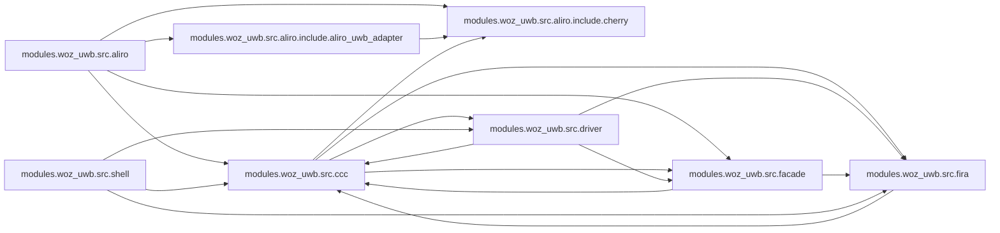

<!-- generated by `documate docs` — edit the source, not this file -->
# openaliro — architecture

Every subsystem on one page, in reading order: entry points (nothing imports them) first, then the machinery they drive. Each section is the subsystem's own prose, what it exposes, and how the pieces depend on each other; headings link to the full per-module reference under [`architecture/`](architecture/).

## `modules/woz_uwb/src/aliro/`

### [`modules/woz_uwb/src/aliro/aliro_uwb_msg.c`](architecture/modules.woz_uwb.src.aliro/aliro_uwb_msg.c.md)

@file aliro_uwb_msg.c — setup/notification message codec.

**depends on** [`modules/woz_uwb/src/aliro/aliro_uwb_msg.h`](architecture/modules.woz_uwb.src.aliro/aliro_uwb_msg.h.md), [`modules/woz_uwb/src/aliro/aliro_uwb_msg_builder.h`](architecture/modules.woz_uwb.src.aliro/aliro_uwb_msg_builder.h.md), [`modules/woz_uwb/src/aliro/aliro_uwb_msg_parser.h`](architecture/modules.woz_uwb.src.aliro/aliro_uwb_msg_parser.h.md), [`modules/woz_uwb/src/aliro/aliro_uwb_msg_spec.h`](architecture/modules.woz_uwb.src.aliro/aliro_uwb_msg_spec.h.md), [`modules/woz_uwb/src/aliro/include/aliro_uwb_adapter/aliro_uwb_adapter.h`](architecture/modules.woz_uwb.src.aliro.include.aliro_uwb_adapter/aliro_uwb_adapter.h.md), [`modules/woz_uwb/src/ccc/aliro_round_config.h`](architecture/modules.woz_uwb.src.ccc/aliro_round_config.h.md), [`modules/woz_uwb/src/facade/woz_alloc.h`](architecture/modules.woz_uwb.src.facade/woz_alloc.h.md)

### [`modules/woz_uwb/src/aliro/aliro_uwb_session.c`](architecture/modules.woz_uwb.src.aliro/aliro_uwb_session.c.md)

@file aliro_uwb_session.c — per-session lifecycle and state machine.

**depends on** [`modules/woz_uwb/src/aliro/aliro_uwb_internal.h`](architecture/modules.woz_uwb.src.aliro/aliro_uwb_internal.h.md), [`modules/woz_uwb/src/aliro/aliro_uwb_msg.h`](architecture/modules.woz_uwb.src.aliro/aliro_uwb_msg.h.md), [`modules/woz_uwb/src/aliro/aliro_uwb_msg_spec.h`](architecture/modules.woz_uwb.src.aliro/aliro_uwb_msg_spec.h.md), [`modules/woz_uwb/src/aliro/include/aliro_uwb_adapter/aliro_uwb_session.h`](architecture/modules.woz_uwb.src.aliro.include.aliro_uwb_adapter/aliro_uwb_session.h.md), [`modules/woz_uwb/src/aliro/include/cherry/cherry_ccc.h`](architecture/modules.woz_uwb.src.aliro.include.cherry/cherry_ccc.h.md), [`modules/woz_uwb/src/facade/woz_alloc.h`](architecture/modules.woz_uwb.src.facade/woz_alloc.h.md)

### [`modules/woz_uwb/src/aliro/aliro_uwb_adapter.c`](architecture/modules.woz_uwb.src.aliro/aliro_uwb_adapter.c.md)

@file aliro_uwb_adapter.c — reader-context lifecycle.

**depends on** [`modules/woz_uwb/src/aliro/aliro_uwb_internal.h`](architecture/modules.woz_uwb.src.aliro/aliro_uwb_internal.h.md), [`modules/woz_uwb/src/aliro/include/aliro_uwb_adapter/aliro_uwb_adapter.h`](architecture/modules.woz_uwb.src.aliro.include.aliro_uwb_adapter/aliro_uwb_adapter.h.md), [`modules/woz_uwb/src/aliro/include/cherry/cherry_ccc.h`](architecture/modules.woz_uwb.src.aliro.include.cherry/cherry_ccc.h.md), [`modules/woz_uwb/src/facade/woz_alloc.h`](architecture/modules.woz_uwb.src.facade/woz_alloc.h.md)

### [`modules/woz_uwb/src/aliro/aliro_uwb_msg_builder.c`](architecture/modules.woz_uwb.src.aliro/aliro_uwb_msg_builder.c.md)

@file aliro_uwb_msg_builder.c — big-endian TLV message builder.

**depends on** [`modules/woz_uwb/src/aliro/aliro_uwb_msg_builder.h`](architecture/modules.woz_uwb.src.aliro/aliro_uwb_msg_builder.h.md), [`modules/woz_uwb/src/facade/woz_alloc.h`](architecture/modules.woz_uwb.src.facade/woz_alloc.h.md)

### [`modules/woz_uwb/src/aliro/aliro_uwb_msg_parser.c`](architecture/modules.woz_uwb.src.aliro/aliro_uwb_msg_parser.c.md)

@file aliro_uwb_msg_parser.c — TLV attribute parser and big-endian reads.

**depends on** [`modules/woz_uwb/src/aliro/aliro_uwb_msg_parser.h`](architecture/modules.woz_uwb.src.aliro/aliro_uwb_msg_parser.h.md)

### [`modules/woz_uwb/src/aliro/aliro_uwb_msg.h`](architecture/modules.woz_uwb.src.aliro/aliro_uwb_msg.h.md)

@file aliro_uwb_msg.h — message framing accessors, dispatch and builders.

**depends on** [`modules/woz_uwb/src/aliro/aliro_uwb_internal.h`](architecture/modules.woz_uwb.src.aliro/aliro_uwb_internal.h.md), [`modules/woz_uwb/src/aliro/include/aliro_uwb_adapter/aliro_uwb_session.h`](architecture/modules.woz_uwb.src.aliro.include.aliro_uwb_adapter/aliro_uwb_session.h.md)  ·  **used by** [`modules/woz_uwb/src/aliro/aliro_uwb_msg.c`](architecture/modules.woz_uwb.src.aliro/aliro_uwb_msg.c.md), [`modules/woz_uwb/src/aliro/aliro_uwb_session.c`](architecture/modules.woz_uwb.src.aliro/aliro_uwb_session.c.md)

### [`modules/woz_uwb/src/aliro/aliro_uwb_msg_builder.h`](architecture/modules.woz_uwb.src.aliro/aliro_uwb_msg_builder.h.md)

@file aliro_uwb_msg_builder.h — big-endian TLV message builder.

**depends on** [`modules/woz_uwb/src/aliro/aliro_uwb_msg_spec.h`](architecture/modules.woz_uwb.src.aliro/aliro_uwb_msg_spec.h.md), [`modules/woz_uwb/src/aliro/include/aliro_uwb_adapter/aliro_uwb_session.h`](architecture/modules.woz_uwb.src.aliro.include.aliro_uwb_adapter/aliro_uwb_session.h.md)  ·  **used by** [`modules/woz_uwb/src/aliro/aliro_uwb_msg.c`](architecture/modules.woz_uwb.src.aliro/aliro_uwb_msg.c.md), [`modules/woz_uwb/src/aliro/aliro_uwb_msg_builder.c`](architecture/modules.woz_uwb.src.aliro/aliro_uwb_msg_builder.c.md)

### [`modules/woz_uwb/src/aliro/aliro_uwb_msg_parser.h`](architecture/modules.woz_uwb.src.aliro/aliro_uwb_msg_parser.h.md)

@file aliro_uwb_msg_parser.h — TLV attribute iteration and big-endian reads.

**depends on** [`modules/woz_uwb/src/aliro/aliro_uwb_msg_spec.h`](architecture/modules.woz_uwb.src.aliro/aliro_uwb_msg_spec.h.md), [`modules/woz_uwb/src/aliro/include/aliro_uwb_adapter/aliro_uwb_session.h`](architecture/modules.woz_uwb.src.aliro.include.aliro_uwb_adapter/aliro_uwb_session.h.md)  ·  **used by** [`modules/woz_uwb/src/aliro/aliro_uwb_msg.c`](architecture/modules.woz_uwb.src.aliro/aliro_uwb_msg.c.md), [`modules/woz_uwb/src/aliro/aliro_uwb_msg_parser.c`](architecture/modules.woz_uwb.src.aliro/aliro_uwb_msg_parser.c.md)

### [`modules/woz_uwb/src/aliro/aliro_uwb_msg_spec.h`](architecture/modules.woz_uwb.src.aliro/aliro_uwb_msg_spec.h.md)

@file aliro_uwb_msg_spec.h — UWB ranging-service framing constants.

**used by** [`modules/woz_uwb/src/aliro/aliro_uwb_msg.c`](architecture/modules.woz_uwb.src.aliro/aliro_uwb_msg.c.md), [`modules/woz_uwb/src/aliro/aliro_uwb_msg_builder.h`](architecture/modules.woz_uwb.src.aliro/aliro_uwb_msg_builder.h.md), [`modules/woz_uwb/src/aliro/aliro_uwb_msg_parser.h`](architecture/modules.woz_uwb.src.aliro/aliro_uwb_msg_parser.h.md), [`modules/woz_uwb/src/aliro/aliro_uwb_session.c`](architecture/modules.woz_uwb.src.aliro/aliro_uwb_session.c.md)

### [`modules/woz_uwb/src/aliro/aliro_uwb_internal.h`](architecture/modules.woz_uwb.src.aliro/aliro_uwb_internal.h.md)

@file aliro_uwb_internal.h — private context types and shared helpers.

**depends on** [`modules/woz_uwb/src/aliro/include/aliro_uwb_adapter/aliro_uwb_adapter.h`](architecture/modules.woz_uwb.src.aliro.include.aliro_uwb_adapter/aliro_uwb_adapter.h.md), [`modules/woz_uwb/src/aliro/include/aliro_uwb_adapter/aliro_uwb_session.h`](architecture/modules.woz_uwb.src.aliro.include.aliro_uwb_adapter/aliro_uwb_session.h.md), [`modules/woz_uwb/src/aliro/include/cherry/cherry.h`](architecture/modules.woz_uwb.src.aliro.include.cherry/cherry.h.md), [`modules/woz_uwb/src/aliro/include/cherry/cherry_ccc.h`](architecture/modules.woz_uwb.src.aliro.include.cherry/cherry_ccc.h.md)  ·  **used by** [`modules/woz_uwb/src/aliro/aliro_uwb_adapter.c`](architecture/modules.woz_uwb.src.aliro/aliro_uwb_adapter.c.md), [`modules/woz_uwb/src/aliro/aliro_uwb_msg.h`](architecture/modules.woz_uwb.src.aliro/aliro_uwb_msg.h.md), [`modules/woz_uwb/src/aliro/aliro_uwb_session.c`](architecture/modules.woz_uwb.src.aliro/aliro_uwb_session.c.md)

## `modules/woz_uwb/src/ccc/`

### [`modules/woz_uwb/src/ccc/ccc_shim_rx.c`](architecture/modules.woz_uwb.src.ccc/ccc_shim_rx.c.md)

@file ccc_shim_rx.c — responder-RX CCC STS substitution (ld --wrap=dwt_rxenable) programming the CCC STS on each RX-arm; target only.

**depends on** [`modules/woz_uwb/src/ccc/aliro_round_config.h`](architecture/modules.woz_uwb.src.ccc/aliro_round_config.h.md), [`modules/woz_uwb/src/ccc/ccc_kdf.h`](architecture/modules.woz_uwb.src.ccc/ccc_kdf.h.md), [`modules/woz_uwb/src/ccc/ccc_mac.h`](architecture/modules.woz_uwb.src.ccc/ccc_mac.h.md), [`modules/woz_uwb/src/ccc/ccc_shim.h`](architecture/modules.woz_uwb.src.ccc/ccc_shim.h.md), [`modules/woz_uwb/src/driver/uwb_min.h`](architecture/modules.woz_uwb.src.driver/uwb_min.h.md), [`modules/woz_uwb/src/driver/uwb_rxdiag.h`](architecture/modules.woz_uwb.src.driver/uwb_rxdiag.h.md), [`modules/woz_uwb/src/facade/woz_diag.h`](architecture/modules.woz_uwb.src.facade/woz_diag.h.md), [`modules/woz_uwb/src/fira/fira_session.h`](architecture/modules.woz_uwb.src.fira/fira_session.h.md)

### [`modules/woz_uwb/src/ccc/cherry_ccc_shim.c`](architecture/modules.woz_uwb.src.ccc/cherry_ccc_shim.c.md)

@file cherry_ccc_shim.c — cherry_ccc_* seam (Aliro responder) implemented over the lock-native FiRa MAC; maps each call onto woz_uwb_facade.

**depends on** [`modules/woz_uwb/src/aliro/include/cherry/cherry.h`](architecture/modules.woz_uwb.src.aliro.include.cherry/cherry.h.md), [`modules/woz_uwb/src/aliro/include/cherry/cherry_ccc.h`](architecture/modules.woz_uwb.src.aliro.include.cherry/cherry_ccc.h.md), [`modules/woz_uwb/src/aliro/include/cherry/cherry_session.h`](architecture/modules.woz_uwb.src.aliro.include.cherry/cherry_session.h.md), [`modules/woz_uwb/src/ccc/aliro_round_config.h`](architecture/modules.woz_uwb.src.ccc/aliro_round_config.h.md), [`modules/woz_uwb/src/facade/woz_alloc.h`](architecture/modules.woz_uwb.src.facade/woz_alloc.h.md), [`modules/woz_uwb/src/facade/woz_uwb_facade.h`](architecture/modules.woz_uwb.src.facade/woz_uwb_facade.h.md)

### [`modules/woz_uwb/src/ccc/ccc_session.c`](architecture/modules.woz_uwb.src.ccc/ccc_session.c.md)

@file ccc_session.c — Aliro/CCC ranging seam implementation. See ccc_session.h.

**depends on** [`modules/woz_uwb/src/ccc/ccc_session.h`](architecture/modules.woz_uwb.src.ccc/ccc_session.h.md)

### [`modules/woz_uwb/src/ccc/ccc_mac.c`](architecture/modules.woz_uwb.src.ccc/ccc_mac.c.md)

@file ccc_mac.c — UWB MAC: hopping sequence, SP0 frame codec, ranging schedule.

**depends on** [`modules/woz_uwb/src/ccc/ccc_mac.h`](architecture/modules.woz_uwb.src.ccc/ccc_mac.h.md)

### [`modules/woz_uwb/src/ccc/ccc_shim.c`](architecture/modules.woz_uwb.src.ccc/ccc_shim.c.md)

@file ccc_shim.c — CCC STS substitution core (implementation).

**depends on** [`modules/woz_uwb/src/ccc/ccc_shim.h`](architecture/modules.woz_uwb.src.ccc/ccc_shim.h.md)

### [`modules/woz_uwb/src/ccc/ccc_shim_wrap.c`](architecture/modules.woz_uwb.src.ccc/ccc_shim_wrap.c.md)

@file ccc_shim_wrap.c — per-frame STS interception (ld --wrap=dwt_configurestsiv) substituting CCC STS for the FiRa MAC; target only.

**depends on** [`modules/woz_uwb/src/ccc/ccc_shim.h`](architecture/modules.woz_uwb.src.ccc/ccc_shim.h.md)

### [`modules/woz_uwb/src/ccc/ccc_sts.c`](architecture/modules.woz_uwb.src.ccc/ccc_sts.c.md)

@file ccc_sts.c — DW3000 STS register load for the CCC ranging path.

**depends on** [`modules/woz_uwb/src/ccc/ccc_sts.h`](architecture/modules.woz_uwb.src.ccc/ccc_sts.h.md)

### [`modules/woz_uwb/src/ccc/ccc_crypto_mbedtls.c`](architecture/modules.woz_uwb.src.ccc/ccc_crypto_mbedtls.c.md)

@file ccc_crypto_mbedtls.c — AES-ECB block via mbedTLS, backing the CCC key schedule on SoCs without a PSA provider (e.g. ESP32-S3).

**depends on** [`modules/woz_uwb/src/ccc/ccc_kdf.h`](architecture/modules.woz_uwb.src.ccc/ccc_kdf.h.md)

### [`modules/woz_uwb/src/ccc/ccc_crypto_psa.c`](architecture/modules.woz_uwb.src.ccc/ccc_crypto_psa.c.md)

@file ccc_crypto_psa.c — On-target AES-ECB block (PSA/CC312) backing the CCC key schedule.

**depends on** [`modules/woz_uwb/src/ccc/ccc_kdf.h`](architecture/modules.woz_uwb.src.ccc/ccc_kdf.h.md)

### [`modules/woz_uwb/src/ccc/ccc_kdf.c`](architecture/modules.woz_uwb.src.ccc/ccc_kdf.c.md)

@file ccc_kdf.c — UWB key schedule + SP0 Pre-POLL frame codec.

**depends on** [`modules/woz_uwb/src/ccc/ccc_kdf.h`](architecture/modules.woz_uwb.src.ccc/ccc_kdf.h.md)

### [`modules/woz_uwb/src/ccc/aliro_round_config.h`](architecture/modules.woz_uwb.src.ccc/aliro_round_config.h.md)

@file aliro_round_config.h — one knob for the CCC ranging round's responder count.

**used by** [`modules/woz_uwb/src/aliro/aliro_uwb_msg.c`](architecture/modules.woz_uwb.src.aliro/aliro_uwb_msg.c.md), [`modules/woz_uwb/src/ccc/ccc_shim_rx.c`](architecture/modules.woz_uwb.src.ccc/ccc_shim_rx.c.md), [`modules/woz_uwb/src/ccc/cherry_ccc_shim.c`](architecture/modules.woz_uwb.src.ccc/cherry_ccc_shim.c.md)

### [`modules/woz_uwb/src/ccc/ccc_kdf.h`](architecture/modules.woz_uwb.src.ccc/ccc_kdf.h.md)

@file ccc_kdf.h
@brief UWB ranging key schedule + SP0 frame crypto (CONFIG_WOZ_ALIRO).
Turns the 32-byte URSK into the per-ranging-cycle keys the DW3000 STS engine
and the SP0 frames consume, over a single AES block-encrypt primitive.

**used by** [`modules/woz_uwb/src/ccc/ccc_crypto_mbedtls.c`](architecture/modules.woz_uwb.src.ccc/ccc_crypto_mbedtls.c.md), [`modules/woz_uwb/src/ccc/ccc_crypto_psa.c`](architecture/modules.woz_uwb.src.ccc/ccc_crypto_psa.c.md), [`modules/woz_uwb/src/ccc/ccc_kdf.c`](architecture/modules.woz_uwb.src.ccc/ccc_kdf.c.md), [`modules/woz_uwb/src/ccc/ccc_mac.h`](architecture/modules.woz_uwb.src.ccc/ccc_mac.h.md), [`modules/woz_uwb/src/ccc/ccc_shim.h`](architecture/modules.woz_uwb.src.ccc/ccc_shim.h.md), [`modules/woz_uwb/src/ccc/ccc_shim_rx.c`](architecture/modules.woz_uwb.src.ccc/ccc_shim_rx.c.md), [`modules/woz_uwb/src/ccc/ccc_sts.h`](architecture/modules.woz_uwb.src.ccc/ccc_sts.h.md)

### [`modules/woz_uwb/src/ccc/ccc_mac.h`](architecture/modules.woz_uwb.src.ccc/ccc_mac.h.md)

@file ccc_mac.h — CCC UWB MAC layer: ranging-round scheduling, SP0 frame codec, DS-TWR.

**depends on** [`modules/woz_uwb/src/ccc/ccc_kdf.h`](architecture/modules.woz_uwb.src.ccc/ccc_kdf.h.md)  ·  **used by** [`modules/woz_uwb/src/ccc/ccc_mac.c`](architecture/modules.woz_uwb.src.ccc/ccc_mac.c.md), [`modules/woz_uwb/src/ccc/ccc_session.h`](architecture/modules.woz_uwb.src.ccc/ccc_session.h.md), [`modules/woz_uwb/src/ccc/ccc_shim_rx.c`](architecture/modules.woz_uwb.src.ccc/ccc_shim_rx.c.md)

### [`modules/woz_uwb/src/ccc/ccc_shim.h`](architecture/modules.woz_uwb.src.ccc/ccc_shim.h.md)

@file ccc_shim.h — map a per-frame STS index to the (dURSK, STS-V) pair the DW3000 STS engine loads.

**depends on** [`modules/woz_uwb/src/ccc/ccc_kdf.h`](architecture/modules.woz_uwb.src.ccc/ccc_kdf.h.md)  ·  **used by** [`modules/woz_uwb/src/ccc/ccc_shim.c`](architecture/modules.woz_uwb.src.ccc/ccc_shim.c.md), [`modules/woz_uwb/src/ccc/ccc_shim_rx.c`](architecture/modules.woz_uwb.src.ccc/ccc_shim_rx.c.md), [`modules/woz_uwb/src/ccc/ccc_shim_wrap.c`](architecture/modules.woz_uwb.src.ccc/ccc_shim_wrap.c.md), [`modules/woz_uwb/src/driver/uwb_rxdiag.c`](architecture/modules.woz_uwb.src.driver/uwb_rxdiag.c.md), [`modules/woz_uwb/src/driver/uwb_selftest.c`](architecture/modules.woz_uwb.src.driver/uwb_selftest.c.md), [`modules/woz_uwb/src/facade/woz_uwb_facade.c`](architecture/modules.woz_uwb.src.facade/woz_uwb_facade.c.md), [`modules/woz_uwb/src/shell/aliro_shell.c`](architecture/modules.woz_uwb.src.shell/aliro_shell.c.md)

### [`modules/woz_uwb/src/ccc/aliro_kdf.h`](architecture/modules.woz_uwb.src.ccc/aliro_kdf.h.md)

@file aliro_kdf.h — UWB Ranging Secret Key (URSK) length.

**used by** [`modules/woz_uwb/src/facade/woz_uwb_facade.c`](architecture/modules.woz_uwb.src.facade/woz_uwb_facade.c.md), [`modules/woz_uwb/src/fira/fira_session.c`](architecture/modules.woz_uwb.src.fira/fira_session.c.md)

### [`modules/woz_uwb/src/ccc/ccc_session.h`](architecture/modules.woz_uwb.src.ccc/ccc_session.h.md)

@file ccc_session.h — Aliro/CCC ranging seam: map an Aliro session's URSK + M1-M4 setup to ccc_ran_params.

**depends on** [`modules/woz_uwb/src/ccc/ccc_mac.h`](architecture/modules.woz_uwb.src.ccc/ccc_mac.h.md)  ·  **used by** [`modules/woz_uwb/src/ccc/ccc_session.c`](architecture/modules.woz_uwb.src.ccc/ccc_session.c.md)

### [`modules/woz_uwb/src/ccc/ccc_sts.h`](architecture/modules.woz_uwb.src.ccc/ccc_sts.h.md)

@file ccc_sts.h — load a CCC ranging PPDU's STS key + IV into the DW3000 STS engine.

**depends on** [`modules/woz_uwb/src/ccc/ccc_kdf.h`](architecture/modules.woz_uwb.src.ccc/ccc_kdf.h.md)  ·  **used by** [`modules/woz_uwb/src/ccc/ccc_sts.c`](architecture/modules.woz_uwb.src.ccc/ccc_sts.c.md)

## `modules/woz_uwb/src/driver/`

### [`modules/woz_uwb/src/driver/uwb_rxdiag.c`](architecture/modules.woz_uwb.src.driver/uwb_rxdiag.c.md)

@file uwb_rxdiag.c — Diagnostic RX/TX event tallies + ranging heartbeat.

**depends on** [`modules/woz_uwb/src/ccc/ccc_shim.h`](architecture/modules.woz_uwb.src.ccc/ccc_shim.h.md), [`modules/woz_uwb/src/driver/uwb_rxdiag.h`](architecture/modules.woz_uwb.src.driver/uwb_rxdiag.h.md), [`modules/woz_uwb/src/facade/woz_alloc.h`](architecture/modules.woz_uwb.src.facade/woz_alloc.h.md), [`modules/woz_uwb/src/facade/woz_diag.h`](architecture/modules.woz_uwb.src.facade/woz_diag.h.md), [`modules/woz_uwb/src/fira/fira_session.h`](architecture/modules.woz_uwb.src.fira/fira_session.h.md)

### [`modules/woz_uwb/src/driver/uwb_selftest.c`](architecture/modules.woz_uwb.src.driver/uwb_selftest.c.md)

@file uwb_selftest.c — Kconfig-gated one-shot UWB init self-test (no iPhone).

**depends on** [`modules/woz_uwb/src/ccc/ccc_shim.h`](architecture/modules.woz_uwb.src.ccc/ccc_shim.h.md), [`modules/woz_uwb/src/facade/woz_uwb_facade.h`](architecture/modules.woz_uwb.src.facade/woz_uwb_facade.h.md)

### [`modules/woz_uwb/src/driver/uwb_isr.c`](architecture/modules.woz_uwb.src.driver/uwb_isr.c.md)

@file uwb_isr.c — DW3000 interrupt-callback registration (implementation).

**depends on** [`modules/woz_uwb/src/driver/uwb_isr.h`](architecture/modules.woz_uwb.src.driver/uwb_isr.h.md), [`modules/woz_uwb/src/facade/trace.h`](architecture/modules.woz_uwb.src.facade/trace.h.md)

### [`modules/woz_uwb/src/driver/uwb_min.c`](architecture/modules.woz_uwb.src.driver/uwb_min.c.md)

@file uwb_min.c — DW3110 bring-up driver (implementation).

**depends on** [`modules/woz_uwb/src/driver/uwb_min.h`](architecture/modules.woz_uwb.src.driver/uwb_min.h.md)

### [`modules/woz_uwb/src/driver/uwb_min.h`](architecture/modules.woz_uwb.src.driver/uwb_min.h.md)

@file uwb_min.h — Minimal DW3110 (DWM3000EVB) hardware bring-up driver.

**used by** [`modules/woz_uwb/src/ccc/ccc_shim_rx.c`](architecture/modules.woz_uwb.src.ccc/ccc_shim_rx.c.md), [`modules/woz_uwb/src/driver/uwb_min.c`](architecture/modules.woz_uwb.src.driver/uwb_min.c.md), [`modules/woz_uwb/src/shell/aliro_shell.c`](architecture/modules.woz_uwb.src.shell/aliro_shell.c.md)

### [`modules/woz_uwb/src/driver/uwb_rxdiag.h`](architecture/modules.woz_uwb.src.driver/uwb_rxdiag.h.md)

@file uwb_rxdiag.h — Read-side accessors for the RX event tallies + log stream.

**used by** [`modules/woz_uwb/src/ccc/ccc_shim_rx.c`](architecture/modules.woz_uwb.src.ccc/ccc_shim_rx.c.md), [`modules/woz_uwb/src/driver/uwb_rxdiag.c`](architecture/modules.woz_uwb.src.driver/uwb_rxdiag.c.md), [`modules/woz_uwb/src/shell/aliro_shell.c`](architecture/modules.woz_uwb.src.shell/aliro_shell.c.md)

### [`modules/woz_uwb/src/driver/uwb_isr.h`](architecture/modules.woz_uwb.src.driver/uwb_isr.h.md)

@file uwb_isr.h — DW3000 interrupt-callback registration (public surface).

**used by** [`modules/woz_uwb/src/driver/uwb_isr.c`](architecture/modules.woz_uwb.src.driver/uwb_isr.c.md)

## `modules/woz_uwb/src/facade/`

### [`modules/woz_uwb/src/facade/woz_uwb_facade.c`](architecture/modules.woz_uwb.src.facade/woz_uwb_facade.c.md)

UWB facade: binds the CCC credential-based STS engine to the DW3000 radio, exposes Aliro DS-TWR responder start/stop and range query, and manages platform dependencies (HFCLK boost, SPI init, callbacks).

**depends on** [`modules/woz_uwb/src/ccc/aliro_kdf.h`](architecture/modules.woz_uwb.src.ccc/aliro_kdf.h.md), [`modules/woz_uwb/src/ccc/ccc_shim.h`](architecture/modules.woz_uwb.src.ccc/ccc_shim.h.md), [`modules/woz_uwb/src/facade/woz_uwb_facade.h`](architecture/modules.woz_uwb.src.facade/woz_uwb_facade.h.md), [`modules/woz_uwb/src/fira/fira_session.h`](architecture/modules.woz_uwb.src.fira/fira_session.h.md)

### [`modules/woz_uwb/src/facade/woz_alloc.h`](architecture/modules.woz_uwb.src.facade/woz_alloc.h.md)

Memory allocation and timing facade: qmalloc, qcalloc, qfree wrap Zephyr k_* heap routines; qrtc_get_us returns monotonic microseconds since boot.

**used by** [`modules/woz_uwb/src/aliro/aliro_uwb_adapter.c`](architecture/modules.woz_uwb.src.aliro/aliro_uwb_adapter.c.md), [`modules/woz_uwb/src/aliro/aliro_uwb_msg.c`](architecture/modules.woz_uwb.src.aliro/aliro_uwb_msg.c.md), [`modules/woz_uwb/src/aliro/aliro_uwb_msg_builder.c`](architecture/modules.woz_uwb.src.aliro/aliro_uwb_msg_builder.c.md), [`modules/woz_uwb/src/aliro/aliro_uwb_session.c`](architecture/modules.woz_uwb.src.aliro/aliro_uwb_session.c.md), [`modules/woz_uwb/src/ccc/cherry_ccc_shim.c`](architecture/modules.woz_uwb.src.ccc/cherry_ccc_shim.c.md), [`modules/woz_uwb/src/driver/uwb_rxdiag.c`](architecture/modules.woz_uwb.src.driver/uwb_rxdiag.c.md)

### [`modules/woz_uwb/src/facade/woz_diag.h`](architecture/modules.woz_uwb.src.facade/woz_diag.h.md)

@file woz_diag.h — DIAGK(): compile-time gate for verbose UWB bring-up diagnostics.

**used by** [`modules/woz_uwb/src/ccc/ccc_shim_rx.c`](architecture/modules.woz_uwb.src.ccc/ccc_shim_rx.c.md), [`modules/woz_uwb/src/driver/uwb_rxdiag.c`](architecture/modules.woz_uwb.src.driver/uwb_rxdiag.c.md)

### [`modules/woz_uwb/src/facade/woz_uwb_facade.h`](architecture/modules.woz_uwb.src.facade/woz_uwb_facade.h.md)

Public header for UWB facade: exposes Aliro DS-TWR responder lifecycle and range query; the CCC engine is bound and unbound via internal ursk and stop calls.

**used by** [`modules/woz_uwb/src/ccc/cherry_ccc_shim.c`](architecture/modules.woz_uwb.src.ccc/cherry_ccc_shim.c.md), [`modules/woz_uwb/src/driver/uwb_selftest.c`](architecture/modules.woz_uwb.src.driver/uwb_selftest.c.md), [`modules/woz_uwb/src/facade/woz_uwb_facade.c`](architecture/modules.woz_uwb.src.facade/woz_uwb_facade.c.md)

### [`modules/woz_uwb/src/facade/trace.h`](architecture/modules.woz_uwb.src.facade/trace.h.md)

@file trace.h — Structured [WOZ_TRACE] emit helpers, gated on CONFIG_WOZ_E2E_TRACE.

**used by** [`modules/woz_uwb/src/driver/uwb_isr.c`](architecture/modules.woz_uwb.src.driver/uwb_isr.c.md)

### [`modules/woz_uwb/src/facade/woz_logfmt.c`](architecture/modules.woz_uwb.src.facade/woz_logfmt.c.md)

@file woz_logfmt.c — PRETTY-gated high-res timestamp + compact colored log line.

### [`modules/woz_uwb/src/facade/woz_logquiet.c`](architecture/modules.woz_uwb.src.facade/woz_logquiet.c.md)

@file woz_logquiet.c — PRETTY-gated runtime muting of benign upstream error spam.
The stock Matter/BLE stack logs several non-fatal conditions at LOG_ERR/LOG_WRN
(red/yellow): mDNS advertiser "incorrect state" churn, "Long dispatch time"
perf notes, unsupported-attribute reads, the "No valid legacy adv to stop" BLE
double-stop, and the empty-slot "Failed to get Access Document at index: 0" the
access layer emits on first contact. All are expected on this bare DK bring-up
and every one is proven benign by the healthy unlock that follows.
A compile-time level cut can't remove just these: each noisy source shares its
CONFIG_*_LOG_LEVEL with a source whose INFO lines drive the demo narrative
(access_document shares CONFIG_DOOR_LOCK_APP_LOG_LEVEL with access_manager's
"ACCESS GRANTED"/ranging lines; bt_adv shares CONFIG_BT_HCI_CORE_LOG_LEVEL),
and a threshold below ERR still lets ERR through. So mute per-source at runtime.
Reversible: compiled only under CONFIG_WOZ_PRETTY_SHELL (PRETTY=1). Drop PRETTY
and every one of these lines returns for raw diagnosis. Needs
CONFIG_LOG_RUNTIME_FILTERING=y (set in integration/overlays/woz-pretty.conf).

## `modules/woz_uwb/src/shell/`

### [`modules/woz_uwb/src/shell/aliro_shell.c`](architecture/modules.woz_uwb.src.shell/aliro_shell.c.md)

@file aliro_shell.c — `aliro` UART shell command: colored console over the UWB engine.

**depends on** [`modules/woz_uwb/src/ccc/ccc_shim.h`](architecture/modules.woz_uwb.src.ccc/ccc_shim.h.md), [`modules/woz_uwb/src/driver/uwb_min.h`](architecture/modules.woz_uwb.src.driver/uwb_min.h.md), [`modules/woz_uwb/src/driver/uwb_rxdiag.h`](architecture/modules.woz_uwb.src.driver/uwb_rxdiag.h.md), [`modules/woz_uwb/src/fira/fira_session.h`](architecture/modules.woz_uwb.src.fira/fira_session.h.md)

## `modules/woz_uwb/src/fira/`

### [`modules/woz_uwb/src/fira/fira_session.c`](architecture/modules.woz_uwb.src.fira/fira_session.c.md)

@file fira_session.c — Range + URSK store for the CCC Pre-POLL responder.

**depends on** [`modules/woz_uwb/src/ccc/aliro_kdf.h`](architecture/modules.woz_uwb.src.ccc/aliro_kdf.h.md), [`modules/woz_uwb/src/fira/fira_session.h`](architecture/modules.woz_uwb.src.fira/fira_session.h.md)

### [`modules/woz_uwb/src/fira/fira_session.h`](architecture/modules.woz_uwb.src.fira/fira_session.h.md)

@file fira_session.h — Range + URSK store for the CCC Pre-POLL responder.

**used by** [`modules/woz_uwb/src/ccc/ccc_shim_rx.c`](architecture/modules.woz_uwb.src.ccc/ccc_shim_rx.c.md), [`modules/woz_uwb/src/driver/uwb_rxdiag.c`](architecture/modules.woz_uwb.src.driver/uwb_rxdiag.c.md), [`modules/woz_uwb/src/facade/woz_uwb_facade.c`](architecture/modules.woz_uwb.src.facade/woz_uwb_facade.c.md), [`modules/woz_uwb/src/fira/fira_session.c`](architecture/modules.woz_uwb.src.fira/fira_session.c.md), [`modules/woz_uwb/src/shell/aliro_shell.c`](architecture/modules.woz_uwb.src.shell/aliro_shell.c.md)

### [`modules/woz_uwb/src/fira/fira_device_config.h`](architecture/modules.woz_uwb.src.fira/fira_device_config.h.md)

@file fira_device_config.h — FiRa DS-TWR device/session parameter bag consumed by fira_session.c.

## `modules/woz_uwb/src/aliro/include/aliro_uwb_adapter/`

### [`modules/woz_uwb/src/aliro/include/aliro_uwb_adapter/aliro_uwb_adapter.h`](architecture/modules.woz_uwb.src.aliro.include.aliro_uwb_adapter/aliro_uwb_adapter.h.md)

@file aliro_uwb_adapter.h — reader-device public interface.

**depends on** [`modules/woz_uwb/src/aliro/include/cherry/cherry.h`](architecture/modules.woz_uwb.src.aliro.include.cherry/cherry.h.md), [`modules/woz_uwb/src/aliro/include/cherry/cherry_ccc.h`](architecture/modules.woz_uwb.src.aliro.include.cherry/cherry_ccc.h.md)  ·  **used by** [`modules/woz_uwb/src/aliro/aliro_uwb_adapter.c`](architecture/modules.woz_uwb.src.aliro/aliro_uwb_adapter.c.md), [`modules/woz_uwb/src/aliro/aliro_uwb_internal.h`](architecture/modules.woz_uwb.src.aliro/aliro_uwb_internal.h.md), [`modules/woz_uwb/src/aliro/aliro_uwb_msg.c`](architecture/modules.woz_uwb.src.aliro/aliro_uwb_msg.c.md)

### [`modules/woz_uwb/src/aliro/include/aliro_uwb_adapter/aliro_uwb_session.h`](architecture/modules.woz_uwb.src.aliro.include.aliro_uwb_adapter/aliro_uwb_session.h.md)

@file aliro_uwb_session.h — per-session public interface.

**depends on** [`modules/woz_uwb/src/aliro/include/cherry/cherry.h`](architecture/modules.woz_uwb.src.aliro.include.cherry/cherry.h.md), [`modules/woz_uwb/src/aliro/include/cherry/cherry_ccc.h`](architecture/modules.woz_uwb.src.aliro.include.cherry/cherry_ccc.h.md)  ·  **used by** [`modules/woz_uwb/src/aliro/aliro_uwb_internal.h`](architecture/modules.woz_uwb.src.aliro/aliro_uwb_internal.h.md), [`modules/woz_uwb/src/aliro/aliro_uwb_msg.h`](architecture/modules.woz_uwb.src.aliro/aliro_uwb_msg.h.md), [`modules/woz_uwb/src/aliro/aliro_uwb_msg_builder.h`](architecture/modules.woz_uwb.src.aliro/aliro_uwb_msg_builder.h.md), [`modules/woz_uwb/src/aliro/aliro_uwb_msg_parser.h`](architecture/modules.woz_uwb.src.aliro/aliro_uwb_msg_parser.h.md), [`modules/woz_uwb/src/aliro/aliro_uwb_session.c`](architecture/modules.woz_uwb.src.aliro/aliro_uwb_session.c.md)

## `modules/woz_uwb/src/aliro/include/cherry/`

### [`modules/woz_uwb/src/aliro/include/cherry/cherry_ccc.h`](architecture/modules.woz_uwb.src.aliro.include.cherry/cherry_ccc.h.md)

@file cherry_ccc.h — CCC/Aliro-session interface (seam the adapter drives).

**depends on** [`modules/woz_uwb/src/aliro/include/cherry/cherry.h`](architecture/modules.woz_uwb.src.aliro.include.cherry/cherry.h.md), [`modules/woz_uwb/src/aliro/include/cherry/cherry_common.h`](architecture/modules.woz_uwb.src.aliro.include.cherry/cherry_common.h.md), [`modules/woz_uwb/src/aliro/include/cherry/cherry_session.h`](architecture/modules.woz_uwb.src.aliro.include.cherry/cherry_session.h.md)  ·  **used by** [`modules/woz_uwb/src/aliro/aliro_uwb_adapter.c`](architecture/modules.woz_uwb.src.aliro/aliro_uwb_adapter.c.md), [`modules/woz_uwb/src/aliro/aliro_uwb_internal.h`](architecture/modules.woz_uwb.src.aliro/aliro_uwb_internal.h.md), [`modules/woz_uwb/src/aliro/aliro_uwb_session.c`](architecture/modules.woz_uwb.src.aliro/aliro_uwb_session.c.md), [`modules/woz_uwb/src/aliro/include/aliro_uwb_adapter/aliro_uwb_adapter.h`](architecture/modules.woz_uwb.src.aliro.include.aliro_uwb_adapter/aliro_uwb_adapter.h.md), [`modules/woz_uwb/src/aliro/include/aliro_uwb_adapter/aliro_uwb_session.h`](architecture/modules.woz_uwb.src.aliro.include.aliro_uwb_adapter/aliro_uwb_session.h.md), [`modules/woz_uwb/src/ccc/cherry_ccc_shim.c`](architecture/modules.woz_uwb.src.ccc/cherry_ccc_shim.c.md)

### [`modules/woz_uwb/src/aliro/include/cherry/cherry.h`](architecture/modules.woz_uwb.src.aliro.include.cherry/cherry.h.md)

@file cherry.h — Cherry core (context + device-capabilities) interface.

**depends on** [`modules/woz_uwb/src/aliro/include/cherry/cherry_common.h`](architecture/modules.woz_uwb.src.aliro.include.cherry/cherry_common.h.md)  ·  **used by** [`modules/woz_uwb/src/aliro/aliro_uwb_internal.h`](architecture/modules.woz_uwb.src.aliro/aliro_uwb_internal.h.md), [`modules/woz_uwb/src/aliro/include/aliro_uwb_adapter/aliro_uwb_adapter.h`](architecture/modules.woz_uwb.src.aliro.include.aliro_uwb_adapter/aliro_uwb_adapter.h.md), [`modules/woz_uwb/src/aliro/include/aliro_uwb_adapter/aliro_uwb_session.h`](architecture/modules.woz_uwb.src.aliro.include.aliro_uwb_adapter/aliro_uwb_session.h.md), [`modules/woz_uwb/src/aliro/include/cherry/cherry_ccc.h`](architecture/modules.woz_uwb.src.aliro.include.cherry/cherry_ccc.h.md), [`modules/woz_uwb/src/aliro/include/cherry/cherry_session.h`](architecture/modules.woz_uwb.src.aliro.include.cherry/cherry_session.h.md), [`modules/woz_uwb/src/ccc/cherry_ccc_shim.c`](architecture/modules.woz_uwb.src.ccc/cherry_ccc_shim.c.md)

### [`modules/woz_uwb/src/aliro/include/cherry/cherry_session.h`](architecture/modules.woz_uwb.src.aliro.include.cherry/cherry_session.h.md)

@file cherry_session.h — generic base-session interface.

**depends on** [`modules/woz_uwb/src/aliro/include/cherry/cherry.h`](architecture/modules.woz_uwb.src.aliro.include.cherry/cherry.h.md), [`modules/woz_uwb/src/aliro/include/cherry/cherry_common.h`](architecture/modules.woz_uwb.src.aliro.include.cherry/cherry_common.h.md)  ·  **used by** [`modules/woz_uwb/src/aliro/include/cherry/cherry_ccc.h`](architecture/modules.woz_uwb.src.aliro.include.cherry/cherry_ccc.h.md), [`modules/woz_uwb/src/ccc/cherry_ccc_shim.c`](architecture/modules.woz_uwb.src.ccc/cherry_ccc_shim.c.md)

### [`modules/woz_uwb/src/aliro/include/cherry/cherry_common.h`](architecture/modules.woz_uwb.src.aliro.include.cherry/cherry_common.h.md)

@file cherry_common.h — diagnostics config struct and report forward decl.

**used by** [`modules/woz_uwb/src/aliro/include/cherry/cherry.h`](architecture/modules.woz_uwb.src.aliro.include.cherry/cherry.h.md), [`modules/woz_uwb/src/aliro/include/cherry/cherry_ccc.h`](architecture/modules.woz_uwb.src.aliro.include.cherry/cherry_ccc.h.md), [`modules/woz_uwb/src/aliro/include/cherry/cherry_session.h`](architecture/modules.woz_uwb.src.aliro.include.cherry/cherry_session.h.md)

## `./`

### [`bootstrap.sh`](architecture/root/bootstrap.sh.md)

bootstrap.sh — build a self-contained west workspace, PRISTINE from upstream.
Fetches everything the build needs from public GitHub into ./workspace
(git-ignored), then applies our integration patches on top. It never reads from
any other local checkout — a clean upstream fetch every time.
Fetches (all public):
- Nordic add-on  ncs-door-lock-and-access-control @ the pin below
- NCS v3.3.0 + Zephyr + every module (via the add-on's own west manifest)
Prereq (once per machine): nRF Connect SDK v3.3.0 toolchain
nrfutil sdk-manager toolchain install --ncs-version v3.3.0
Usage:  ./bootstrap.sh                       # workspace in ./workspace
ALIRO_WS=/big/disk/ws ./bootstrap.sh # put the multi-GB workspace elsewhere

### [`build.sh`](architecture/root/build.sh.md)

build.sh {build|rebuild|flash|flash-erase|build-flash} — build the Aliro
NFC+UWB image from the self-contained ./workspace. Run ./bootstrap.sh first.
Layers our modules + ISC dw3000 onto the fetched add-on via out-of-tree
overlays. Output → ./build (git-ignored).
Incremental by default — a full from-scratch (pristine) build runs only when it
has to: first build, changed build flags (UWB chip / self-test / config), or
when you ask for one. A preflight first checks the workspace is bootstrapped.
./build.sh build                  # incremental where safe (fast)
./build.sh rebuild                # force a clean pristine build
PRISTINE=1 ./build.sh build       # same as rebuild
UWB_SELFTEST=1 ./build.sh build   # one-shot boot self-test, no iPhone (diagnostic)
PRETTY=1 ./build.sh build         # curated/clean console (reversible; default verbose)
UWB_CHIP=dw3720 ./build.sh build  # select the plugged-in UWB chip (default: dw3000)

### [`ws-seed.sh`](architecture/root/ws-seed.sh.md)

ws-seed.sh — give this git worktree its own NCS workspace, cheaply.
Frequent branch-bouncing over a single shared workspace is a trap: the tree
holds one patch state at a time (last bootstrap wins), so a build from the
wrong worktree silently compiles another branch's patches. This seeds a
per-worktree workspace at the default path ($TREE/workspace) so build.sh picks
it up with no env var, and each worktree stays self-contained.
Cheap because it uses an APFS copy-on-write clone (cp -c): the clone shares
every block with the primary and costs ~0 extra disk until a patched file
diverges. Cleanup is automatic — the workspace lives inside the worktree, so
deleting the worktree deletes it (see `make ws-clean`).

## `modules/woz_aliro_ecp/src/`

### [`modules/woz_aliro_ecp/src/nfc_prop_ecp.cpp`](architecture/modules.woz_aliro_ecp.src/nfc_prop_ecp.cpp.md)

NFC Type A proprietary callback implementation for Aliro Express unlock (tap-to-unlock without Face ID). Emits a CRC_A–checksummed ECP frame carrying the reader identifier.

## `ports/esp32s3/sample/src/`

### [`ports/esp32s3/sample/src/main.c`](architecture/ports.esp32s3.sample.src/main.c.md)

Woz UWB ranging engine on ESP32-S3 — minimal bring-up sample.
Binds a canned URSK and starts the CCC DS-TWR responder on the DW3000, then
polls for a range. With no iPhone/initiator present this proves the SPI +
DW3000 + CCC init path comes up on ESP32-S3; a live range needs a peer that
drives the DS-TWR exchange (an Aliro Wallet, or a second board as initiator).
Reference scaffold (see ports/esp32s3/README.md) — not yet built on silicon.
