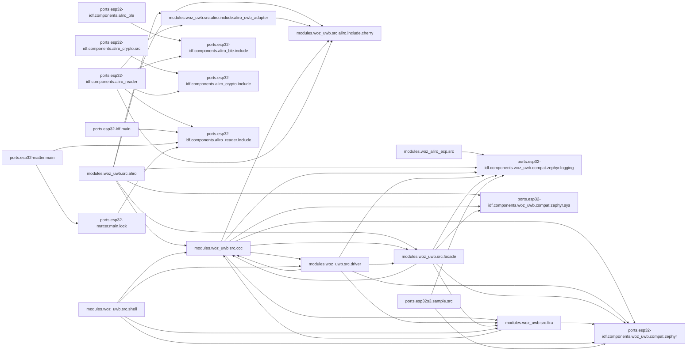

<!-- generated documentation — edit the source, not this file -->
# openaliro

**97 subsystems in 24 directories · 731/752 symbols documented (97%)**

**Start here:** [`modules/woz_uwb/src/aliro/aliro_uwb_msg.c`](architecture/modules.woz_uwb.src.aliro/aliro_uwb_msg.c.md), [`modules/woz_uwb/src/aliro/aliro_uwb_session.c`](architecture/modules.woz_uwb.src.aliro/aliro_uwb_session.c.md), [`modules/woz_uwb/src/ccc/ccc_shim_rx.c`](architecture/modules.woz_uwb.src.ccc/ccc_shim_rx.c.md) — the doors into the codebase (nothing else imports them).

## Directories

| directory | subsystems | documented |
|---|---|---|
| [`./`](architecture/root/README.md) | 3 | 14/14 (100%) |
| [`modules/woz_aliro_ecp/src/`](architecture/modules.woz_aliro_ecp.src/README.md) | 1 | 5/5 (100%) |
| [`modules/woz_uwb/src/aliro/`](architecture/modules.woz_uwb.src.aliro/README.md) | 10 | 104/118 (88%) |
| [`modules/woz_uwb/src/aliro/include/aliro_uwb_adapter/`](architecture/modules.woz_uwb.src.aliro.include.aliro_uwb_adapter/README.md) | 2 | 17/17 (100%) |
| [`modules/woz_uwb/src/aliro/include/cherry/`](architecture/modules.woz_uwb.src.aliro.include.cherry/README.md) | 4 | 36/36 (100%) |
| [`modules/woz_uwb/src/ccc/`](architecture/modules.woz_uwb.src.ccc/README.md) | 17 | 137/142 (96%) |
| [`modules/woz_uwb/src/driver/`](architecture/modules.woz_uwb.src.driver/README.md) | 7 | 43/43 (100%) |
| [`modules/woz_uwb/src/facade/`](architecture/modules.woz_uwb.src.facade/README.md) | 7 | 25/25 (100%) |
| [`modules/woz_uwb/src/fira/`](architecture/modules.woz_uwb.src.fira/README.md) | 3 | 10/10 (100%) |
| [`modules/woz_uwb/src/shell/`](architecture/modules.woz_uwb.src.shell/README.md) | 1 | 12/12 (100%) |
| [`ports/esp32-idf/components/aliro_ble/`](architecture/ports.esp32-idf.components.aliro_ble/README.md) | 1 | 42/42 (100%) |
| [`ports/esp32-idf/components/aliro_ble/include/`](architecture/ports.esp32-idf.components.aliro_ble.include/README.md) | 1 | 6/6 (100%) |
| [`ports/esp32-idf/components/aliro_crypto/include/`](architecture/ports.esp32-idf.components.aliro_crypto.include/README.md) | 2 | 1/1 (100%) |
| [`ports/esp32-idf/components/aliro_crypto/src/`](architecture/ports.esp32-idf.components.aliro_crypto.src/README.md) | 4 | 37/37 (100%) |
| [`ports/esp32-idf/components/aliro_reader/`](architecture/ports.esp32-idf.components.aliro_reader/README.md) | 8 | 92/92 (100%) |
| [`ports/esp32-idf/components/aliro_reader/include/`](architecture/ports.esp32-idf.components.aliro_reader.include/README.md) | 1 | 0/0 (0%) |
| [`ports/esp32-idf/components/woz_uwb/compat/zephyr/`](architecture/ports.esp32-idf.components.woz_uwb.compat.zephyr/README.md) | 1 | 11/11 (100%) |
| [`ports/esp32-idf/components/woz_uwb/compat/zephyr/logging/`](architecture/ports.esp32-idf.components.woz_uwb.compat.zephyr.logging/README.md) | 1 | 0/0 (0%) |
| [`ports/esp32-idf/components/woz_uwb/compat/zephyr/sys/`](architecture/ports.esp32-idf.components.woz_uwb.compat.zephyr.sys/README.md) | 3 | 8/8 (100%) |
| [`ports/esp32-idf/components/woz_uwb/port/`](architecture/ports.esp32-idf.components.woz_uwb.port/README.md) | 4 | 30/30 (100%) |
| [`ports/esp32-idf/main/`](architecture/ports.esp32-idf.main/README.md) | 3 | 16/16 (100%) |
| [`ports/esp32-matter/main/`](architecture/ports.esp32-matter.main/README.md) | 7 | 26/26 (100%) |
| [`ports/esp32-matter/main/lock/`](architecture/ports.esp32-matter.main.lock/README.md) | 5 | 57/59 (96%) |
| [`ports/esp32s3/sample/src/`](architecture/ports.esp32s3.sample.src/README.md) | 1 | 2/2 (100%) |

## Hotspots

*Mined from git history as of `ee5ff72`.*

**Most-changed:** [`ports/esp32-idf/components/aliro_reader/aliro_reader.c`](architecture/ports.esp32-idf.components.aliro_reader/aliro_reader.c.md) (15 commits), [`modules/woz_uwb/src/ccc/ccc_shim_rx.c`](architecture/modules.woz_uwb.src.ccc/ccc_shim_rx.c.md) (11 commits), [`ports/esp32-matter/main/app_main.cpp`](architecture/ports.esp32-matter.main/app_main.cpp.md) (8 commits), [`build.sh`](architecture/root/build.sh.md) (7 commits), [`ports/esp32-idf/components/aliro_reader/include/aliro_reader.h`](architecture/ports.esp32-idf.components.aliro_reader.include/aliro_reader.h.md) (7 commits).

**Change together without importing each other:**

- [`ports/esp32-idf/components/aliro_ble/aliro_ble.c`](architecture/ports.esp32-idf.components.aliro_ble/aliro_ble.c.md) ↔ [`ports/esp32-idf/components/aliro_reader/aliro_reader.c`](architecture/ports.esp32-idf.components.aliro_reader/aliro_reader.c.md) (4 shared commits)
- [`ports/esp32-idf/components/aliro_ble/aliro_ble.c`](architecture/ports.esp32-idf.components.aliro_ble/aliro_ble.c.md) ↔ [`ports/esp32-idf/components/aliro_reader/include/aliro_reader.h`](architecture/ports.esp32-idf.components.aliro_reader.include/aliro_reader.h.md) (4 shared commits)
- [`ports/esp32-idf/components/aliro_ble/include/aliro_ble.h`](architecture/ports.esp32-idf.components.aliro_ble.include/aliro_ble.h.md) ↔ [`ports/esp32-idf/components/aliro_reader/include/aliro_reader.h`](architecture/ports.esp32-idf.components.aliro_reader.include/aliro_reader.h.md) (4 shared commits)
- [`ports/esp32-idf/components/aliro_crypto/src/aliro_crypto.c`](architecture/ports.esp32-idf.components.aliro_crypto.src/aliro_crypto.c.md) ↔ [`ports/esp32-idf/components/aliro_reader/aliro_reader.c`](architecture/ports.esp32-idf.components.aliro_reader/aliro_reader.c.md) (3 shared commits)
- [`ports/esp32-idf/components/aliro_reader/aliro_apdu.c`](architecture/ports.esp32-idf.components.aliro_reader/aliro_apdu.c.md) ↔ [`ports/esp32-idf/components/aliro_reader/aliro_reader.c`](architecture/ports.esp32-idf.components.aliro_reader/aliro_reader.c.md) (3 shared commits)
