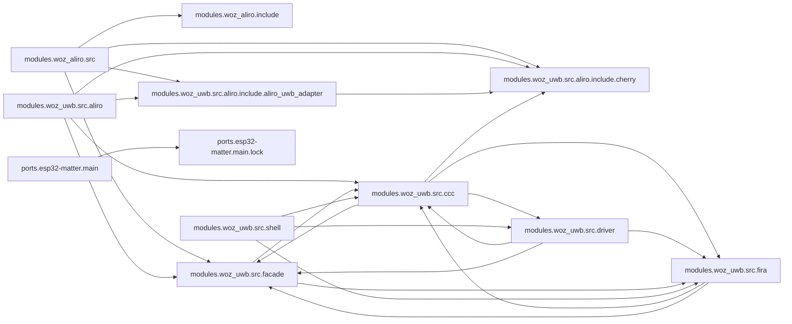

<!-- generated documentation — edit the source, not this file -->
# openaliro

**101 subsystems in 21 directories · 603/616 symbols documented (97%)**

**Start here:** [`modules/woz_uwb/src/aliro/aliro_uwb_msg.c`](architecture/modules.woz_uwb.src.aliro/aliro_uwb_msg.c.md), [`modules/woz_uwb/src/aliro/aliro_uwb_session.c`](architecture/modules.woz_uwb.src.aliro/aliro_uwb_session.c.md), [`modules/woz_aliro/src/aliro_ranging.c`](architecture/modules.woz_aliro.src/aliro_ranging.c.md) — the doors into the codebase (nothing else imports them).

## Directories

| directory | subsystems | documented |
|---|---|---|
| [`./`](architecture/root/README.md) | 5 | 14/14 (100%) |
| [`integration/homeassistant/`](architecture/integration.homeassistant/README.md) | 1 | 4/5 (80%) |
| [`modules/woz_aliro/include/`](architecture/modules.woz_aliro.include/README.md) | 5 | 6/6 (100%) |
| [`modules/woz_aliro/src/`](architecture/modules.woz_aliro.src/README.md) | 10 | 94/101 (93%) |
| [`modules/woz_aliro_ecp/src/`](architecture/modules.woz_aliro_ecp.src/README.md) | 1 | 5/5 (100%) |
| [`modules/woz_uwb/src/aliro/`](architecture/modules.woz_uwb.src.aliro/README.md) | 10 | 83/83 (100%) |
| [`modules/woz_uwb/src/aliro/include/aliro_uwb_adapter/`](architecture/modules.woz_uwb.src.aliro.include.aliro_uwb_adapter/README.md) | 2 | 4/4 (100%) |
| [`modules/woz_uwb/src/aliro/include/cherry/`](architecture/modules.woz_uwb.src.aliro.include.cherry/README.md) | 4 | 13/13 (100%) |
| [`modules/woz_uwb/src/ccc/`](architecture/modules.woz_uwb.src.ccc/README.md) | 17 | 120/120 (100%) |
| [`modules/woz_uwb/src/driver/`](architecture/modules.woz_uwb.src.driver/README.md) | 7 | 35/35 (100%) |
| [`modules/woz_uwb/src/facade/`](architecture/modules.woz_uwb.src.facade/README.md) | 11 | 41/41 (100%) |
| [`modules/woz_uwb/src/fira/`](architecture/modules.woz_uwb.src.fira/README.md) | 3 | 10/10 (100%) |
| [`modules/woz_uwb/src/shell/`](architecture/modules.woz_uwb.src.shell/README.md) | 1 | 10/10 (100%) |
| [`ports/esp32-idf/components/aliro_ble/`](architecture/ports.esp32-idf.components.aliro_ble/README.md) | 1 | 27/27 (100%) |
| [`ports/esp32-idf/components/aliro_reader/`](architecture/ports.esp32-idf.components.aliro_reader/README.md) | 1 | 3/3 (100%) |
| [`ports/esp32-idf/components/woz_uwb/port/`](architecture/ports.esp32-idf.components.woz_uwb.port/README.md) | 4 | 30/30 (100%) |
| [`ports/esp32-idf/main/`](architecture/ports.esp32-idf.main/README.md) | 3 | 15/15 (100%) |
| [`ports/esp32-matter/main/`](architecture/ports.esp32-matter.main/README.md) | 7 | 24/24 (100%) |
| [`ports/esp32-matter/main/lock/`](architecture/ports.esp32-matter.main.lock/README.md) | 5 | 60/60 (100%) |
| [`ports/esp32s3/sample/src/`](architecture/ports.esp32s3.sample.src/README.md) | 1 | 1/1 (100%) |
| [`tools/`](architecture/tools/README.md) | 2 | 4/9 (44%) |

## Hotspots

*Mined from git history as of `ffa4a3f`.*

**Most-changed:** [`modules/woz_uwb/src/ccc/ccc_shim_rx.c`](architecture/modules.woz_uwb.src.ccc/ccc_shim_rx.c.md) (13 commits), [`ports/esp32-matter/main/app_main.cpp`](architecture/ports.esp32-matter.main/app_main.cpp.md) (11 commits), [`bootstrap.sh`](architecture/root/bootstrap.sh.md) (8 commits), [`build.sh`](architecture/root/build.sh.md) (8 commits), [`ports/esp32-idf/components/aliro_ble/aliro_ble.c`](architecture/ports.esp32-idf.components.aliro_ble/aliro_ble.c.md) (7 commits).

**Change together without importing each other:**

- [`ports/esp32-matter/main/app_main.cpp`](architecture/ports.esp32-matter.main/app_main.cpp.md) ↔ [`ports/esp32-matter/main/lock/door_lock_manager.cpp`](architecture/ports.esp32-matter.main.lock/door_lock_manager.cpp.md) (3 shared commits)
