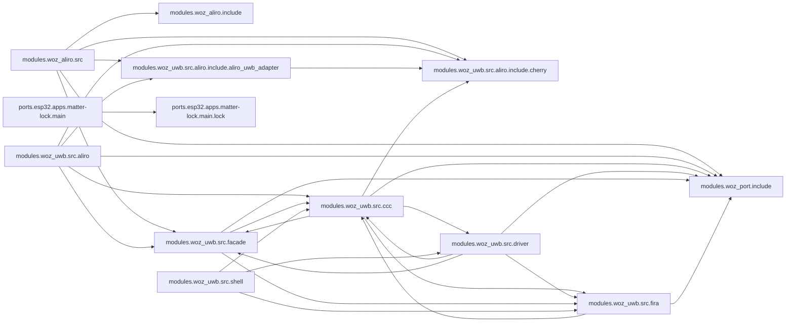

<!-- generated documentation — edit the source, not this file -->
# openaliro

**110 subsystems in 23 directories · 614/663 symbols documented (92%)**

**Start here:** [`modules/woz_uwb/src/aliro/aliro_uwb_msg.c`](architecture/modules.woz_uwb.src.aliro/aliro_uwb_msg.c.md), [`modules/woz_uwb/src/aliro/aliro_uwb_session.c`](architecture/modules.woz_uwb.src.aliro/aliro_uwb_session.c.md), [`modules/woz_aliro/src/aliro_ranging.c`](architecture/modules.woz_aliro.src/aliro_ranging.c.md) — the doors into the codebase (nothing else imports them).

## Directories

| directory | subsystems | documented |
|---|---|---|
| [`integration/homeassistant/`](architecture/integration.homeassistant/README.md) | 1 | 4/5 (80%) |
| [`modules/woz_aliro/include/`](architecture/modules.woz_aliro.include/README.md) | 5 | 6/6 (100%) |
| [`modules/woz_aliro/src/`](architecture/modules.woz_aliro.src/README.md) | 10 | 94/101 (93%) |
| [`modules/woz_aliro_ecp/src/`](architecture/modules.woz_aliro_ecp.src/README.md) | 1 | 5/5 (100%) |
| [`modules/woz_port/include/`](architecture/modules.woz_port.include/README.md) | 2 | 12/12 (100%) |
| [`modules/woz_uwb/src/aliro/`](architecture/modules.woz_uwb.src.aliro/README.md) | 10 | 83/83 (100%) |
| [`modules/woz_uwb/src/aliro/include/aliro_uwb_adapter/`](architecture/modules.woz_uwb.src.aliro.include.aliro_uwb_adapter/README.md) | 2 | 4/4 (100%) |
| [`modules/woz_uwb/src/aliro/include/cherry/`](architecture/modules.woz_uwb.src.aliro.include.cherry/README.md) | 4 | 13/13 (100%) |
| [`modules/woz_uwb/src/ccc/`](architecture/modules.woz_uwb.src.ccc/README.md) | 17 | 120/120 (100%) |
| [`modules/woz_uwb/src/driver/`](architecture/modules.woz_uwb.src.driver/README.md) | 7 | 35/35 (100%) |
| [`modules/woz_uwb/src/facade/`](architecture/modules.woz_uwb.src.facade/README.md) | 9 | 29/29 (100%) |
| [`modules/woz_uwb/src/fira/`](architecture/modules.woz_uwb.src.fira/README.md) | 3 | 10/10 (100%) |
| [`modules/woz_uwb/src/shell/`](architecture/modules.woz_uwb.src.shell/README.md) | 1 | 10/10 (100%) |
| [`ports/esp32/apps/matter-lock/main/`](architecture/ports.esp32.apps.matter-lock.main/README.md) | 7 | 24/24 (100%) |
| [`ports/esp32/apps/matter-lock/main/lock/`](architecture/ports.esp32.apps.matter-lock.main.lock/README.md) | 5 | 60/60 (100%) |
| [`ports/esp32/apps/reader/main/`](architecture/ports.esp32.apps.reader.main/README.md) | 3 | 15/15 (100%) |
| [`ports/esp32/components/aliro_ble/`](architecture/ports.esp32.components.aliro_ble/README.md) | 1 | 27/27 (100%) |
| [`ports/esp32/components/aliro_reader/`](architecture/ports.esp32.components.aliro_reader/README.md) | 1 | 3/3 (100%) |
| [`ports/esp32/components/woz_uwb/port/`](architecture/ports.esp32.components.woz_uwb.port/README.md) | 4 | 30/30 (100%) |
| [`release/esp32-matter-lock/`](architecture/release.esp32-matter-lock/README.md) | 1 | 0/0 (0%) |
| [`release/nrf5340dk/`](architecture/release.nrf5340dk/README.md) | 1 | 0/0 (0%) |
| [`scripts/`](architecture/scripts/README.md) | 6 | 12/16 (75%) |
| [`tools/`](architecture/tools/README.md) | 9 | 18/55 (32%) |

## Hotspots

*Mined from git history as of `cf29a5f`.*

**Most-changed:** [`modules/woz_uwb/src/ccc/ccc_shim_rx.c`](architecture/modules.woz_uwb.src.ccc/ccc_shim_rx.c.md) (14 commits), [`tools/docs_start.py`](architecture/tools/docs_start.md) (7 commits), [`tools/docs_graph.py`](architecture/tools/docs_graph.md) (6 commits), [`modules/woz_uwb/src/aliro/aliro_uwb_msg.c`](architecture/modules.woz_uwb.src.aliro/aliro_uwb_msg.c.md) (4 commits), [`modules/woz_uwb/src/fira/fira_session.h`](architecture/modules.woz_uwb.src.fira/fira_session.h.md) (4 commits).

**Change together without importing each other:**

- [`modules/woz_uwb/src/aliro/aliro_uwb_msg.c`](architecture/modules.woz_uwb.src.aliro/aliro_uwb_msg.c.md) ↔ [`modules/woz_uwb/src/ccc/ccc_shim_rx.c`](architecture/modules.woz_uwb.src.ccc/ccc_shim_rx.c.md) (3 shared commits)
- [`scripts/bootstrap.sh`](architecture/scripts/bootstrap.sh.md) ↔ [`scripts/build.sh`](architecture/scripts/build.sh.md) (3 shared commits)
- [`scripts/docs.sh`](architecture/scripts/docs.sh.md) ↔ [`tools/docs_start.py`](architecture/tools/docs_start.md) (3 shared commits)
- [`tools/docs_cmds.py`](architecture/tools/docs_cmds.md) ↔ [`tools/docs_start.py`](architecture/tools/docs_start.md) (3 shared commits)
