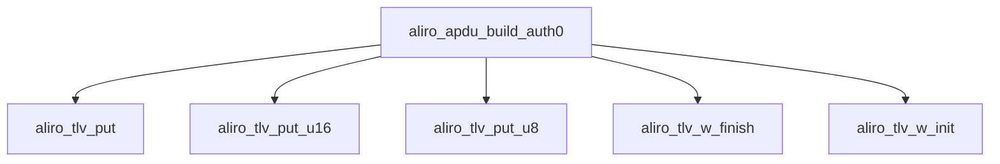

<!-- generated documentation — edit the source, not this file -->
# `modules/woz_aliro/src/aliro_apdu.c`

Aliro APDU TLV codec: builds command payloads (AUTH0, AUTH1, AuthData, EXCHANGE) and parses
response APDUs, plus BLE envelope framing/unframing and ISO7816 APDU wrap/status-word stripping.
Provides a minimal BER-TLV writer (aliro_tlv_w_init/put/finish) used to assemble command
payloads, and TLV/APDU parsing helpers used to extract fields from device responses.

**depends on** [`modules/woz_aliro/src/aliro_apdu.h`](aliro_apdu.h.md)  ·  **discussed in** [`ports/esp32/components/aliro_reader/README.md`](../../../ports/esp32/components/aliro_reader/README.md)

## API

### `void aliro_tlv_w_init(struct aliro_tlv_w *w, uint8_t *buf, size_t cap)`
`modules/woz_aliro/src/aliro_apdu.c:23`

Initializes a TLV writer to append into buf, with capacity cap and no error latched.
Must be called before any aliro_tlv_put / aliro_tlv_put_empty / w_byte calls on w.

**called by** `aliro_apdu_build_auth0`, `aliro_apdu_build_auth1`, `aliro_apdu_build_authdata`, `aliro_apdu_build_exchange`

### `static void w_byte(struct aliro_tlv_w *w, uint8_t b)`
`modules/woz_aliro/src/aliro_apdu.c:34`

Appends a single byte to the TLV writer's buffer.
If the buffer is already full (len >= cap), sets w->err and writes nothing; callers must check
w->err after a write sequence rather than after each byte.

**called by** `aliro_tlv_put`, `aliro_tlv_put_empty`, `w_len`

### `static void w_len(struct aliro_tlv_w *w, size_t len)`
`modules/woz_aliro/src/aliro_apdu.c:45`

Encode and append a BER-TLV length field to the writer: single byte if len < 0x80, 0x81 + one
length byte if len <= 0xff, otherwise 0x82 + two big-endian length bytes.

**called by** `aliro_tlv_put`, `aliro_tlv_put_empty`  ·  **calls** `w_byte`

### `void aliro_tlv_put(struct aliro_tlv_w *w, uint8_t tag, const uint8_t *val, size_t len)`
`modules/woz_aliro/src/aliro_apdu.c:60`

Append a complete TLV item (tag byte, encoded length, then len bytes of val) to the writer.

**called by** `aliro_apdu_build_auth0`, `aliro_apdu_build_auth1`, `aliro_apdu_build_authdata`, `aliro_tlv_put_u16`, `aliro_tlv_put_u8`  ·  **calls** `w_byte`, `w_len`

### `void aliro_tlv_put_u8(struct aliro_tlv_w *w, uint8_t tag, uint8_t v)`
`modules/woz_aliro/src/aliro_apdu.c:70`

Append a TLV item whose value is the single byte v.

**called by** `aliro_apdu_build_auth0`, `aliro_apdu_build_auth1`  ·  **calls** `aliro_tlv_put`

### `void aliro_tlv_put_u16(struct aliro_tlv_w *w, uint8_t tag, uint16_t v)`
`modules/woz_aliro/src/aliro_apdu.c:76`

Append a TLV item whose 2-byte value is v encoded big-endian.

**called by** `aliro_apdu_build_auth0`, `aliro_apdu_build_exchange`  ·  **calls** `aliro_tlv_put`

### `static int tlv_read(const uint8_t *buf, size_t buf_len, size_t *pos, uint8_t *tag, const uint8_t **val, size_t *val_len)`
`modules/woz_aliro/src/aliro_apdu.c:101`

Read one item at *pos. On success advance *pos and set tag/val/len.

**called by** `aliro_tlv_find`

### `int aliro_tlv_find(const uint8_t *buf, size_t buf_len, uint8_t tag, const uint8_t **val, size_t *val_len)`
`modules/woz_aliro/src/aliro_apdu.c:139`

Find the first item with tag; returns 0 and sets val/len, or -1 if absent.

**called by** `aliro_apdu_parse_auth0_response`, `aliro_apdu_parse_auth1_response`  ·  **calls** `tlv_read`

### `int aliro_apdu_build_auth0(uint8_t exp_phase, uint8_t user_policy, uint16_t version, const uint8_t reader_eph_pub[65], const uint8_t txid[16], const uint8_t reader_id[32], uint8_t *out, size_t cap, size_t *out_len)`
`modules/woz_aliro/src/aliro_apdu.c:155`

---- command builders (out receives the raw APDU payload, no envelope) ----

**calls** `aliro_tlv_put`, `aliro_tlv_put_u16`, `aliro_tlv_put_u8`, `aliro_tlv_w_finish`, `aliro_tlv_w_init`

### `int aliro_apdu_build_auth1(uint8_t cred_type, const uint8_t sig[64], uint8_t *out, size_t cap, size_t *out_len)`
`modules/woz_aliro/src/aliro_apdu.c:178`

Build the AUTH1 command TLV: a 1-byte credential-type/exp-phase tag followed by the 64-byte
ECDSA signature. Writes into out (capacity cap) and sets *out_len via aliro_tlv_w_finish.
Returns whatever aliro_tlv_w_finish returns (0 on success, nonzero on writer overflow).

**calls** `aliro_tlv_put`, `aliro_tlv_put_u8`, `aliro_tlv_w_finish`, `aliro_tlv_w_init`

### `int aliro_apdu_build_authdata(int which, const uint8_t reader_id[32], const uint8_t device_pubx[32], const uint8_t reader_eph_pubx[32], const uint8_t txid[16], uint8_t *out, size_t cap, size_t *out_len)`
`modules/woz_aliro/src/aliro_apdu.c:194`

Build the plaintext AuthData TLV blob used as the ECDSA signing/verification input for
AUTH0/AUTH1. Encodes reader_id, device_pubx, reader_eph_pubx, txid, and a 4-byte usage tag
selected by which (ALIRO_AUTH_READER vs. user/device usage), in that fixed order. Writes into out
(capacity cap) and sets *out_len via aliro_tlv_w_finish. Returns whatever aliro_tlv_w_finish
returns (0 on success, nonzero if the writer latched an overflow error).

**calls** `aliro_tlv_put`, `aliro_tlv_w_finish`, `aliro_tlv_w_init`

### `int aliro_apdu_build_exchange(int have_status, uint16_t reader_status, int ursk_ready, uint8_t *out, size_t cap, size_t *out_len)`
`modules/woz_aliro/src/aliro_apdu.c:210`

EXCHANGE command plaintext (sealed by the caller before framing).

**calls** `aliro_tlv_put_empty`, `aliro_tlv_put_u16`, `aliro_tlv_w_finish`, `aliro_tlv_w_init`

### `int aliro_apdu_wrap(uint8_t ins, const uint8_t *tlv, size_t tlv_len, uint8_t *out, size_t cap, size_t *out_len)`
`modules/woz_aliro/src/aliro_apdu.c:225`

Wrap a command TLV in an ISO7816 short-form APDU: "80 <ins> 00 00 Lc <tlv> Le"
(Le = 0x00 => up to 256 response bytes). ins is one of ALIRO_INS_*. The result
is the AP command payload to frame with type=ACCESS, opcode=AP_OP_COMMAND.

### `int aliro_apdu_strip_sw(const uint8_t *buf, size_t *len, uint16_t *sw)`
`modules/woz_aliro/src/aliro_apdu.c:248`

Drop the trailing ISO7816 status word (SW1 SW2) from an APDU response body.
Returns the SW via *sw (0x9000 = OK) and shortens *len, or -1 if too short.

### `int aliro_apdu_parse_auth0_response(const uint8_t *buf, size_t len, struct aliro_auth0_response *r)`
`modules/woz_aliro/src/aliro_apdu.c:266`

Parses an AUTH0 response APDU body, extracting the device's ephemeral public key and optional
cryptogram. buf/len is the APDU body with any status word already stripped. The device ephemeral
public key (tag ALIRO_TAG_DEVICE_PUBX) is mandatory and must be exactly 65 bytes; the cryptogram
(tag 0x9D) is optional and, if present, must be exactly 64 bytes. Returns 0 on success with *r
populated (zero-initialized first); returns -1 if the mandatory pubkey TLV is missing or has the
wrong length.

**calls** `aliro_tlv_find`

### `int aliro_apdu_parse_auth1_response(const uint8_t *buf, size_t len, struct aliro_auth1_response *r)`
`modules/woz_aliro/src/aliro_apdu.c:290`

Parses an AUTH1 response APDU body, extracting the device's signature and optional device public
key. buf/len is the APDU body with any status word already stripped. The device signature (tag
ALIRO_TAG_SIG) is mandatory and must be exactly 64 bytes; the device public key (tag
ALIRO_TAG_DEVICE_PUB) is optional and, if present, must be exactly 65 bytes. A signaling-bitmap
item at tag 0x91 is recognized but ignored. Returns 0 on success with *r populated
(zero-initialized first); returns -1 if the mandatory signature TLV is missing or has the wrong
length.

**calls** `aliro_tlv_find`

### `int aliro_ble_frame(uint8_t type, uint8_t opcode, const uint8_t *payload, size_t plen, uint8_t *out, size_t cap, size_t *out_len)`
`modules/woz_aliro/src/aliro_apdu.c:317`

Frames a payload into an Aliro BLE envelope: 1-byte type (top 2 bits masked off), 1-byte opcode,
2-byte big-endian payload length, followed by the payload. Returns 0 on success with *out_len set
to the total framed length; returns -1 if plen exceeds 0xFFFF or cap is too small to hold the
header plus payload.

### `int aliro_ble_unframe(const uint8_t *buf, size_t len, uint8_t *type, uint8_t *opcode, const uint8_t **payload, size_t *plen)`
`modules/woz_aliro/src/aliro_apdu.c:338`

Parses an Aliro BLE envelope, extracting the type, opcode, and a pointer/length into the payload
region of buf. The returned *payload points into buf; the caller must not use it beyond buf's
lifetime. Returns 0 on success; returns -1 if len is shorter than the envelope header, or the
encoded payload length would exceed the buffer.

Undocumented (2)

- `aliro_tlv_put_empty`
- `aliro_tlv_w_finish`

