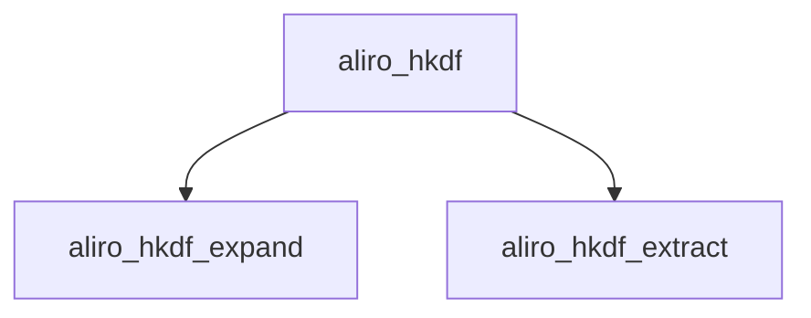

<!-- generated documentation — edit the source, not this file -->
# `modules/woz_aliro/src/aliro_hash.c`

Self-contained SHA-256, HMAC-SHA256, HKDF, and ANSI-X9.63 KDF implementation for the ESP32-IDF Aliro crypto port, with no external crypto library dependency.

**depends on** [`modules/woz_aliro/src/aliro_hash.h`](aliro_hash.h.md)  ·  **discussed in** [`ports/docs/esp-32-gotchas.md`](../../../ports/docs/esp-32-gotchas.md), [`ports/esp32-idf/components/aliro_crypto/README.md`](../../../ports/esp32-idf/components/aliro_crypto/README.md)

## API

### `static uint32_t ror32(uint32_t x, unsigned n)`
`modules/woz_aliro/src/aliro_hash.c:13`

Rotate a 32-bit word right by n bits.

**called by** `sha256_block`

### `static void sha256_block(uint32_t h[8], const uint8_t p[64])`
`modules/woz_aliro/src/aliro_hash.c:35`

Compresses one 64-byte message block into the running SHA-256 state h, per FIPS 180-4.
h: 8-word running hash state, updated in place.
p: 64-byte input block.

**called by** `aliro_sha256_update`  ·  **calls** `ror32`

### `void aliro_sha256_init(struct aliro_sha256 *s)`
`modules/woz_aliro/src/aliro_hash.c:83`

Initialize a streaming SHA-256 context with the FIPS 180-4 initial hash values.
Resets total byte count and internal buffer length to zero; must be called before feeding data.

**called by** `aliro_hkdf_expand`, `aliro_hmac_sha256`, `aliro_sha256`, `aliro_x963_kdf`

### `void aliro_sha256_update(struct aliro_sha256 *s, const void *data, size_t len)`
`modules/woz_aliro/src/aliro_hash.c:101`

Feeds len bytes of data into a streaming SHA-256 context, buffering a partial block and compressing full 64-byte blocks as they accumulate.
s: context to update; total byte count and internal buffer are updated in place.
data: bytes to hash; may be split across multiple calls.
len: number of bytes in data.

**called by** `aliro_hkdf_expand`, `aliro_hmac_sha256`, `aliro_sha256`, `aliro_sha256_final`, `aliro_x963_kdf`  ·  **calls** `sha256_block`

### `void aliro_sha256_final(struct aliro_sha256 *s, uint8_t out[ALIRO_SHA256_LEN])`
`modules/woz_aliro/src/aliro_hash.c:135`

Finalizes a streaming SHA-256 computation, applying FIPS 180-4 padding and the big-endian bit-length suffix, and writes the 32-byte digest to out.
s: context to finalize; consumed by this call, must not be reused afterward without re-initializing.
out: 32-byte buffer that receives the digest.

**called by** `aliro_hkdf_expand`, `aliro_hmac_sha256`, `aliro_sha256`, `aliro_x963_kdf`  ·  **calls** `aliro_sha256_update`

### `void aliro_hmac_sha256(const uint8_t *key, size_t key_len, const void *msg, size_t msg_len, uint8_t out[ALIRO_SHA256_LEN])`
`modules/woz_aliro/src/aliro_hash.c:168`

HMAC-SHA256 (RFC 2104). out is 32 bytes.

**called by** `aliro_hkdf_extract`  ·  **calls** `aliro_sha256`, `aliro_sha256_final`, `aliro_sha256_init`, `aliro_sha256_update`

### `void aliro_hkdf_extract(const uint8_t *salt, size_t salt_len, const uint8_t *ikm, size_t ikm_len, uint8_t prk[ALIRO_SHA256_LEN])`
`modules/woz_aliro/src/aliro_hash.c:197`

HKDF-SHA256 (RFC 5869).
extract: PRK = HMAC(salt, ikm); salt==NULL uses a 32-byte zero salt.
expand:  OKM = T(1)|T(2)|... truncated to out_len (<= 255*32).
Returns 0 on success, -1 on a bad length.

**called by** `aliro_hkdf`  ·  **calls** `aliro_hmac_sha256`

### `int aliro_hkdf_expand(const uint8_t prk[ALIRO_SHA256_LEN], const uint8_t *info, size_t info_len, uint8_t *out, size_t out_len)`
`modules/woz_aliro/src/aliro_hash.c:216`

HKDF-SHA256 expand step (RFC 5869): derives out_len bytes of output keying material from a pseudorandom key and context info.
prk: 32-byte pseudorandom key, typically from aliro_hkdf_extract.
info: context/application-specific info bytes, may be NULL if info_len is 0.
info_len: length of info in bytes.
out: buffer that receives out_len bytes of derived key material.
out_len: number of bytes to produce; must not exceed 255 * 32 bytes (255 * ALIRO_SHA256_LEN).
Returns 0 on success, or -1 if out_len exceeds the RFC 5869 maximum.

**called by** `aliro_hkdf`  ·  **calls** `aliro_sha256_final`, `aliro_sha256_init`, `aliro_sha256_update`

### `int aliro_hkdf(const uint8_t *salt, size_t salt_len, const uint8_t *ikm, size_t ikm_len, const uint8_t *info, size_t info_len, uint8_t *out, size_t out_len)`
`modules/woz_aliro/src/aliro_hash.c:273`

HKDF-SHA256 (RFC 5869): extracts a pseudorandom key from salt and input keying material, then expands it to out_len bytes of output.
salt: salt bytes for the extract step.
salt_len: length of salt in bytes.
ikm: input keying material.
ikm_len: length of ikm in bytes.
info: context/application-specific info bytes for the expand step.
info_len: length of info in bytes.
out: buffer that receives out_len bytes of derived key material.
out_len: number of bytes to produce; must not exceed 255 * 32 bytes, per aliro_hkdf_expand.
Returns 0 on success, or -1 if out_len exceeds the RFC 5869 maximum.

**calls** `aliro_hkdf_expand`, `aliro_hkdf_extract`

### `int aliro_x963_kdf(const uint8_t *z, size_t z_len, const uint8_t *info, size_t info_len, uint8_t *out, size_t out_len)`
`modules/woz_aliro/src/aliro_hash.c:283`

ANSI-X9.63 KDF (SEC1 v2 KDF2), SHA-256 variant:
OKM = Hash(Z | counter_be32=1 | info) | Hash(Z | counter=2 | info) | ...
truncated to out_len. Returns 0 on success, -1 on a bad length.

**calls** `aliro_sha256_final`, `aliro_sha256_init`, `aliro_sha256_update`

### `void aliro_sha256_init(struct aliro_sha256 *s)`
`modules/woz_aliro/src/aliro_hash.c:293`

Initialize a streaming SHA-256 context with the FIPS 180-4 initial hash values.
Resets total byte count and internal buffer length to zero; must be called before feeding data.

**called by** `aliro_hmac_sha256`  ·  **calls** `aliro_sha256_final`, `aliro_sha256_init`, `aliro_sha256_update`
