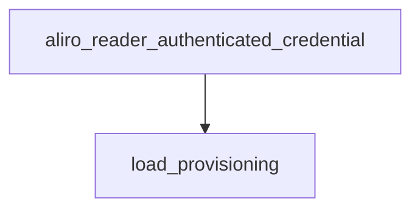

<!-- generated documentation — edit the source, not this file -->
# `modules/woz_aliro/src/aliro_reader.c`

Aliro reader engine: drives the Access Protocol (AUTH0/AUTH1/EXCHANGE) handshake over BLE,
manages reader identity and credential trust provisioning in NVS, and arms UWB ranging once
a session is authenticated. Maintains a fixed-size table of per-connection sessions tracking
transaction phase and secure-channel state, and exposes start/attach entry points for both
standalone and Matter-attached BLE transports, plus provisioning and diagnostic APIs used by
Matter commissioning and the bench console.

**depends on** [`modules/woz_aliro/include/aliro_ble.h`](../modules.woz_aliro.include/aliro_ble.h.md), [`modules/woz_aliro/include/aliro_crypto.h`](../modules.woz_aliro.include/aliro_crypto.h.md), [`modules/woz_aliro/include/aliro_lat.h`](../modules.woz_aliro.include/aliro_lat.h.md), [`modules/woz_aliro/include/aliro_prim.h`](../modules.woz_aliro.include/aliro_prim.h.md), [`modules/woz_aliro/include/aliro_prov.h`](../modules.woz_aliro.include/aliro_prov.h.md), [`modules/woz_aliro/include/aliro_reader.h`](../modules.woz_aliro.include/aliro_reader.h.md), [`modules/woz_aliro/src/aliro_apdu.h`](aliro_apdu.h.md), [`modules/woz_aliro/src/aliro_ranging.h`](aliro_ranging.h.md), [`modules/woz_port/include/woz_log.h`](../modules.woz_port.include/woz_log.h.md), [`modules/woz_port/include/woz_port.h`](../modules.woz_port.include/woz_port.h.md)  ·  **discussed in** [`docs/esp32-gotchas.md`](../../esp32-gotchas.md), [`ports/esp32/components/aliro_reader/README.md`](../../../ports/esp32/components/aliro_reader/README.md)

## API

### `static void compute_reader_group_x(void)`
`modules/woz_aliro/src/aliro_reader.c:82`

Recover the reader group key X from the provisioned signingKey. Call after any
mutation of s_id. Leaves s_have_group_x=false (and logs) on failure.

**called by** `aliro_reader_provision_clear`, `aliro_reader_provision_identity`, `load_provisioning`

### `static const char *phase_str(enum txn_phase p)`
`modules/woz_aliro/src/aliro_reader.c:117`

Returns a human-readable name for a transaction phase enum value, or "?" for an unrecognized
value.

**called by** `on_disconnected`, `transaction_feed`

### `static struct aliro_session`
`modules/woz_aliro/src/aliro_reader.c:144`

One credential-auth transaction, keyed by BLE connection handle. Holds the
reader's ephemeral keypair and the transcript inputs (txid, device pubkey, Z)
that derive the two secure channels and the URSK, so everything a transaction
needs between AUTH0 and ranging setup lives here. Cleared on disconnect;
ALIRO_MAX_SESSIONS of them are statically allocated.

### `static struct aliro_session *session_find(uint16_t conn_handle)`
`modules/woz_aliro/src/aliro_reader.c:168`

Finds the active session matching the given BLE connection handle.
Returns a pointer to the matching session, or NULL if no active session has that conn_handle.

**called by** `on_data`, `on_disconnected`

### `static struct aliro_session *session_alloc(uint16_t conn_handle)`
`modules/woz_aliro/src/aliro_reader.c:181`

Allocates and returns the first inactive slot in the fixed-size session table for a new
connection, initializing it to phase PH_IDLE. Returns NULL if all ALIRO_MAX_SESSIONS slots are
already active.

**called by** `on_connected`

### `static void load_provisioning(void)`
`modules/woz_aliro/src/aliro_reader.c:199`

Loads the reader's provisioning state (identity, trust anchors) from NVS into the module-level
s_id/s_trust, lazily creating the provisioning mutex on first call. Idempotent: does nothing on
subsequent calls once s_loaded is set. Logs whether a dev-default or real identity was loaded and
its source (NVS vs. dev default), then recomputes the reader group X coordinate.

**called by** `aliro_reader_authenticated_credential`, `aliro_reader_prov_print`, `aliro_reader_provision_add_trust`, `aliro_reader_provision_clear`, `aliro_reader_provision_identity`, `aliro_reader_trust_clear`, `aliro_reader_trust_last`, `reader_engine_init`  ·  **calls** `compute_reader_group_x`

### `static int send_ap_command(uint16_t conn, uint8_t ins, const uint8_t *tlv, size_t len)`
`modules/woz_aliro/src/aliro_reader.c:226`

Frame + send an Access-Protocol command: wrap the command TLV in an ISO7816
APDU (ins selects AUTH0/AUTH1/EXCHANGE), then a BLE Access frame
(type=ACCESS, opcode=AP_OP_COMMAND). The command byte lives in the APDU INS,
NOT the BLE opcode — the phone rejects a raw TLV under opcode=INS.

**called by** `on_auth0_response`, `on_auth1_response`, `start_auth`

### `static void start_auth(struct aliro_session *s)`
`modules/woz_aliro/src/aliro_reader.c:272`

Kick the reader-driven access protocol: ephemeral keys + txid -> AUTH0.

**called by** `transaction_feed`  ·  **calls** `send_ap_command`

### `static void on_auth0_response(struct aliro_session *s, const uint8_t *pl, size_t len)`
`modules/woz_aliro/src/aliro_reader.c:311`

Handles an inbound AUTH0Response: strips the APDU status word, parses the device's ephemeral
public key, performs ECDH with the reader's ephemeral private key, derives the KDF intermediate
z, signs the reader-usage transcript, and sends AUTH1. On any failure (short/malformed APDU,
parse failure, ECDH failure, signing failure) sets s->phase to PH_FAILED and returns without
sending. On success sets s->phase to PH_SENT_AUTH1 after sending the AUTH1 command. Logs (does
not fail on) an unexpected status word other than 0x9000.

**called by** `transaction_feed`  ·  **calls** `send_ap_command`

### `static void on_auth1_response(struct aliro_session *s, const uint8_t *pl, size_t len)`
`modules/woz_aliro/src/aliro_reader.c:377`

Handles an inbound AUTH1Response: derives the AP and BLE-ranging secure channel keys and URSK
from the ECDH intermediate, decrypts and parses the response, verifies the device's signature,
checks trust, and sends EXCHANGE. Requires the reader group X coordinate to already be available
(s_have_group_x); fails otherwise. Derives the session salt and 160-byte key block, splits it
into the AP channel keys and URSK, and separately derives the BLE ranging-channel keys from the
block's BleSK segment using a versions-based salt; both secure channels are initialized with
counters starting at 1. Decrypts the AUTH1Response body via AES-GCM and fails on tag mismatch
(indicating a key/counter/framing error), oversized ciphertext, or parse failure. Verifies the
device's signature over the device-usage transcript using the presented device public key if
available, else the device's ephemeral public key; a bad signature fails the session. Records the
presented credential key under s_prov_lock and checks it against the trust store: an untrusted
key fails the session unless the reader identity is the dev default (which accepts and warns). On
success, seals and sends the EXCHANGE command, sets s->phase to PH_SENT_EXCHANGE, and logs the
derived URSK; on any failure path sets s->phase to PH_FAILED and returns without sending
EXCHANGE.

**called by** `transaction_feed`  ·  **calls** `send_ap_command`

### `static void on_exchange_response(struct aliro_session *s, const uint8_t *pl, size_t len)`
`modules/woz_aliro/src/aliro_reader.c:566`

Handle the EXCHANGE response, then complete the AP and arm ranging. The body is
an AP (proto-0) response on the ExpeditedSK channel: <ct || 16B tag> SW1SW2.

**called by** `transaction_feed`

### `static void reader_status_send_on_host(bool unsecured)`
`modules/woz_aliro/src/aliro_reader.c:638`

Reader Status Changed (Aliro transaction step 23): the reader->phone grant/relock
confirmation that fires the iPhone Wallet unlock animation. proto-2 (Notification)
message-id 0x02, one State Attribute (id 0x00, len 2) = [OperationSource,
ReaderStateByte]. OperationSource 0x04 = this user device in the BLE+UWB Aliro flow;
ReaderStateByte Unsecured 0x01 = granted (animate), Secured 0x00 = relocked. The
65-byte access-credential public key is NOT serialized (the reference uses it only
to select which connection to notify). Plaintext the BleSK channel then seals:
[02][02][00 04][00 02 04 <state>]. Runs on the BLE-host task (posted via
aliro_ble_post_reader_status) so it serializes with the other sc_ble seals.

### `void aliro_reader_notify_unlock(bool unsecured)`
`modules/woz_aliro/src/aliro_reader.c:673`

Sends a Reader-Status BLE notification reporting the lock's unsecured/secured state to the
connected device. unsecured is true if the reader/lock is currently unsecured (unlocked), false
if secured.

### `bool aliro_reader_authenticated_credential(uint8_t out[ALIRO_CRED_PUB_LEN])`
`modules/woz_aliro/src/aliro_reader.c:681`

Copies the credential public key that most recently passed the trust check into out.
Returns true if a credential has authenticated since boot (out written), false otherwise
(out untouched). Safe to call from any task.

**calls** `load_provisioning`

### `static size_t capture_a5_tlv(const uint8_t *pl, size_t pl_len, uint8_t *out, size_t cap)`
`modules/woz_aliro/src/aliro_reader.c:701`

Scan an op-0x05 Initiate-Access-Protocol payload for the phone's 0xA5
proprietary-information TLV (short-form BER length; the A5 value is small) and
copy the whole TLV (tag+len+value) into out. Returns the stored length, or 0
if no well-formed 0xA5 TLV fits.

**called by** `transaction_feed`

### `static void transaction_feed(struct aliro_session *s, const uint8_t *data, uint16_t len)`
`modules/woz_aliro/src/aliro_reader.c:719`

Consume one inbound Aliro transaction SDU.

**called by** `on_data`  ·  **calls** `capture_a5_tlv`, `on_auth0_response`, `on_auth1_response`, `on_exchange_response`, `phase_str`, `start_auth`

### `static void on_connected(uint16_t conn_handle)`
`modules/woz_aliro/src/aliro_reader.c:814`

BLE connection-established callback: allocates a session slot for the new connection.
Logs an error and returns without effect if no free session slot is available.

**calls** `session_alloc`

### `static void on_disconnected(uint16_t conn_handle)`
`modules/woz_aliro/src/aliro_reader.c:828`

BLE disconnection callback: marks the connection's session inactive (if one exists) and
stops any UWB ranging associated with the connection.
Logs the session's message count and final transaction phase before deactivating it.

**calls** `phase_str`, `session_find`, `spare_eph_refill`

### `static void on_data(uint16_t conn_handle, const uint8_t *data, uint16_t len)`
`modules/woz_aliro/src/aliro_reader.c:848`

BLE data-received callback: looks up the session for conn_handle and feeds the data into its
transaction state machine.
Logs a warning and drops the data if no active session exists for conn_handle.

**calls** `session_find`, `transaction_feed`

### `static struct aliro_ble_config make_ble_cfg(void)`
`modules/woz_aliro/src/aliro_reader.c:862`

The reader's BLE transport config: advertised versions/features + the
transaction transport callbacks. Shared by the standalone + attached starts.

**called by** `aliro_reader_ble_prepare`, `aliro_reader_start`

### `static int reader_engine_init(void)`
`modules/woz_aliro/src/aliro_reader.c:884`

crypto + provisioning load + UWB ranging setup, shared by both start paths.

**called by** `aliro_reader_start`, `aliro_reader_start_attached`  ·  **calls** `load_provisioning`, `spare_eph_refill`

### `int aliro_reader_start(void)`
`modules/woz_aliro/src/aliro_reader.c:902`

Starts the Aliro reader: initializes the engine (crypto, provisioning, UWB ranging) and brings up
the BLE transport using the default advertising config. Returns 0 on success; returns -1 if
engine initialization fails, or the underlying aliro_ble_start result otherwise.

**calls** `make_ble_cfg`, `reader_engine_init`

### `const void *aliro_reader_ble_prepare(void)`
`modules/woz_aliro/src/aliro_reader.c:920`

Prepares the BLE transport and returns the Aliro GATT service definition for external
registration, without starting the transport. Returns NULL if aliro_ble_prepare fails; on success
returns the pointer from aliro_ble_service_def(), owned by the BLE layer.

**calls** `make_ble_cfg`

### `int aliro_reader_start_attached(void)`
`modules/woz_aliro/src/aliro_reader.c:937`

Starts the Aliro reader in "attached" transport mode: initializes the engine, applies provisioned
resolvable advertising parameters if a real GRK is present, then starts the attached BLE
transport. Unlike aliro_reader_start, this applies GRK-based advertising params (group/subgroup
ID from reader_id, GRK) before starting, when the reader has already been provisioned; falls back
to unresolvable advertising if no GRK is set yet. Returns 0 on success; returns -1 if engine
initialization fails, or the underlying aliro_ble_start_attached result otherwise.

**calls** `reader_engine_init`

### `void aliro_reader_refresh_adv(void)`
`modules/woz_aliro/src/aliro_reader.c:974`

Refreshes the BLE advertisement to include the resolvable service data once a real
GroupResolvingKey (GRK) is available. Handles the case where Matter provisioning
(SetAliroReaderConfig) lands after advertising has already started with only the bare 0xFFF2 UUID
(dev default, all-zero GRK), which the phone cannot resolve. No-ops if the GRK in s_id is still
all-zero. On a nonzero GRK, derives the two-byte subgroup ID from reader_id[16..17] and calls
aliro_ble_set_adv_params + aliro_ble_readvertise to make the reader approach-resolvable.

### `void aliro_reader_prov_print(void)`
`modules/woz_aliro/src/aliro_reader.c:1005`

Print the reader's provisioning state (identity, trust anchors, last presented credential)
to the console for diagnostics.
Loads provisioning first, then snapshots the shared state under s_prov_lock before printing
so UART I/O does not hold the lock during the BLE task's trust check.

**calls** `load_provisioning`

### `int aliro_reader_trust_last(void)`
`modules/woz_aliro/src/aliro_reader.c:1049`

Add the most recently presented credential's public key to the trust store and persist it.
Returns 1 if no credential has been presented yet or it is already trusted (nothing
persisted), -1 if the store is full or the NVS write fails (in-memory trust store left
unchanged on failure), 0 if newly added and committed.

**calls** `load_provisioning`

### `int aliro_reader_trust_clear(void)`
`modules/woz_aliro/src/aliro_reader.c:1092`

Empty the trust store and persist the empty store, keeping the reader identity.
Returns 1 if the store was already empty (nothing persisted), -1 if the NVS write fails
(in-memory trust store left unchanged), 0 if cleared and committed.
Every re-pair mints a fresh credential and nothing evicts the old ones, so the store
reaches ALIRO_TRUST_MAX and refuses the key currently being presented. A Matter factory
reset does not touch this namespace, so without this the only way out is erasing NVS.

**calls** `load_provisioning`

### `int aliro_reader_provision_identity(const uint8_t reader_id[ALIRO_READER_ID_LEN], const uint8_t sign_priv[ALIRO_READER_PRIV_LEN], const uint8_t grk[ALIRO_GRK_LEN])`
`modules/woz_aliro/src/aliro_reader.c:1126`

Store a Matter-provisioned reader identity (reader ID, signing private key, GRK), keeping
any trust anchors already present, and persist it to NVS.
Returns -1 if the NVS write fails, in which case in-memory identity (s_id) is unchanged;
returns 0 on success, after which the reader group key salt is recomputed via
compute_reader_group_x since the signing key changed.

**calls** `compute_reader_group_x`, `load_provisioning`

### `int aliro_reader_provision_add_trust(const uint8_t cred_pub[ALIRO_CRED_PUB_LEN])`
`modules/woz_aliro/src/aliro_reader.c:1159`

Add a Matter-provisioned credential public key to the reader's trust store and persist it.
Returns 0 if newly added and stored, 1 if the credential was already trusted (nothing
persisted), -1 if the store is full, cred_pub is not a valid P-256 point, or the NVS write
fails. On failure the in-memory trust store (s_trust) is left unchanged.

**calls** `load_provisioning`

### `int aliro_reader_provision_clear(void)`
`modules/woz_aliro/src/aliro_reader.c:1193`

Revert the reader's provisioning to the default dev identity and empty trust store, and
persist that state to NVS.
Returns -1 if the NVS write fails, in which case in-memory state is unchanged; returns 0 on
success, after which the reader group key salt is recomputed via compute_reader_group_x.

**calls** `compute_reader_group_x`, `load_provisioning`

Undocumented (1)

- `spare_eph_refill`

