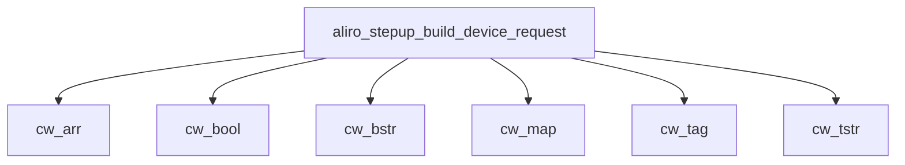

<!-- generated documentation — edit the source, not this file -->
# `modules/woz_aliro/src/aliro_stepup.c`

Aliro step-up phase codec + verifier: derives the StepUpSK SessionData keys, builds the mdoc
DeviceRequest and its ENVELOPE/GET RESPONSE APDUs, seals/opens SessionData over the aliro_secchan
AES-256-GCM channel, and runs the six-step Access Document verification of spec 7.4. The ES256
primitive is injected (verify ctx) so this unit carries no elliptic-curve dependency.

**depends on** [`modules/woz_aliro/include/aliro_crypto.h`](../modules.woz_aliro.include/aliro_crypto.h.md), [`modules/woz_aliro/include/aliro_stepup.h`](../modules.woz_aliro.include/aliro_stepup.h.md), [`modules/woz_aliro/src/aliro_hash.h`](aliro_hash.h.md)

## API

### `static size_t build_sig_structure(const struct aliro_stepup_doc *doc, uint8_t *out, size_t cap)`
`modules/woz_aliro/src/aliro_stepup.c:277`

Build the COSE Sig_structure ["Signature1", protected, ext_aad(empty), payload]
that the IssuerAuth ES256 signature covers. Returns the length or 0 on error.

**called by** `aliro_stepup_verify`  ·  **calls** `cw_arr`, `cw_bstr`, `cw_tstr`

### `static int x5chain_ee_pubkey(const uint8_t *x5, size_t n, uint8_t pub[65])`
`modules/woz_aliro/src/aliro_stepup.c:295`

Extract a P-256 end-entity public key from an x5chain: scan for the SPKI
uncompressed-point marker `03 42 00 04` (BIT STRING, 66 bytes, 0 unused, 0x04)
and take the following 64 bytes as X||Y. Bounded; no full DER parse.

**called by** `select_issuer`

Undocumented (20)

- `aliro_stepup_derive_keys`
- `aliro_stepup_channel_init`
- `cw`
- `cw_raw`
- `cw_type`
- `cw_map`
- `cw_arr`
- `cw_tstr`
- `cw_bstr`
- `cw_tag`
- `cw_bool`
- `aliro_stepup_build_device_request`
- `aliro_stepup_seal_sessiondata`
- `aliro_stepup_open_sessiondata`
- `aliro_stepup_build_envelope`
- `aliro_stepup_build_get_response`
- `select_issuer`
- `find_digest`
- `aliro_stepup_verify`
- `aliro_stepup_run`

