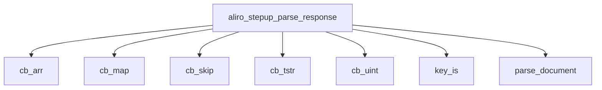

<!-- generated documentation — edit the source, not this file -->
# `modules/woz_aliro/src/aliro_stepup_parse.c`

DeviceResponse structural decoder for the Aliro step-up phase: a minimal, bounds-checked,
depth-limited CBOR reader (definite-length core-deterministic only) plus the Table 8-22/7-1/7-2
field walk. No crypto and no allocation; every parsed field is a slice of the caller's buffer.
This is the wire-facing attack surface and is fuzzed on its own (tests/host/fuzz/fuzz_stepup.c).

**depends on** [`modules/woz_aliro/include/aliro_stepup.h`](../modules.woz_aliro.include/aliro_stepup.h.md)

## API

### `static int cb_head(struct cbor *c, uint8_t *mt, uint64_t *arg)`
`modules/woz_aliro/src/aliro_stepup_parse.c:30`

Read one CBOR head: major type + argument. Consumes the argument bytes (and,
for major type 7, the simple/float payload). Rejects indefinite lengths and
anything truncated. Returns 0 on success.

**called by** `cb_bool`, `cb_expect`, `cb_int_key`, `cb_skip_d`

### `static int cb_int_key(struct cbor *c, int64_t *v)`
`modules/woz_aliro/src/aliro_stepup_parse.c:157`

Read a signed integer map key (uint or nint).

**called by** `parse_issuer_auth`  ·  **calls** `cb_head`

### `static void str_copy(char *dst, size_t cap, const uint8_t *s, size_t n)`
`modules/woz_aliro/src/aliro_stepup_parse.c:194`

Copy a text string into a fixed char buffer (NUL-terminated, truncated).

**called by** `parse_document`, `parse_mso`, `parse_name_spaces`, `parse_one_item`

### `static int key_is(const uint8_t *s, size_t n, char c)`
`modules/woz_aliro/src/aliro_stepup_parse.c:203`

Match a 1-byte text key "1".."9" without allocating.

**called by** `aliro_stepup_parse_response`, `parse_document`, `parse_issuer_signed`, `parse_mso`, `parse_one_item`, `parse_validity`

### `static int64_t days_from_civil(int64_t y, unsigned m, unsigned d)`
`modules/woz_aliro/src/aliro_stepup_parse.c:220`

days since 1970-01-01 for a proleptic-Gregorian civil date (Hinnant).

**called by** `tdate_epoch`

### `static int tdate_epoch(const uint8_t *s, size_t n, int64_t *epoch)`
`modules/woz_aliro/src/aliro_stepup_parse.c:232`

Parse "YYYY-MM-DDTHH:MM:SSZ" (20 chars). Returns 0 and *epoch, else -1.

**called by** `parse_validity`  ·  **calls** `days_from_civil`, `digit2`

Undocumented (22)

- `cbor`
- `cb_skip_d`
- `cb_skip`
- `cb_expect`
- `cb_map`
- `cb_arr`
- `cb_uint`
- `cb_bytes`
- `cb_bstr`
- `cb_tstr`
- `cb_bool`
- `cb_tag`
- `digit2`
- `parse_validity`
- `parse_value_digests`
- `parse_mso`
- `parse_issuer_auth`
- `parse_one_item`
- `parse_name_spaces`
- `parse_issuer_signed`
- `parse_document`
- `aliro_stepup_parse_response`

