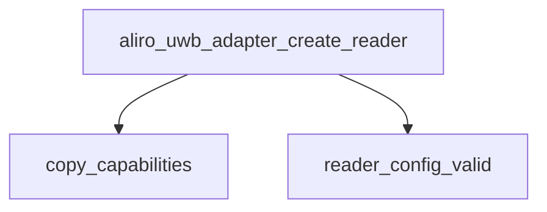

<!-- generated documentation — edit the source, not this file -->
# `modules/woz_uwb/src/aliro/aliro_uwb_adapter.c`

@file aliro_uwb_adapter.c — reader-context lifecycle.

**depends on** [`modules/woz_port/include/woz_log.h`](../modules.woz_port.include/woz_log.h.md), [`modules/woz_uwb/src/aliro/aliro_uwb_internal.h`](aliro_uwb_internal.h.md), [`modules/woz_uwb/src/aliro/include/aliro_uwb_adapter/aliro_uwb_adapter.h`](../modules.woz_uwb.src.aliro.include.aliro_uwb_adapter/aliro_uwb_adapter.h.md), [`modules/woz_uwb/src/aliro/include/cherry/cherry_ccc.h`](../modules.woz_uwb.src.aliro.include.cherry/cherry_ccc.h.md), [`modules/woz_uwb/src/facade/woz_alloc.h`](../modules.woz_uwb.src.facade/woz_alloc.h.md)

## API

### `enum aliro_uwb_err cherry_err_to_aliro(enum cherry_err err)`
`modules/woz_uwb/src/aliro/aliro_uwb_adapter.c:21`

@brief Map a CCC error code to its Aliro UWB equivalent, treating unknown errors as internal
failures.
@param err CCC error code to translate.
@return Corresponding `enum aliro_uwb_err` value, or `ALIRO_UWB_ERR_INTERNAL` if unrecognized.

### `static enum aliro_uwb_err copy_capabilities(struct aliro_uwb_adapter *adapter, struct cherry_core_event_device_capabilities *caps)`
`modules/woz_uwb/src/aliro/aliro_uwb_adapter.c:51`

@brief Deep-copy the device CCC capabilities into the adapter.
@param adapter Adapter whose `ccc_caps` field receives the copied capabilities.
@param caps Device capabilities event supplying the source CCC capabilities to copy.
@return `ALIRO_UWB_ERR_NONE` on success, or `ALIRO_UWB_ERR_INTERNAL` if the source capabilities
are missing or allocation fails.

**called by** `aliro_uwb_adapter_create_reader`

### `static bool reader_config_valid(const struct aliro_uwb_adapter_reader_config *config)`
`modules/woz_uwb/src/aliro/aliro_uwb_adapter.c:94`

@brief Validate that a reader configuration offers at least one valid hopping sequence and
respects configured bounds, returning false if invalid.
@param config Reader configuration to validate.
@return true if the configuration's hopping count is within bounds and includes a default
sequence, false otherwise.

**called by** `aliro_uwb_adapter_create_reader`

### `aliro_uwb_adapter_create_reader`
`modules/woz_uwb/src/aliro/aliro_uwb_adapter.c:117`

@brief Create a reader-mode adapter, copying the peer's CCC capabilities into it and
resolving the minimum RAN multiplier against the reader's own configuration.

**calls** `copy_capabilities`, `reader_config_valid`

### `void aliro_uwb_adapter_set_diagnostics(struct aliro_uwb_adapter *aliro_ctx, struct cherry_common_diag_cfg config)`
`modules/woz_uwb/src/aliro/aliro_uwb_adapter.c:160`

@brief Store a diagnostics configuration in the adapter for later application to CCC sessions,
allocating storage if needed.

### `void aliro_uwb_adapter_destroy(struct aliro_uwb_adapter *aliro_ctx)`
`modules/woz_uwb/src/aliro/aliro_uwb_adapter.c:179`

@brief Destroy an Aliro UWB adapter, freeing all associated CCC capabilities arrays and
diagnostic configuration.
