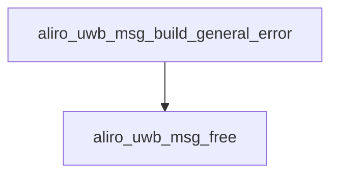

<!-- generated documentation — edit the source, not this file -->
# `modules/woz_uwb/src/aliro/aliro_uwb_msg.c`

@file aliro_uwb_msg.c — setup/notification message codec.

**depends on** [`modules/woz_port/include/woz_log.h`](../modules.woz_port.include/woz_log.h.md), [`modules/woz_uwb/src/aliro/aliro_uwb_msg.h`](aliro_uwb_msg.h.md), [`modules/woz_uwb/src/aliro/aliro_uwb_msg_builder.h`](aliro_uwb_msg_builder.h.md), [`modules/woz_uwb/src/aliro/aliro_uwb_msg_parser.h`](aliro_uwb_msg_parser.h.md), [`modules/woz_uwb/src/aliro/aliro_uwb_msg_spec.h`](aliro_uwb_msg_spec.h.md), [`modules/woz_uwb/src/aliro/include/aliro_uwb_adapter/aliro_uwb_adapter.h`](../modules.woz_uwb.src.aliro.include.aliro_uwb_adapter/aliro_uwb_adapter.h.md), [`modules/woz_uwb/src/ccc/aliro_round_config.h`](../modules.woz_uwb.src.ccc/aliro_round_config.h.md), [`modules/woz_uwb/src/facade/woz_alloc.h`](../modules.woz_uwb.src.facade/woz_alloc.h.md), [`modules/woz_uwb/src/facade/woz_util.h`](../modules.woz_uwb.src.facade/woz_util.h.md)  ·  **discussed in** [`docs/esp32-gotchas.md`](../../esp32-gotchas.md)

## API

### `void aliro_uwb_msg_free(struct aliro_uwb_message *message)`
`modules/woz_uwb/src/aliro/aliro_uwb_msg.c:64`

@brief Releases a message allocated by this layer's message builders.

**called by** `aliro_uwb_msg_build_general_error`, `aliro_uwb_msg_build_m1`, `aliro_uwb_msg_build_m3`, `aliro_uwb_msg_build_suspend_response`, `aliro_uwb_msg_build_suspend_resume_request`

### `struct aliro_uwb_message *aliro_uwb_msg_build_m1(struct aliro_uwb_session *session)`
`modules/woz_uwb/src/aliro/aliro_uwb_msg.c:77`

@brief Builds the M1 ranging-session-setup message advertising configuration IDs, pulse-shape
combos, channel bitmask, and session ID.
@param session Session whose Aliro capabilities and session ID populate the message.
@return Newly allocated M1 message, or NULL if builder init or attribute encoding fails.

**calls** `aliro_uwb_msg_free`

### `static struct aliro_uwb_message *aliro_uwb_msg_build_m3(struct aliro_uwb_session *session)`
`modules/woz_uwb/src/aliro/aliro_uwb_msg.c:126`

@brief Builds the M3 ranging-parameters message, deriving RAN multiplier and
chaps-per-slot from the M2-negotiated durations and committing the reader's MAC mode.
@param session Session whose negotiated M2 config and reader settings populate the M3
attributes.
@return Newly allocated M3 message, or NULL if builder init or attribute encoding fails.

**called by** `handle_m2`  ·  **calls** `aliro_uwb_msg_free`

### `aliro_uwb_msg_build_suspend_resume_request`
`modules/woz_uwb/src/aliro/aliro_uwb_msg.c:200`

@brief Builds a suspend or resume request message carrying the session identifier.
@param session Session whose session ID is encoded into the message.
@param suspend True to build a suspend request, false to build a resume request.
@return Newly allocated request message, or NULL if builder init or attribute encoding
fails.

**calls** `aliro_uwb_msg_free`

### `aliro_uwb_msg_build_suspend_response`
`modules/woz_uwb/src/aliro/aliro_uwb_msg.c:235`

@brief Builds a suspend-response message carrying an accept or reject status.
@param session Unused; reserved for a consistent builder signature.
@param status Response status; must be ALIRO_UWB_RANGING_SERVICE_STATUS_ACCEPT or
ALIRO_UWB_RANGING_SERVICE_STATUS_REJECT.
@return Newly allocated suspend-response message, or NULL if status is invalid, or if
builder init or attribute encoding fails.

**called by** `handle_suspend_request`  ·  **calls** `aliro_uwb_msg_free`

### `struct aliro_uwb_message *aliro_uwb_msg_build_general_error(struct aliro_uwb_session *session, uint8_t error_code)`
`modules/woz_uwb/src/aliro/aliro_uwb_msg.c:274`

@brief Builds an Aliro general-error notification message carrying the given error code.
@param session Unused; reserved for a consistent builder signature.
@param error_code Error code to encode in the general-error notification attribute.
@return Newly allocated notification message, or NULL if builder init or attribute encoding
fails.

**calls** `aliro_uwb_msg_free`

### `uint8_t aliro_uwb_msg_protocol_header(const uint8_t *bytes)`
`modules/woz_uwb/src/aliro/aliro_uwb_msg.c:308`

@brief Extracts the protocol type from byte 0 of an Aliro message header.
@param bytes Pointer to the start of the raw message bytes.
@return The protocol type byte.

### `uint8_t aliro_uwb_msg_message_id(const uint8_t *bytes)`
`modules/woz_uwb/src/aliro/aliro_uwb_msg.c:319`

@brief Extracts the message type ID from byte 1 of an Aliro message header, used to dispatch
M1-M4 setup and ranging messages during parsing.
@param bytes Pointer to the start of the raw message bytes.
@return The message ID byte.

**called by** `aliro_uwb_msg_process_notification`, `aliro_uwb_msg_process_ranging`, `aliro_uwb_msg_process_supplementary`

### `uint16_t aliro_uwb_msg_payload_length(const uint8_t *bytes)`
`modules/woz_uwb/src/aliro/aliro_uwb_msg.c:330`

@brief Extracts the payload length from bytes 2-3 of an Aliro message header as a 16-bit
big-endian integer.
@param bytes Pointer to the start of the raw message bytes.
@return The payload length in bytes.

**called by** `aliro_uwb_msg_process_supplementary`

### `static enum aliro_uwb_err parse_config_id(struct aliro_uwb_session *session, struct aliro_uwb_msg_attribute *attr)`
`modules/woz_uwb/src/aliro/aliro_uwb_msg.c:344`

@brief Parses the UWB configuration ID attribute from M2 and stores it in the session config.
@param session Session whose config receives the parsed configuration ID.
@param attr Attribute to parse.
@return ALIRO_UWB_ERR_NONE on success, or ALIRO_UWB_ERR_MSG_MALFORMED if the value cannot be
read.

**called by** `parse_session_attribute`

### `static enum aliro_uwb_err parse_pulse_shape(struct aliro_uwb_session *session, struct aliro_uwb_msg_attribute *attr)`
`modules/woz_uwb/src/aliro/aliro_uwb_msg.c:363`

@brief Parses the pulse-shape-combo attribute from M2 and stores it in the session config.
@param session Session whose config receives the parsed pulse shape.
@param attr Attribute to parse.
@return ALIRO_UWB_ERR_NONE on success, or ALIRO_UWB_ERR_MSG_MALFORMED if the value cannot be
read.

**called by** `parse_session_attribute`

### `static enum aliro_uwb_err parse_session_id(struct aliro_uwb_session *session, struct aliro_uwb_msg_attribute *attr)`
`modules/woz_uwb/src/aliro/aliro_uwb_msg.c:383`

@brief Parses the session-identifier attribute from M2 and verifies it matches the session's
active session ID.
@param session Session whose session ID is checked against the parsed value.
@param attr Attribute to parse.
@return ALIRO_UWB_ERR_NONE on success, ALIRO_UWB_ERR_MSG_MALFORMED if the value cannot be read,
or ALIRO_UWB_ERR_INVALID_PARAMETER on a session ID mismatch.

**called by** `parse_session_attribute`

### `static enum aliro_uwb_err parse_channel(struct aliro_uwb_session *session, struct aliro_uwb_msg_attribute *attr)`
`modules/woz_uwb/src/aliro/aliro_uwb_msg.c:406`

@brief Parses the channel bitmask attribute from M2, mapping it to channel 5 or 9 in the session
config.
@param session Session whose config receives the resolved channel number.
@param attr Attribute to parse.
@return ALIRO_UWB_ERR_NONE on success, ALIRO_UWB_ERR_MSG_MALFORMED if the value cannot be read,
or ALIRO_UWB_ERR_INVALID_PARAMETER for an unsupported bitmask.

**called by** `parse_session_attribute`

### `static enum aliro_uwb_err parse_ran_multiplier(struct aliro_uwb_session *session, struct aliro_uwb_msg_attribute *attr)`
`modules/woz_uwb/src/aliro/aliro_uwb_msg.c:433`

@brief Parses the RAN multiplier attribute from M3, selecting the larger of the peer's value and
the reader's minimum, and computes the ranging duration in milliseconds.
@param session Session whose config receives the computed ranging duration.
@param attr Attribute to parse.
@return ALIRO_UWB_ERR_NONE on success, or ALIRO_UWB_ERR_MSG_MALFORMED if the value cannot be
read.

**called by** `parse_session_attribute`

### `static enum aliro_uwb_err parse_slot_bitmask(struct aliro_uwb_session *session, struct aliro_uwb_msg_attribute *attr)`
`modules/woz_uwb/src/aliro/aliro_uwb_msg.c:458`

@brief Parses the slot bitmask attribute from M3, intersects it with the local capability
bitmask, and maps the lowest common bit to a chaps-per-slot count to compute slot duration.
@param session Session whose config receives the computed slot duration.
@param attr Attribute to parse.
@return ALIRO_UWB_ERR_NONE on success, or ALIRO_UWB_ERR_MSG_MALFORMED if the value cannot be
read.

**called by** `parse_session_attribute`

### `static enum aliro_uwb_err parse_sync_code_bitmask(struct aliro_uwb_session *session, struct aliro_uwb_msg_attribute *attr)`
`modules/woz_uwb/src/aliro/aliro_uwb_msg.c:512`

@brief Parses the sync code bitmask attribute from M2 and logs the peer's offered bitmask; the
reader retains its own capability bitmask for M3 and does not update the session config.
@param session Unused; reserved for a consistent parser signature.
@param attr Attribute to parse.
@return ALIRO_UWB_ERR_NONE on success, or ALIRO_UWB_ERR_MSG_MALFORMED if the value cannot be
read.

**called by** `parse_session_attribute`

### `static enum aliro_uwb_err parse_sync_code_index(struct aliro_uwb_session *session, struct aliro_uwb_msg_attribute *attr)`
`modules/woz_uwb/src/aliro/aliro_uwb_msg.c:533`

@brief Parses the sync code index attribute from M3 and stores it in the session config.
@param session Session whose config receives the parsed sync code index.
@param attr Attribute to parse.
@return ALIRO_UWB_ERR_NONE on success, or ALIRO_UWB_ERR_MSG_MALDORMED if the value cannot be
read.

**called by** `parse_session_attribute`

### `static enum aliro_uwb_err parse_hopping_bitmask(struct aliro_uwb_session *session, struct aliro_uwb_msg_attribute *attr)`
`modules/woz_uwb/src/aliro/aliro_uwb_msg.c:554`

@brief Parses the hopping configuration bitmask attribute from M2, intersects peer capabilities
with local CCC capabilities, and selects the first mutually supported preferred hopping config.
@param session Session whose reader preferences are matched and whose config receives the
selected hopping mode.
@param attr Attribute to parse.
@return ALIRO_UWB_ERR_NONE on success, ALIRO_UWB_ERR_MSG_MALFORMED if the value cannot be read or
no common hopping config is found.

**called by** `parse_session_attribute`

### `static enum aliro_uwb_err parse_sts_index0(struct aliro_uwb_session *session, struct aliro_uwb_msg_attribute *attr)`
`modules/woz_uwb/src/aliro/aliro_uwb_msg.c:604`

@brief Parses the STS index 0 attribute from M2 and stores it in the session config.
@param session Session whose config receives the parsed STS index.
@param attr Attribute to parse.
@return ALIRO_UWB_ERR_NONE on success, or ALIRO_UWB_ERR_MSG_MALFORMED if the value cannot be
read.

**called by** `parse_session_attribute`

### `static enum aliro_uwb_err parse_uwb_time0(struct aliro_uwb_session *session, struct aliro_uwb_msg_attribute *attr)`
`modules/woz_uwb/src/aliro/aliro_uwb_msg.c:623`

@brief Parses the UWB time 0 attribute from M2 and stores it as the session's initial UWB time.
@param session Session whose config receives the parsed UWB time.
@param attr Attribute to parse.
@return ALIRO_UWB_ERR_NONE on success, or ALIRO_UWB_ERR_MSG_MALFORMED if the value cannot be
read.

**called by** `parse_session_attribute`

### `static enum aliro_uwb_err parse_hop_mode_key(struct aliro_uwb_session *session, struct aliro_uwb_msg_attribute *attr)`
`modules/woz_uwb/src/aliro/aliro_uwb_msg.c:643`

@brief Parses the hop mode key attribute from M2 and stores the raw key bytes in the session
config; unused downstream on this lock.
@param session Session whose config receives the parsed hop mode key.
@param attr Attribute to parse.
@return ALIRO_UWB_ERR_NONE on success, or ALIRO_UWB_ERR_MSG_MALFORMED if the value cannot be
read.

**called by** `parse_session_attribute`

### `static enum aliro_uwb_err parse_status(struct aliro_uwb_msg_attribute *attr, uint8_t *status)`
`modules/woz_uwb/src/aliro/aliro_uwb_msg.c:663`

@brief Parses a status attribute from a ranging message into the given output parameter.
@param attr Attribute to parse.
@param status Output parameter receiving the parsed 8-bit status value.
@return ALIRO_UWB_ERR_NONE on success, or ALIRO_UWB_ERR_MSG_MALFORMED if the value cannot be
read.

**called by** `parse_ranging`

### `static enum aliro_uwb_err parse_session_attribute(struct aliro_uwb_msg_attribute *attr, struct aliro_uwb_session *session)`
`modules/woz_uwb/src/aliro/aliro_uwb_msg.c:679`

@brief Dispatches a ranging-service session attribute to its type-specific parser and applies it
to the session; unknown attributes are logged and ignored.
@param attr Attribute to parse and apply.
@param session Session updated by the attribute-specific parser.
@return ALIRO_UWB_ERR_NONE on success or for ignored/unknown attributes, otherwise the error from
the specific parser.

**called by** `parse_ranging`  ·  **calls** `parse_channel`, `parse_config_id`, `parse_hop_mode_key`, `parse_hopping_bitmask`, `parse_pulse_shape`, `parse_ran_multiplier`, `parse_session_id`, `parse_slot_bitmask`

### `static enum aliro_uwb_err parse_ranging(struct aliro_uwb_session *session, struct aliro_uwb_message *message, uint32_t *attr_mask, uint8_t *status)`
`modules/woz_uwb/src/aliro/aliro_uwb_msg.c:726`

@brief Parses all ranging-service attributes in a message, applying each to the session and
recording which attributes were present.
@param session Session updated by attribute-specific parsers.
@param message Message whose attributes are parsed.
@param attr_mask Output parameter receiving a bitmask of attribute IDs present in the message.
@param status Output parameter receiving the parsed status, or
ALIRO_UWB_RANGING_SERVICE_STATUS_UNKNOWN if no status attribute is present.
@return ALIRO_UWB_ERR_NONE on success, or the first parsing error encountered.

**called by** `handle_m2`, `handle_m4`, `handle_resume_response`, `handle_suspend_request`, `handle_suspend_response`  ·  **calls** `parse_session_attribute`, `parse_status`

### `static void compute_initiation_time(struct aliro_uwb_session *session)`
`modules/woz_uwb/src/aliro/aliro_uwb_msg.c:759`

@brief Sets the session's ranging initiation time from its time offset, using zero if
unsynchronized or adding the offset to the existing UWB time otherwise.
@param session Session whose config's uwb_time_us is updated in place.

**called by** `handle_m4`, `handle_resume_response`

### `static enum aliro_uwb_err set_resume_params(struct aliro_uwb_session *session)`
`modules/woz_uwb/src/aliro/aliro_uwb_msg.c:777`

@brief Sets the STS index and initiation time on the CCC session in preparation for re-arming
ranging after a suspend.
@param session Session whose CCC session and Aliro config supply the resume parameters.
@return ALIRO_UWB_ERR_NONE on success, or ALIRO_UWB_ERR_INTERNAL if either CCC call fails.

**called by** `handle_resume_response`

### `static enum aliro_uwb_err handle_m2(struct aliro_uwb_session *session, struct aliro_uwb_message *message)`
`modules/woz_uwb/src/aliro/aliro_uwb_msg.c:802`

@brief Handles an inbound M2 message by validating its attributes and session state, then
building and transmitting M3 and advancing to the M3_SENT state.
@param session Session receiving the M2 message.
@param message Inbound M2 message to process.
@return ALIRO_UWB_ERR_NONE on success, or an error if parsing, attributes, state, or M3
construction fail.

**called by** `aliro_uwb_msg_process_ranging`  ·  **calls** `aliro_uwb_msg_build_m3`, `parse_ranging`

### `static enum aliro_uwb_err handle_m4(struct aliro_uwb_session *session, struct aliro_uwb_message *message)`
`modules/woz_uwb/src/aliro/aliro_uwb_msg.c:844`

@brief Handles an inbound M4 message by validating its attributes and session state, computing
the ranging initiation time, initializing the session, and advancing to the RANGING state.
@param session Session receiving the M4 message.
@param message Inbound M4 message to process.
@return ALIRO_UWB_ERR_NONE on success, or an error if parsing, attributes, state, or session
initialization fail.

**called by** `aliro_uwb_msg_process_ranging`  ·  **calls** `compute_initiation_time`, `parse_ranging`

### `static enum aliro_uwb_err handle_suspend_request(struct aliro_uwb_session *session, struct aliro_uwb_message *message)`
`modules/woz_uwb/src/aliro/aliro_uwb_msg.c:885`

@brief Handles an inbound suspend request by validating session state, stopping the session, then
building and transmitting a suspend response with acceptance or rejection status.
@param session Session receiving the suspend request.
@param message Inbound suspend-request message to process.
@return ALIRO_UWB_ERR_NONE on success, or an error if parsing, attributes, state, or response
construction fail.

**called by** `aliro_uwb_msg_process_ranging`  ·  **calls** `aliro_uwb_msg_build_suspend_response`, `parse_ranging`

### `static enum aliro_uwb_err handle_suspend_response(struct aliro_uwb_session *session, struct aliro_uwb_message *message)`
`modules/woz_uwb/src/aliro/aliro_uwb_msg.c:927`

@brief Handles an inbound suspend response by validating its attributes and session state,
stopping the session if accepted or returning to the RANGING state if rejected.
@param session Session receiving the suspend response.
@param message Inbound suspend-response message to process.
@return ALIRO_UWB_ERR_NONE on success, or an error if parsing, attributes, or state validation
fail.

**called by** `aliro_uwb_msg_process_ranging`  ·  **calls** `parse_ranging`

### `static enum aliro_uwb_err handle_resume_response(struct aliro_uwb_session *session, struct aliro_uwb_message *message)`
`modules/woz_uwb/src/aliro/aliro_uwb_msg.c:960`

@brief Handle an inbound resume response, arm timing and CCC state, and start ranging.
@param session Aliro UWB session expected to be in RESUME_REQ_SENT state.
@param message Received resume response message to validate and parse.
@return ALIRO_UWB_ERR_NONE on success; an error if attributes are missing, state is wrong, or
resume setup/session start fails.

**called by** `aliro_uwb_msg_process_ranging`  ·  **calls** `compute_initiation_time`, `parse_ranging`, `set_resume_params`

### `enum aliro_uwb_err aliro_uwb_msg_process_ranging(struct aliro_uwb_session *session, struct aliro_uwb_message *message)`
`modules/woz_uwb/src/aliro/aliro_uwb_msg.c:1000`

@brief Dispatch an inbound ranging-phase message to its handler based on message type.
@param session Aliro UWB session to update.
@param message Received ranging message to dispatch.
@return Handler's result on success; ALIRO_UWB_ERR_INVALID_PARAMETER if session or message is
NULL; ALIRO_UWB_ERR_MESSAGE_UNSUPPORTED for unknown message types.

**calls** `aliro_uwb_msg_message_id`, `handle_m2`, `handle_m4`, `handle_resume_response`, `handle_suspend_request`, `handle_suspend_response`

### `static enum aliro_uwb_err handle_init_ranging_later(struct aliro_uwb_session *session)`
`modules/woz_uwb/src/aliro/aliro_uwb_msg.c:1033`

@brief Handle an "init ranging later" notification, returning the session to CREATED state.
@param session Aliro UWB session expected to be in M1_SENT state.
@return ALIRO_UWB_ERR_NONE on success; ALIRO_UWB_ERR_INVALID_STATE if the session is not in
M1_SENT.

**called by** `parse_ranging_notification`

### `static enum aliro_uwb_err handle_resume_later(struct aliro_uwb_session *session)`
`modules/woz_uwb/src/aliro/aliro_uwb_msg.c:1050`

@brief Handle a "resume later" notification, moving the session to SUSPENDED without re-arming
ranging.
@param session Aliro UWB session expected to be in RESUME_REQ_SENT state.
@return ALIRO_UWB_ERR_NONE on success; ALIRO_UWB_ERR_INVALID_STATE if the session is not in
RESUME_REQ_SENT.

**called by** `parse_ranging_notification`

### `static enum aliro_uwb_err handle_ranging_suspended(struct aliro_uwb_session *session)`
`modules/woz_uwb/src/aliro/aliro_uwb_msg.c:1067`

@brief Handle a "ranging suspended" notification by stopping the session and moving it to
SUSPENDED.
@param session Aliro UWB session expected to be in RANGING state.
@return ALIRO_UWB_ERR_NONE on success; ALIRO_UWB_ERR_INVALID_STATE if the session is not in
RANGING; otherwise the result of stopping the session.

**called by** `parse_ranging_notification`

### `static enum aliro_uwb_err parse_event_notification(struct aliro_uwb_session *session, struct aliro_uwb_message *message)`
`modules/woz_uwb/src/aliro/aliro_uwb_msg.c:1084`

@brief Parse an Aliro event notification message, logging busy, general-error, and
reader-descriptor events.
@param session Aliro UWB session (unused).
@param message Received event notification message to parse.
@return ALIRO_UWB_ERR_NONE on success; ALIRO_UWB_ERR_MSG_MALFORMED if a general-error attribute
has the wrong length.

**called by** `aliro_uwb_msg_process_notification`

### `static enum aliro_uwb_err parse_ranging_notification(struct aliro_uwb_session *session, struct aliro_uwb_message *message)`
`modules/woz_uwb/src/aliro/aliro_uwb_msg.c:1131`

@brief Parse a ranging-setup notification message and dispatch each attribute to its session
state handler.
@param session Aliro UWB session to update.
@param message Received ranging notification message to parse.
@return ALIRO_UWB_ERR_NONE on success; the first handler error encountered otherwise.

**called by** `aliro_uwb_msg_process_notification`  ·  **calls** `handle_init_ranging_later`, `handle_ranging_suspended`, `handle_resume_later`

### `enum aliro_uwb_err aliro_uwb_msg_process_notification(struct aliro_uwb_session *session, struct aliro_uwb_message *message)`
`modules/woz_uwb/src/aliro/aliro_uwb_msg.c:1178`

@brief Dispatch a received notification message to its parser by message ID. Reader-status
notifications are informational and ignored; unknown IDs are logged and ignored.
@param session Aliro UWB session to update with the parsed notification's effects.
@param message Received notification message to dispatch.
@return ALIRO_UWB_ERR_NONE for handled, informational and unknown notifications, otherwise
the error from the event or ranging parser.

**calls** `aliro_uwb_msg_message_id`, `parse_event_notification`, `parse_ranging_notification`

### `enum aliro_uwb_err aliro_uwb_msg_process_supplementary(struct aliro_uwb_session *session, struct aliro_uwb_message *message)`
`modules/woz_uwb/src/aliro/aliro_uwb_msg.c:1208`

@brief Log every attribute of a Supplementary Service message (protocol 0x03).
The phone sends one of these at session establishment. Nothing is modelled yet
and no response is emitted, so this only surfaces the payload: the semantics are
unknown and are being characterised by diffing the attributes across conditions.
@param session Aliro UWB session (unused; no state is driven from here yet).
@param message Received supplementary-service message to log.
@return ALIRO_UWB_ERR_NONE always.

**calls** `aliro_uwb_msg_message_id`, `aliro_uwb_msg_payload_length`
