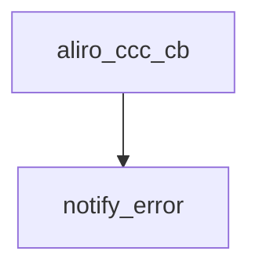

<!-- generated documentation — edit the source, not this file -->
# `modules/woz_uwb/src/aliro/aliro_uwb_session.c`

@file aliro_uwb_session.c — per-session lifecycle and state machine.

**depends on** [`modules/woz_uwb/src/aliro/aliro_uwb_internal.h`](aliro_uwb_internal.h.md), [`modules/woz_uwb/src/aliro/aliro_uwb_msg.h`](aliro_uwb_msg.h.md), [`modules/woz_uwb/src/aliro/aliro_uwb_msg_spec.h`](aliro_uwb_msg_spec.h.md), [`modules/woz_uwb/src/aliro/include/aliro_uwb_adapter/aliro_uwb_session.h`](../modules.woz_uwb.src.aliro.include.aliro_uwb_adapter/aliro_uwb_session.h.md), [`modules/woz_uwb/src/aliro/include/cherry/cherry_ccc.h`](../modules.woz_uwb.src.aliro.include.cherry/cherry_ccc.h.md), [`modules/woz_uwb/src/facade/woz_alloc.h`](../modules.woz_uwb.src.facade/woz_alloc.h.md), [`modules/woz_uwb/src/facade/woz_log.h`](../modules.woz_uwb.src.facade/woz_log.h.md)

## API

### `static enum aliro_uwb_err notify_error(struct aliro_uwb_session *session)`
`modules/woz_uwb/src/aliro/aliro_uwb_session.c:25`

@brief Send a general-error notification to the peer.
@param session Session on which to build and transmit the error message.
@return `ALIRO_UWB_ERR_NONE` on success, `ALIRO_UWB_ERR_INVALID_PARAMETER` if session is NULL, or
`ALIRO_UWB_ERR_INTERNAL` if the message could not be built.

**called by** `aliro_ccc_cb`

### `static void aliro_ccc_cb(struct cherry_ccc_event *event, void *user_data)`
`modules/woz_uwb/src/aliro/aliro_uwb_session.c:46`

@brief CCC seam callback: wrap the CCC event and forward it to the client.
@param event CCC event to wrap and forward.
@param user_data Aliro UWB session that owns the callback and client data.

### `static void aliro_ccc_cb(struct cherry_ccc_event *event, void *user_data)`
`modules/woz_uwb/src/aliro/aliro_uwb_session.c:46`

@brief CCC seam callback: wrap the CCC event and forward it to the client.
@param event CCC event to wrap and forward.
@param user_data Aliro UWB session that owns the callback and client data.

**calls** `notify_error`

### `static void session_close(struct aliro_uwb_session *session)`
`modules/woz_uwb/src/aliro/aliro_uwb_session.c:104`

@brief Tear down: destroy the CCC session, or free directly if there is none.
@param session Session to close.

**called by** `aliro_uwb_session_destroy`, `aliro_uwb_session_init`, `aliro_uwb_session_start`, `aliro_uwb_session_stop`

### `enum aliro_uwb_err aliro_uwb_session_init(struct aliro_uwb_session *session)`
`modules/woz_uwb/src/aliro/aliro_uwb_session.c:121`

@brief Initialize a session by creating and configuring a CCC Aliro responder, setting URSK,
protocol version, antennas, and diagnostics, then starting the session. On any error, tears down
the session and returns the mapped error code.
@param session Session to initialize.
@return `ALIRO_UWB_ERR_NONE` on success, `ALIRO_UWB_ERR_INVALID_PARAMETER` if session is NULL, or
the mapped CCC error on failure.

**calls** `session_close`

### `struct aliro_uwb_adapter_reader_config *reader`
`modules/woz_uwb/src/aliro/aliro_uwb_session.c:127`

@brief Reader configuration attached to an adapter, specifying hopping preferences and
antenna assignments.

### `enum aliro_uwb_err aliro_uwb_session_start(struct aliro_uwb_session *session)`
`modules/woz_uwb/src/aliro/aliro_uwb_session.c:197`

@brief Start an active CCC session. On error, tears down the session and returns the mapped error
code.
@param session Session to start.
@return `ALIRO_UWB_ERR_NONE` on success, `ALIRO_UWB_ERR_INVALID_PARAMETER` if session is NULL, or
the mapped CCC error on failure.

**calls** `session_close`

### `enum aliro_uwb_err aliro_uwb_session_stop(struct aliro_uwb_session *session)`
`modules/woz_uwb/src/aliro/aliro_uwb_session.c:219`

@brief Stop an active CCC session, transitioning to SUSPENDED state. On error, tears down the
session and returns the mapped error code.
@param session Session to stop.
@return `ALIRO_UWB_ERR_NONE` on success, `ALIRO_UWB_ERR_INVALID_PARAMETER` if session is NULL, or
the mapped CCC error on failure.

**calls** `session_close`

### `aliro_uwb_session_create(struct aliro_uwb_adapter *aliro_ctx, uint32_t session_id, aliro_uwb_session_cb_t callback, aliro_uwb_adapter_transmit_message_t transmit, void *user_data)`
`modules/woz_uwb/src/aliro/aliro_uwb_session.c:241`

@brief Opaque Aliro UWB adapter handle, holds CCC context and reader configuration for
session setup.

### `void aliro_uwb_session_destroy(struct aliro_uwb_session *session)`
`modules/woz_uwb/src/aliro/aliro_uwb_session.c:272`

@brief Destroy an Aliro UWB session, freeing the URSK and tearing down the underlying CCC
session.
@param session Session to destroy; no-op if NULL.

**calls** `session_close`

### `void aliro_uwb_session_message_free(struct aliro_uwb_message *message)`
`modules/woz_uwb/src/aliro/aliro_uwb_session.c:285`

@brief Free a session message, delegating to the message-specific free function.
@param message Message to free.

### `void aliro_uwb_session_event_free(struct aliro_uwb_session_event *event)`
`modules/woz_uwb/src/aliro/aliro_uwb_session.c:294`

@brief Free a session event, releasing its wrapped CCC event if present.
@param event Event to free; no-op if NULL.

### `void aliro_uwb_session_event_free(struct aliro_uwb_session_event *event)`
`modules/woz_uwb/src/aliro/aliro_uwb_session.c:294`

@brief Free a session event, releasing its wrapped CCC event if present.
@param event Event to free; no-op if NULL.

### `enum aliro_uwb_err aliro_uwb_session_set_ursk(struct aliro_uwb_session *session, const uint8_t *ursk)`
`modules/woz_uwb/src/aliro/aliro_uwb_session.c:314`

@brief Store a copy of the URSK (Unique Ranging Session Key) for later use during session
initialization. Allocates a 16-byte buffer and returns ALIRO_UWB_ERR_INTERNAL on allocation
failure.
@param session Session that receives the copied URSK.
@param ursk Source URSK bytes to copy.
@return `ALIRO_UWB_ERR_NONE` on success, `ALIRO_UWB_ERR_INVALID_PARAMETER` if session or ursk is
NULL, or `ALIRO_UWB_ERR_INTERNAL` on allocation failure.

### `enum aliro_uwb_err aliro_uwb_session_init_setup(struct aliro_uwb_session *session)`
`modules/woz_uwb/src/aliro/aliro_uwb_session.c:353`

@brief Begin session setup by building and transmitting M1, transitioning from CREATED to M1_SENT
state. Returns ALIRO_UWB_ERR_INVALID_STATE if not in CREATED state.
@param session Session to begin setup on.
@return `ALIRO_UWB_ERR_NONE` on success, `ALIRO_UWB_ERR_INVALID_PARAMETER` if session is NULL,
`ALIRO_UWB_ERR_INVALID_STATE` if not in CREATED state, or `ALIRO_UWB_ERR_INTERNAL` if M1 could
not be built.

### `enum aliro_uwb_err aliro_uwb_session_suspend(struct aliro_uwb_session *session)`
`modules/woz_uwb/src/aliro/aliro_uwb_session.c:442`

@brief Suspend an active ranging session by sending a suspend request.
@param session Session to suspend.
@return ALIRO_UWB_ERR_NONE on success, ALIRO_UWB_ERR_INVALID_PARAMETER if session is NULL,
ALIRO_UWB_ERR_INVALID_STATE if there is no active CCC session or the session is not in the
RANGING state, ALIRO_UWB_ERR_INTERNAL if the suspend request could not be built.

### `enum aliro_uwb_err aliro_uwb_session_resume(struct aliro_uwb_session *session)`
`modules/woz_uwb/src/aliro/aliro_uwb_session.c:496`

@brief Resume a suspended ranging session by building and transmitting a resume request.
@param session Session to resume.
@return ALIRO_UWB_ERR_NONE on success, ALIRO_UWB_ERR_INVALID_PARAMETER if session is NULL,
ALIRO_UWB_ERR_INVALID_STATE if there is no active CCC session or the session is not in the
SUSPENDED state, ALIRO_UWB_ERR_INTERNAL if the resume request could not be built.

### `enum aliro_uwb_err aliro_uwb_session_resume(struct aliro_uwb_session *session)`
`modules/woz_uwb/src/aliro/aliro_uwb_session.c:496`

@brief Resume a suspended ranging session by building and transmitting a resume request.
@param session Session to resume.
@return ALIRO_UWB_ERR_NONE on success, ALIRO_UWB_ERR_INVALID_PARAMETER if session is NULL,
ALIRO_UWB_ERR_INVALID_STATE if there is no active CCC session or the session is not in the
SUSPENDED state, ALIRO_UWB_ERR_INTERNAL if the resume request could not be built.

### `struct aliro_uwb_message *request`
`modules/woz_uwb/src/aliro/aliro_uwb_session.c:502`

@brief Serialized Aliro UWB message (M1-M4 or notification) built for transmission,
holding protocol header and payload.

Undocumented (5)

- `aliro_uwb_session_create` — tested: aliro msg; aliro session
- `aliro_uwb_session_set_protocol_version` — tested: aliro msg; aliro session
- `aliro_uwb_session_set_time_offset` — tested: aliro msg; aliro session
- `aliro_uwb_session_message_handle` — tested: aliro session
- `aliro_uwb_session_forced_suspend` — tested: aliro session

