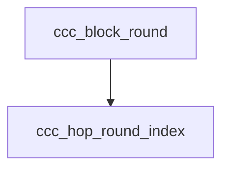

<!-- generated documentation — edit the source, not this file -->
# `modules/woz_uwb/src/ccc/ccc_mac.c`

@file ccc_mac.c — UWB MAC: hopping sequence, SP0 frame codec, ranging schedule.

**depends on** [`modules/woz_uwb/src/ccc/ccc_mac.h`](ccc_mac.h.md)

## API

### `uint16_t ccc_hop_round_index(uint32_t block_index, uint32_t hop_key_rw, uint32_t n_round)`
`modules/woz_uwb/src/ccc/ccc_mac.c:18`

@brief Default hopping round index S(i) in [0, n_round) for a ranging block.
@param block_index Block index i.
@param hop_key_rw HOP_Key_RW value keying the hop calculation.
@param n_round Total number of ranging rounds.
@return Round index in [0, n_round).

**called by** `ccc_block_round`, `ccc_initiator_next_hop`

### `static void put_le16(uint8_t *p, uint16_t v)`
`modules/woz_uwb/src/ccc/ccc_mac.c:40`

@brief Store a uint16 little-endian.

**called by** `ccc_build_mhr`, `ccc_final_data_pack`, `ccc_pre_poll_pack`

### `static void put_le32(uint8_t *p, uint32_t v)`
`modules/woz_uwb/src/ccc/ccc_mac.c:47`

@brief Store a uint32 little-endian.

**called by** `ccc_build_mhr`, `ccc_final_data_pack`, `ccc_pre_poll_pack`

### `static uint16_t get_le16(const uint8_t *p)`
`modules/woz_uwb/src/ccc/ccc_mac.c:56`

@brief Load a uint16 little-endian.

**called by** `ccc_final_data_parse`, `ccc_parse_mhr`, `ccc_pre_poll_parse`

### `static uint32_t get_le32(const uint8_t *p)`
`modules/woz_uwb/src/ccc/ccc_mac.c:62`

@brief Load a uint32 little-endian.

**called by** `ccc_final_data_parse`, `ccc_parse_mhr`, `ccc_pre_poll_parse`

### `static bool mhr_vendor_oui_ok(const uint8_t *p)`
`modules/woz_uwb/src/ccc/ccc_mac.c:69`

@brief True if the 3-byte little-endian OUI at p is the CCC or Aliro OUI (both accepted).

**called by** `ccc_parse_mhr`

### `int ccc_build_mhr(const struct ccc_mhr_fields *f, uint8_t out[CCC_MHR_LEN])`
`modules/woz_uwb/src/ccc/ccc_mac.c:82`

@brief Build the 23-byte SP0 MHR little-endian on the wire.
@param f MHR fields (destination address, frame counter, key source, message ID, payload length).
@param out Output buffer of at least CCC_MHR_LEN bytes.
@return 0 on success, -EINVAL if inputs are null.

**calls** `put_le16`, `put_le32`

### `int ccc_parse_mhr(const uint8_t in[CCC_MHR_LEN], struct ccc_mhr_fields *f)`
`modules/woz_uwb/src/ccc/ccc_mac.c:110`

@brief Parse and validate a 23-byte SP0 MHR, extracting variable fields.
@param in Input buffer of exactly CCC_MHR_LEN bytes.
@param f Output structure to hold parsed fields (destination address, frame counter, key source,
message ID, payload length).
@return 0 on success, -EINVAL on mismatch or null input.

**calls** `get_le16`, `get_le32`, `mhr_vendor_oui_ok`

### `int ccc_pre_poll_pack(const struct ccc_pre_poll *p, uint8_t out[CCC_PRE_POLL_LEN])`
`modules/woz_uwb/src/ccc/ccc_mac.c:134`

@brief Pack a Pre-POLL payload little-endian.
@param p Pre-POLL structure (session ID, STS index, ranging block, hop flag, round index).
@param out Output buffer of at least CCC_PRE_POLL_LEN bytes.
@return 0 on success, -EINVAL if inputs are null.

**calls** `put_le16`, `put_le32`

### `int ccc_pre_poll_parse(const uint8_t in[CCC_PRE_POLL_LEN], struct ccc_pre_poll *p)`
`modules/woz_uwb/src/ccc/ccc_mac.c:154`

@brief Parse a 13-byte Pre-POLL payload.
@param in Input buffer of exactly CCC_PRE_POLL_LEN bytes.
@param p Output structure to hold parsed fields (session ID, STS index, ranging block, hop flag,
round index).
@return 0 on success, -EINVAL if inputs are null.

**calls** `get_le16`, `get_le32`

### `int ccc_final_data_pack(const struct ccc_final_data *f, uint8_t *out, size_t cap, size_t *len)`
`modules/woz_uwb/src/ccc/ccc_mac.c:177`

@brief Pack a Final_Data payload little-endian.
@param f Final_Data structure (session ID, ranging block, hop flag, round index, STS index,
timestamp, responder list).
@param out Output buffer.
@param cap Capacity of output buffer.
@param len Output: number of bytes written.
@return 0 on success, -EINVAL if inputs are null, responder count exceeds CCC_MAX_RESPONDERS, or
buffer is too small.

**calls** `put_le16`, `put_le32`

### `int ccc_final_data_parse(const uint8_t *in, size_t len, struct ccc_final_data *f)`
`modules/woz_uwb/src/ccc/ccc_mac.c:215`

@brief Parse a Final_Data payload.
@param in Input buffer.
@param len Length of input buffer.
@param f Output structure to hold parsed fields (session ID, ranging block, hop flag, round
index, STS index, timestamp, responder list).
@return 0 on success, -EINVAL if inputs are null, input length is inconsistent with responder
count, or responder count exceeds CCC_MAX_RESPONDERS.

**calls** `get_le16`, `get_le32`

### `static uint32_t slot_offset(const struct ccc_ran_params *p, enum ccc_slot slot, uint8_t responder)`
`modules/woz_uwb/src/ccc/ccc_mac.c:245`

@brief STS-index offset of a slot within its ranging round.

**called by** `ccc_slot_sts_index`

### `uint16_t ccc_block_round(const struct ccc_ran_params *p, uint32_t block)`
`modules/woz_uwb/src/ccc/ccc_mac.c:269`

@brief The ranging round a block uses (block 0 uses round 0; continuous hopping uses S(i) for
i>=1).
@param p Ranging parameters.
@param block Block index.
@return Round index in [0, n_round).

**calls** `ccc_hop_round_index`

### `uint32_t ccc_slot_sts_index(const struct ccc_ran_params *p, uint32_t block, uint16_t round, enum ccc_slot slot, uint8_t responder)`
`modules/woz_uwb/src/ccc/ccc_mac.c:288`

@brief STS index for one slot of a ranging round (wraps mod 2^32).
@param p Ranging parameters.
@param block Block index.
@param round Round index.
@param slot Slot type (POLL, Response, or Final).
@param responder Responder index.
@return STS index for the slot.

**calls** `slot_offset`

### `struct ccc_hop_decision ccc_initiator_next_hop(const struct ccc_ran_params *p, uint32_t block)`
`modules/woz_uwb/src/ccc/ccc_mac.c:309`

@brief The initiator's hop decision for the block after block, written into its Final_Data.
@param p Ranging parameters.
@param block Block index.
@return Hop decision (hop flag and next round index); both zero if hopping is disabled or params
are null.

**calls** `ccc_hop_round_index`

### `uint32_t ccc_ds_twr_tof(const struct ccc_ds_twr *t)`
`modules/woz_uwb/src/ccc/ccc_mac.c:327`

@brief DS-TWR one-way time-of-flight in timestamp ticks.
@param t DS-TWR intervals (round-trip and reply times at both ends).
@return Time-of-flight in ticks, or 0 if the denominator is 0 or input is null.

### `int ccc_responder_ds_twr(const struct ccc_final_data *fd, uint8_t responder, uint32_t t_reply1, uint32_t t_round2, struct ccc_ds_twr *out)`
`modules/woz_uwb/src/ccc/ccc_mac.c:339`

Assemble the DS-TWR intervals at the responder from a received Final_Data.

### `bool ccc_ursk_exhausted(const struct ccc_ran_params *p, uint32_t block)`
`modules/woz_uwb/src/ccc/ccc_mac.c:355`

Whether the current URSK is exhausted for a ranging block (true once its highest STS index would
exceed 2^31-1).
