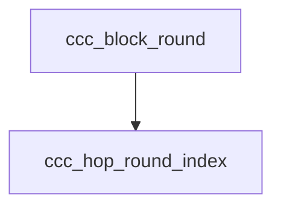

<!-- generated documentation — edit the source, not this file -->
# `modules/woz_uwb/src/ccc/ccc_mac.c`

@file ccc_mac.c — UWB MAC: hopping sequence, SP0 frame codec, ranging schedule.

**depends on** [`modules/woz_uwb/src/ccc/ccc_mac.h`](ccc_mac.h.md)

## API

### `uint16_t ccc_hop_round_index(uint32_t block_index, uint32_t hop_key_rw, uint32_t n_round)`
`modules/woz_uwb/src/ccc/ccc_mac.c:11`

Default hopping round index S(i) in [0, n_round) for a ranging block, keyed by HOP_Key_RW.

**called by** `ccc_block_round`, `ccc_initiator_next_hop`

### `static void put_le16(uint8_t *p, uint16_t v)`
`modules/woz_uwb/src/ccc/ccc_mac.c:33`

@brief Store a uint16 little-endian.

**called by** `ccc_build_mhr`, `ccc_final_data_pack`, `ccc_pre_poll_pack`

### `static void put_le32(uint8_t *p, uint32_t v)`
`modules/woz_uwb/src/ccc/ccc_mac.c:40`

@brief Store a uint32 little-endian.

**called by** `ccc_build_mhr`, `ccc_final_data_pack`, `ccc_pre_poll_pack`

### `static uint16_t get_le16(const uint8_t *p)`
`modules/woz_uwb/src/ccc/ccc_mac.c:49`

@brief Load a uint16 little-endian.

**called by** `ccc_final_data_parse`, `ccc_parse_mhr`, `ccc_pre_poll_parse`

### `static uint32_t get_le32(const uint8_t *p)`
`modules/woz_uwb/src/ccc/ccc_mac.c:55`

@brief Load a uint32 little-endian.

**called by** `ccc_final_data_parse`, `ccc_parse_mhr`, `ccc_pre_poll_parse`

### `static bool mhr_vendor_oui_ok(const uint8_t *p)`
`modules/woz_uwb/src/ccc/ccc_mac.c:62`

@brief True if the 3-byte little-endian OUI at p is the CCC or Aliro OUI (both accepted).

**called by** `ccc_parse_mhr`

### `int ccc_build_mhr(const struct ccc_mhr_fields *f, uint8_t out[CCC_MHR_LEN])`
`modules/woz_uwb/src/ccc/ccc_mac.c:69`

Build the 23-byte SP0 MHR (little-endian on the wire).

**calls** `put_le16`, `put_le32`

### `int ccc_parse_mhr(const uint8_t in[CCC_MHR_LEN], struct ccc_mhr_fields *f)`
`modules/woz_uwb/src/ccc/ccc_mac.c:90`

Parse and validate a 23-byte SP0 MHR, extracting the variable fields (-EINVAL on mismatch).

**calls** `get_le16`, `get_le32`, `mhr_vendor_oui_ok`

### `int ccc_pre_poll_pack(const struct ccc_pre_poll *p, uint8_t out[CCC_PRE_POLL_LEN])`
`modules/woz_uwb/src/ccc/ccc_mac.c:108`

Pack a Pre-POLL payload little-endian.

**calls** `put_le16`, `put_le32`

### `int ccc_pre_poll_parse(const uint8_t in[CCC_PRE_POLL_LEN], struct ccc_pre_poll *p)`
`modules/woz_uwb/src/ccc/ccc_mac.c:121`

Parse a 13-byte Pre-POLL payload.

**calls** `get_le16`, `get_le32`

### `int ccc_final_data_pack(const struct ccc_final_data *f, uint8_t *out, size_t cap, size_t *len)`
`modules/woz_uwb/src/ccc/ccc_mac.c:134`

Pack a Final_Data payload little-endian.

**calls** `put_le16`, `put_le32`

### `int ccc_final_data_parse(const uint8_t *in, size_t len, struct ccc_final_data *f)`
`modules/woz_uwb/src/ccc/ccc_mac.c:163`

Parse a Final_Data payload (-EINVAL if length is inconsistent with num_responders).

**calls** `get_le16`, `get_le32`

### `static uint32_t slot_offset(const struct ccc_ran_params *p, enum ccc_slot slot, uint8_t responder)`
`modules/woz_uwb/src/ccc/ccc_mac.c:193`

@brief STS-index offset of a slot within its ranging round.

**called by** `ccc_slot_sts_index`

### `uint16_t ccc_block_round(const struct ccc_ran_params *p, uint32_t block)`
`modules/woz_uwb/src/ccc/ccc_mac.c:210`

The ranging round a block uses (block 0 uses round 0; continuous hopping uses S(i) for i>=1).

**calls** `ccc_hop_round_index`

### `uint32_t ccc_slot_sts_index(const struct ccc_ran_params *p, uint32_t block, uint16_t round, enum ccc_slot slot, uint8_t responder)`
`modules/woz_uwb/src/ccc/ccc_mac.c:220`

STS index for one slot of a ranging round (uint32 wraps mod 2^32).

**calls** `slot_offset`

### `struct ccc_hop_decision ccc_initiator_next_hop(const struct ccc_ran_params *p, uint32_t block)`
`modules/woz_uwb/src/ccc/ccc_mac.c:234`

The initiator's hop decision for the block after block, written into its Final_Data.

**calls** `ccc_hop_round_index`

### `uint32_t ccc_ds_twr_tof(const struct ccc_ds_twr *t)`
`modules/woz_uwb/src/ccc/ccc_mac.c:247`

DS-TWR one-way time-of-flight in timestamp ticks (0 if the denominator is 0).

### `int ccc_responder_ds_twr(const struct ccc_final_data *fd, uint8_t responder, uint32_t t_reply1, uint32_t t_round2, struct ccc_ds_twr *out)`
`modules/woz_uwb/src/ccc/ccc_mac.c:259`

Assemble the DS-TWR intervals at the responder from a received Final_Data.

### `bool ccc_ursk_exhausted(const struct ccc_ran_params *p, uint32_t block)`
`modules/woz_uwb/src/ccc/ccc_mac.c:275`

Whether the current URSK is exhausted for a ranging block (true once its highest STS index would
exceed 2^31-1).
