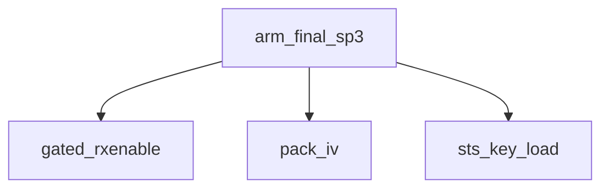

<!-- generated documentation — edit the source, not this file -->
# `modules/woz_uwb/src/ccc/ccc_shim_rx.c`

@file ccc_shim_rx.c — responder-RX CCC STS substitution (ld --wrap=dwt_rxenable) programming the
CCC STS on each RX-arm; target only.

**depends on** [`modules/woz_port/include/woz_log.h`](../modules.woz_port.include/woz_log.h.md), [`modules/woz_port/include/woz_port.h`](../modules.woz_port.include/woz_port.h.md), [`modules/woz_uwb/src/ccc/aliro_round_config.h`](aliro_round_config.h.md), [`modules/woz_uwb/src/ccc/ccc_kdf.h`](ccc_kdf.h.md), [`modules/woz_uwb/src/ccc/ccc_mac.h`](ccc_mac.h.md), [`modules/woz_uwb/src/ccc/ccc_shim.h`](ccc_shim.h.md), [`modules/woz_uwb/src/driver/uwb_min.h`](../modules.woz_uwb.src.driver/uwb_min.h.md), [`modules/woz_uwb/src/driver/uwb_rxdiag.h`](../modules.woz_uwb.src.driver/uwb_rxdiag.h.md), [`modules/woz_uwb/src/facade/woz_bytes.h`](../modules.woz_uwb.src.facade/woz_bytes.h.md), [`modules/woz_uwb/src/facade/woz_diag.h`](../modules.woz_uwb.src.facade/woz_diag.h.md), [`modules/woz_uwb/src/fira/fira_session.h`](../modules.woz_uwb.src.fira/fira_session.h.md)  ·  **discussed in** [`docs/porting-esp32.md`](../../porting-esp32.md), [`docs/porting.md`](../../porting.md), [`integration/homeassistant/README.md`](../../../integration/homeassistant/README.md), [`ports/esp32/apps/reader/README.md`](../../../ports/esp32/apps/reader/README.md)

## API

### `static uint32_t ccc_rx_cur_cand(void)`
`modules/woz_uwb/src/ccc/ccc_shim_rx.c:204`

@brief Current candidate index: the latched lock, or the live sweep value.

**called by** `__wrap_dwt_rxenable`

### `void ccc_shim_rx_log_reset(void)`
`modules/woz_uwb/src/ccc/ccc_shim_rx.c:214`

@brief Reset all Per-POLL state: arm count, index tracking, STS warm cache, and optional
lock-sweep diagnostic counters; called on entry to a new Pre-POLL listen.

**called by** `ccc_prepoll_listen`

### `bool ccc_shim_rx_awaiting_poll(void)`
`modules/woz_uwb/src/ccc/ccc_shim_rx.c:252`

@brief Returns true if the responder is awaiting the POLL frame after a successful Pre-POLL
decode.
@return true if awaiting POLL, false otherwise.

### `void ccc_shim_rx_notify_rx(uint32_t status)`
`modules/woz_uwb/src/ccc/ccc_shim_rx.c:263`

@brief Log one RX event for the optional lock-sweep diagnostic (CONFIG_CCC_RX_LOCK_SWEEP); tracks
CPER (STS correlation fail flag) and dwells candidate indices until lock achieved or full cycle
exhausted.
@param status DW3000 status register value.

### `static void prepoll_decode(const uint8_t *frame, uint16_t datalength)`
`modules/woz_uwb/src/ccc/ccc_shim_rx.c:314`

@brief Decode a received Pre-POLL frame: verify MHR and message ID, decrypt SP0 payload, cache
UAD-derived keys, extract Poll_STS_Index and stride, and pre-warm the next block's STS triplet
(POLL, Response_0, Final) to eliminate KDF latency from the critical path.
@param frame Pointer to the received frame buffer.
@param datalength Length of the frame in bytes.

**called by** `ccc_shim_rx_try_prepoll`, `prepoll_rx_rearm`, `resp_tx_done`

### `static uint64_t ts5_to_u64(const uint8_t t[5])`
`modules/woz_uwb/src/ccc/ccc_shim_rx.c:427`

@brief Assemble a 5-byte DW3000 (40-bit) timestamp into a uint64 (DTU ticks).

**called by** `final_data_decode`, `prepoll_rx_rearm`, `resp_tx_done`

### `static void final_data_decode(const uint8_t *frame, uint16_t datalength)`
`modules/woz_uwb/src/ccc/ccc_shim_rx.c:456`

@brief Decode a received Final_Data (SP0, msg_id=02): dUDSK-decrypt and parse the initiator's
ranging timestamps; not time-critical.
@param frame Pointer to the received frame buffer.
@param datalength Length of the frame in bytes.

**called by** `ccc_shim_rx_try_prepoll`  ·  **calls** `ts5_to_u64`

### `void ccc_shim_rx_try_prepoll(uint16_t datalength)`
`modules/woz_uwb/src/ccc/ccc_shim_rx.c:631`

@brief Pre-POLL RX entry (from the RX-good shim): stash the frame and DEFER its ~2 ms
decrypt+derive off the Pre-POLL->POLL critical path.
The decode only feeds the NEXT block's warm (the SP3 arm keys on the pre-warmed prediction,
not this block's fresh index), so it has the ~190 ms idle to run in.  Running it inline —
on the single DW3000 workqueue, ahead of the queued POLL RX-OK callback — pushed the
Response TX arm past its slot (dx-now < 0 => HPDWARN).  So read the bytes now (cheap SPI),
then:
- bootstrap (no warm yet): decode inline to seed the first arm's STS — this block is not
armed, so blocking its POLL is harmless;
- steady state: mark pending; @ref prepoll_rx_rearm runs @ref prepoll_decode after the
Response TX is armed.  A pending decode orphaned by a missed POLL is flushed on the next
Pre-POLL so the warm never goes more than one block stale.

**calls** `final_data_decode`, `prepoll_decode`

### `static void pack_key(dwt_sts_cp_key_t *out, const uint8_t dursk[CCC_DURSK_LEN])`
`modules/woz_uwb/src/ccc/ccc_shim_rx.c:661`

@brief Pack a 16-byte `dURSK` into the DW3000 STS-key image (whole-16 reverse).

**called by** `__wrap_dwt_rxenable`, `ccc_pack_selftest`, `sts_key_load`

### `static void pack_iv(dwt_sts_cp_iv_t *out, const uint8_t sts_v[CCC_STS_V_LEN])`
`modules/woz_uwb/src/ccc/ccc_shim_rx.c:680`

@brief Pack a 16-byte STS-V into the DW3000 STS-IV image (whole-16 reverse then per-word LE, same
as pack_key).
@param out Pointer to the DW3000 STS-IV register image.
@param sts_v 16-byte STS vector to pack.

**called by** `__wrap_dwt_rxenable`, `arm_final_sp3`, `arm_poll_sp3`, `ccc_pack_selftest`, `tx_response_sp3`

### `static void sts_key_load(const uint8_t dursk[CCC_DURSK_LEN])`
`modules/woz_uwb/src/ccc/ccc_shim_rx.c:701`

The STS key (dURSK) is per ranging CYCLE — POLL, Response, Final and every block in the cycle
share it — but each arm re-wrote all four STS_KEY registers: ~258 us of SPI on the critical path,
~40% of the arm latency that misses the ~1836 us slot deadline. Cache the loaded
dURSK and skip dwt_configurestskey when unchanged; the STS_KEY registers persist across the
per-frame IV/loadiv/mode reprogramming within a session. ccc_shim_rx_log_reset() clears the cache
(a new session's dwt_configure re-clears the registers). Only the ~16-byte IV write remains per
arm. (g_sts_key_cache / g_sts_key_cached are declared up top so ccc_shim_rx_log_reset can clear
them.)

**called by** `arm_final_sp3`, `arm_poll_sp3`, `tx_response_sp3`  ·  **calls** `pack_key`

### `static void pack_iv_rev(dwt_sts_cp_iv_t *out, const uint8_t v[CCC_STS_V_LEN])`
`modules/woz_uwb/src/ccc/ccc_shim_rx.c:737`

@brief Pack a 16-byte V whole-16-reversed then word-LE (the `pack_key`/blob convention).

**called by** `ccc_pack_selftest`

### `static void ccc_pack_selftest(void)`
`modules/woz_uwb/src/ccc/ccc_shim_rx.c:751`

@brief One-shot: dump STS register lanes for the KAT V under three packings.

**called by** `__wrap_dwt_rxenable`  ·  **calls** `pack_iv`, `pack_iv_rev`, `pack_key`

### `int32_t __wrap_dwt_rxenable(int32_t mode)`
`modules/woz_uwb/src/ccc/ccc_shim_rx.c:794`

Program the CCC STS for the current ranging slot, then arm RX.

**calls** `ccc_pack_selftest`, `ccc_rx_cur_cand`, `pack_iv`, `pack_key`

### `static int32_t gated_rxenable(int32_t mode)`
`modules/woz_uwb/src/ccc/ccc_shim_rx.c:916`

@brief Gate-checked RX arm for every self-rearm site below; refuses once the listen-gate is
closed.

**called by** `arm_final_sp3`, `arm_poll_sp3`, `prepoll_rx_rearm`, `revert_to_sp0_listen`

### `static int arm_poll_sp3(uint32_t prepoll_ip)`
`modules/woz_uwb/src/ccc/ccc_shim_rx.c:926`

Flip to SP3/ND, load the pre-warmed CCC STS (g_warm_index), and arm a delayed RX to catch the
POLL that follows the Pre-POLL.

**called by** `prepoll_rx_rearm`  ·  **calls** `gated_rxenable`, `pack_iv`, `sts_key_load`

### `static void revert_to_sp0_listen(void)`
`modules/woz_uwb/src/ccc/ccc_shim_rx.c:983`

@brief Revert SP3/ND -> SP0 and re-arm the permanent Pre-POLL listen (no timeout).

**called by** `prepoll_rx_rearm`, `resp_tx_done`  ·  **calls** `gated_rxenable`

### `static int tx_response_sp3(uint32_t poll_ip, uint32_t resp_idx)`
`modules/woz_uwb/src/ccc/ccc_shim_rx.c:997`

Delayed-TX the responder's Response_0 (SP3-ND) one slot after the POLL, at STS index
Poll_STS_Index + 1 (same dURSK, STS-V advances).

**called by** `prepoll_rx_rearm`  ·  **calls** `pack_iv`, `sts_key_load`

### `static int arm_final_sp3(uint32_t poll_ip)`
`modules/woz_uwb/src/ccc/ccc_shim_rx.c:1036`

Arm the delayed SP3-ND RX for the phone's Final at STS index
Poll_STS_Index+ALIRO_FINAL_SLOT_OFFSET, packing the g_armed_final_* STS (no KDF).
EXPERIMENT-2RESP: the 1:1 baseline uses POLL + 2 slots / index+2; a 2-responder round puts the
Final at POLL + 3 (responder 1's silent slot sits at POLL + 2).

**called by** `prepoll_rx_rearm`, `resp_tx_done`  ·  **calls** `gated_rxenable`, `pack_iv`, `sts_key_load`

### `static void resp_tx_done(const dwt_cb_data_t *cb)`
`modules/woz_uwb/src/ccc/ccc_shim_rx.c:1068`

TX-done (TXFRS) callback: our Response_0 left the antenna, so arm the Final RX one slot later,
then run the block's deferred Pre-POLL decode in the idle.

**calls** `arm_final_sp3`, `prepoll_decode`, `revert_to_sp0_listen`, `ts5_to_u64`

### `static void prepoll_rx_rearm(const dwt_cb_data_t *cb)`
`modules/woz_uwb/src/ccc/ccc_shim_rx.c:1112`

@brief RX callback for Pre-POLL listen and POLL/Final results.
Re-arms SP0 by default, or arms SP3/ND for POLL if a warmed index is ready, or fires the
delayed-TX Response_0 and Final RX arm on valid POLL CPER; logs free-running timing and
optionally defers Pre-POLL decode to warm the next block.

**calls** `arm_final_sp3`, `arm_poll_sp3`, `gated_rxenable`, `prepoll_decode`, `revert_to_sp0_listen`, `ts5_to_u64`, `tx_response_sp3`

### `int ccc_prepoll_listen(uint8_t channel, uint8_t preamble_code)`
`modules/woz_uwb/src/ccc/ccc_shim_rx.c:1332`

Initialize the DW3000 radio for permanent SP0 Pre-POLL listen: configure PHY (6.8 Mbps, preamble
length 64, SFD 4a, no STS), install RX callbacks that self-rearm on every frame outcome, and
enable all RX/TX interrupts; returns 0 on success.

**calls** `ccc_shim_rx_log_reset`

### `void ccc_prepoll_stop(void)`
`modules/woz_uwb/src/ccc/ccc_shim_rx.c:1397`

Stop the permanent Pre-POLL listener: close the listen-gate (every self-rearm
site checks it via gated_rxenable), then force the radio out of RX/TX.  The
DW3000 callbacks run on the dedicated coop (-11) isr workqueue with
busy-polled SPI and synchronous woz_printf, so a callback never yields
mid-flight: one in flight when a preemptive-thread caller gets here has
already run to completion (its rearm landed BEFORE our forcetrxoff), and any
later callback sees the gate closed.  A residual rearm window exists only if
this is ever called from an ISR or a coop thread at prio <= -11.
