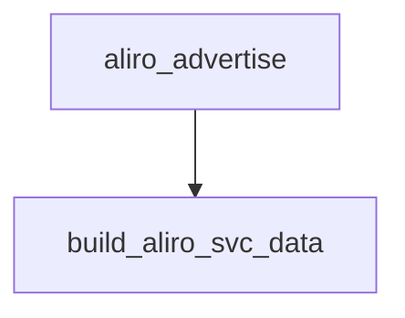

<!-- generated documentation — edit the source, not this file -->
# `ports/esp32-idf/components/aliro_ble/aliro_ble.c`

NimBLE-backed BLE transport for the Aliro reader: GAP advertising, the Aliro GATT service,
and an L2CAP connection-oriented channel (CoC) used to carry Aliro protocol messages.
Supports two bring-up modes: a standalone NimBLE host (aliro_ble_start) and attachment to a
host already owned and synced by another stack such as esp-matter (aliro_ble_prepare +
aliro_ble_start_attached). Tracks CoC channels per connection handle in a fixed-size table
and exposes send/receive plus reader-status notification helpers to the rest of the Aliro
reader.

## API

### `static struct aliro_ble_callbacks s_cb`
`ports/esp32-idf/components/aliro_ble/aliro_ble.c:62`

Module-static table of Aliro BLE callbacks registered by the application, invoked by the GATT/GAP/L2CAP handlers as events occur.

### `static struct os_mempool s_coc_mempool`
`ports/esp32-idf/components/aliro_ble/aliro_ble.c:97`

Module-static memory pool backing the CoC mbuf pool, initialized by l2cap_init.

### `static struct os_mbuf_pool s_coc_mbuf_pool`
`ports/esp32-idf/components/aliro_ble/aliro_ble.c:99`

Module-static mbuf pool backing L2CAP CoC send/receive buffers, initialized by l2cap_init.

### `static void coc_track(uint16_t conn_handle, struct ble_l2cap_chan *chan)`
`ports/esp32-idf/components/aliro_ble/aliro_ble.c:110`

Record a newly established L2CAP CoC channel against its connection handle in the first free tracking slot.
Silently does nothing if all CONFIG_BT_NIMBLE_L2CAP_COC_MAX_NUM slots are already active.

**called by** `l2cap_event_cb`

### `static void coc_untrack(const struct ble_l2cap_chan *chan)`
`ports/esp32-idf/components/aliro_ble/aliro_ble.c:124`

Remove the tracking entry for a given L2CAP CoC channel, freeing its slot.
No-op if chan is not found among the active tracked entries.

**called by** `l2cap_event_cb`

### `static struct ble_l2cap_chan *coc_chan_for(uint16_t conn_handle)`
`ports/esp32-idf/components/aliro_ble/aliro_ble.c:136`

Look up the tracked L2CAP CoC channel for a given connection handle.
Returns the channel pointer if an active tracked entry matches conn_handle, otherwise NULL.

**called by** `aliro_ble_send`

### `static int coc_arm_rx(struct ble_l2cap_chan *chan)`
`ports/esp32-idf/components/aliro_ble/aliro_ble.c:147`

Give the stack a fresh receive buffer so the next SDU can be assembled.

**called by** `l2cap_event_cb`

### `static int l2cap_event_cb(struct ble_l2cap_event *event, void *arg)`
`ports/esp32-idf/components/aliro_ble/aliro_ble.c:158`

NimBLE L2CAP event callback that tracks connection-oriented channel (CoC) lifecycle events (connect, disconnect, data) for the Aliro L2CAP server.

### `static int l2cap_event_cb(struct ble_l2cap_event *event, void *arg)`
`ports/esp32-idf/components/aliro_ble/aliro_ble.c:158`

NimBLE L2CAP event callback that tracks connection-oriented channel (CoC) lifecycle events (connect, disconnect, data) for the Aliro L2CAP server.

**calls** `coc_arm_rx`, `coc_track`, `coc_untrack`

### `static void l2cap_init(void)`
`ports/esp32-idf/components/aliro_ble/aliro_ble.c:210`

Initialize the L2CAP connection-oriented channel (CoC) server used for Aliro's BLE transport.
Sets up the CoC mbuf memory pool and registers an L2CAP server on the Aliro SPSM with the given MTU. Logs an error and returns early if the mempool init, mbuf pool init, or ble_l2cap_create_server call fails, leaving the CoC server unavailable.

**called by** `aliro_ble_start`, `aliro_ble_start_attached`

### `static uint8_t encode_features(const struct aliro_ble_features *f)`
`ports/esp32-idf/components/aliro_ble/aliro_ble.c:235`

Pack an aliro_ble_features struct into a single bitmask byte for advertising/READ payloads.
Bit 0 = timesync_procedure_0, bit 1 = timesync_procedure_1, bit 2 = le_coded_phy.

### `static uint8_t encode_features(const struct aliro_ble_features *f)`
`ports/esp32-idf/components/aliro_ble/aliro_ble.c:235`

Pack an aliro_ble_features struct into a single bitmask byte for advertising/READ payloads.
Bit 0 = timesync_procedure_0, bit 1 = timesync_procedure_1, bit 2 = le_coded_phy.

**called by** `build_read_payload`

### `static void build_read_payload(const struct aliro_ble_config *cfg)`
`ports/esp32-idf/components/aliro_ble/aliro_ble.c:253`

Build the GATT READ payload advertising the L2CAP SPSM, supported protocol versions, and
supported features, writing it into s_read_payload and recording its length in
s_read_payload_len.

**called by** `capture_cfg`  ·  **calls** `encode_features`

### `static int reader_spsm_access(uint16_t conn_handle, uint16_t attr_handle, struct ble_gatt_access_ctxt *ctxt, void *arg)`
`ports/esp32-idf/components/aliro_ble/aliro_ble.c:273`

READ: hand back the prebuilt SPSM/versions/features buffer.

### `static int device_ver_access(uint16_t conn_handle, uint16_t attr_handle, // NimBLE GATT access context describing a characteristic read/write operation dispatched to an Aliro GATT characteristic access callback. struct ble_gatt_access_ctxt *ctxt, void *arg)`
`ports/esp32-idf/components/aliro_ble/aliro_ble.c:284`

WRITE: [version be16][featLen u8][features]. Validate + log the negotiated version.

### `struct ble_gatt_access_ctxt *ctxt, void *arg)`
`ports/esp32-idf/components/aliro_ble/aliro_ble.c:286`

NimBLE GATT access context describing a characteristic read/write operation dispatched to an Aliro GATT characteristic access callback.

### `(struct ble_gatt_chr_def[])`
`ports/esp32-idf/components/aliro_ble/aliro_ble.c:325`

Array of GATT characteristic definitions for the Aliro BLE service, listing each characteristic's UUID, access callback, and flags.

### `static int gap_event(struct ble_gap_event *event, void *arg)`
`ports/esp32-idf/components/aliro_ble/aliro_ble.c:343`

NimBLE GAP event callback that handles connection, disconnection, and advertising-related events for the Aliro BLE service.

### `static int gap_event(struct ble_gap_event *event, void *arg)`
`ports/esp32-idf/components/aliro_ble/aliro_ble.c:343`

NimBLE GAP event callback that handles connection, disconnection, and advertising-related events for the Aliro BLE service.

**calls** `aliro_advertise`

### `static bool build_aliro_svc_data(uint8_t out[26])`
`ports/esp32-idf/components/aliro_ble/aliro_ble.c:377`

Assemble the 0xFFF2 service data (26 B = 2-byte UUID + 24-byte payload) with the
GroupResolvingKey dynamic tag. Payload layout (bytes 0..23):
[0]      flags: bit7 = BLE+UWB supported, bits2:0 = version (0)
[1]      tx power (int8)
[2..9]   truncated reader group id (8)     = reader_id[0..7]
[10..11] truncated reader group sub id (2) = reader_id[16..17]
[12..15] dynamic-tag expiry, big-endian (0xFFFFFFFF = no clock)
[16]     reserved (0)
[17..23] dynamic tag = AES-128(GRK, 00*6 ‖ reverse(AdvA) ‖ BE32(expiry))[0..6]
Reverse-engineered from libaliro_ble.a (AliroStack::GenerateAdvertisingData +
BleDynamicTag::Generate). AdvA orientation is the top bench-tunable.

**called by** `aliro_advertise`

### `static void aliro_advertise(void)`
`ports/esp32-idf/components/aliro_ble/aliro_ble.c:429`

Configure and start BLE advertising for Aliro discovery.
Advertises full Aliro service data (0xFFF2, 26 bytes) built by build_aliro_svc_data when adv is enabled and a GRK is configured; otherwise falls back to a bare service UUID plus device name for the unprovisioned/no-GRK case. Logs and returns without starting advertising if either ble_gap_adv_set_fields or ble_gap_adv_start fails.

**called by** `aliro_ble_readvertise`, `aliro_ble_start_attached`, `gap_event`, `on_sync`  ·  **calls** `build_aliro_svc_data`

### `struct ble_hs_adv_fields fields =`
`ports/esp32-idf/components/aliro_ble/aliro_ble.c:432`

Local advertising fields structure populated by aliro_advertise and passed to ble_gap_adv_set_fields; zero-initialized before being filled with either full Aliro service data or the fallback UUID/name fields.

### `struct ble_gap_adv_params adv_params =`
`ports/esp32-idf/components/aliro_ble/aliro_ble.c:461`

Local GAP advertising parameters used to configure and start Aliro BLE advertising.
Zero-initialized then set to undirected connectable, general discoverable mode before being passed to ble_gap_adv_start.

### `static void on_sync(void)`
`ports/esp32-idf/components/aliro_ble/aliro_ble.c:474`

NimBLE host sync callback: ensures a device address exists, infers the own address type,
and starts Aliro advertising. Logs and returns early without advertising if either step
fails.

**calls** `aliro_advertise`

### `static void on_reset(int reason)`
`ports/esp32-idf/components/aliro_ble/aliro_ble.c:492`

NimBLE host reset callback; logs the reset reason.

### `static void host_task(void *param)`
`ports/esp32-idf/components/aliro_ble/aliro_ble.c:499`

FreeRTOS task entry point that runs the NimBLE host until stopped.
Blocks in nimble_port_run() until nimble_port_stop() is called, then deinitializes the NimBLE FreeRTOS port; param is unused.

### `static int capture_cfg(const struct aliro_ble_config *cfg)`
`ports/esp32-idf/components/aliro_ble/aliro_ble.c:508`

Capture the config into the module statics (versions, callbacks, READ payload).
Shared by aliro_ble_start (owns the host) and aliro_ble_prepare (attach mode).

**called by** `aliro_ble_prepare`, `aliro_ble_start`  ·  **calls** `build_read_payload`

### `int aliro_ble_start(const struct aliro_ble_config *cfg)`
`ports/esp32-idf/components/aliro_ble/aliro_ble.c:529`

Bring up the Aliro BLE service as a standalone NimBLE host: init NVS, init the NimBLE port,
register the GAP/GATT services and the Aliro L2CAP CoC server, and start the host task.
Captures cfg first; returns -1 if that fails. Returns -1 on any NVS, NimBLE port, or GATT
registration failure (aborting via ESP_ERROR_CHECK for NVS init errors other than the
handled no-free-pages/new-version cases). Returns 0 on success.

**calls** `capture_cfg`, `l2cap_init`

### `int aliro_ble_prepare(const struct aliro_ble_config *cfg)`
`ports/esp32-idf/components/aliro_ble/aliro_ble.c:580`

Capture the Aliro BLE configuration for later use by the service.
Returns whatever capture_cfg returns; does not itself start advertising or the GATT service.

### `int aliro_ble_prepare(const struct aliro_ble_config *cfg)`
`ports/esp32-idf/components/aliro_ble/aliro_ble.c:580`

Capture the Aliro BLE configuration for later use by the service.
Returns whatever capture_cfg returns; does not itself start advertising or the GATT service.

**calls** `capture_cfg`

### `const struct ble_gatt_svc_def *aliro_ble_service_def(void)`
`ports/esp32-idf/components/aliro_ble/aliro_ble.c:586`

Return the Aliro GATT service definition table for registration with the NimBLE host.

### `const struct ble_gatt_svc_def *aliro_ble_service_def(void)`
`ports/esp32-idf/components/aliro_ble/aliro_ble.c:586`

Return the Aliro GATT service definition table for registration with the NimBLE host.

### `int aliro_ble_start_attached(void)`
`ports/esp32-idf/components/aliro_ble/aliro_ble.c:596`

Bring up the Aliro BLE service on a host already initialized and synced by the owning stack
(e.g. esp-matter), instead of starting a private NimBLE host.
Only starts the L2CAP CoC server and advertising; the GATT service must already be
registered through the owning stack's extra-services hook. The owner must have stopped its
own advertiser first. Returns -1 if address inference fails, otherwise 0.

**calls** `aliro_advertise`, `l2cap_init`

### `void aliro_ble_readvertise(void)`
`ports/esp32-idf/components/aliro_ble/aliro_ble.c:622`

Re-emit the BLE advertisement with the current advertising parameters.
Used when provisioning (the GRK) lands after the advertiser is already up: Apple sends
SetAliroReaderConfig post-commissioning, so the reader initially advertised only the bare
UUID. Stops any running advertisement and restarts it so the new full 0xFFF2 service data
takes effect. No-op if the transport has not been attached yet (start_attached() will
advertise with the current params once it runs).

**calls** `aliro_advertise`

### `void aliro_ble_set_adv_params(const uint8_t group_id8[8], const uint8_t sub_id2[2], const uint8_t grk[16], int8_t tx_power)`
`ports/esp32-idf/components/aliro_ble/aliro_ble.c:637`

Set the Aliro advertising identity (group ID, sub ID, GRK) and TX power, and enable full Aliro service-data advertising.
Copies group_id8, sub_id2, and grk into module statics; after this call, aliro_advertise will build and advertise full Aliro service data instead of the fallback bare-UUID form.

### `uint16_t aliro_ble_spsm(void)`
`ports/esp32-idf/components/aliro_ble/aliro_ble.c:648`

Return the L2CAP SPSM (simplified protocol/service multiplexer) value used for the Aliro CoC channel.

### `int aliro_ble_send(uint16_t conn_handle, const uint8_t *data, size_t len)`
`ports/esp32-idf/components/aliro_ble/aliro_ble.c:658`

Send data to a connected peer over its Aliro L2CAP CoC channel.
Returns 0 on success (queued or sent), -1 if data is NULL, len is 0, no CoC channel exists
for conn_handle, mbuf allocation/append fails, or ble_l2cap_send fails for any reason other
than BLE_HS_ESTALLED (which means the SDU was queued and will flush on TX_UNSTALLED).
On success the stack takes ownership of the sdu buffer; on failure it is freed here.

**calls** `coc_chan_for`

### `static void coc_track(uint16_t conn_handle, struct ble_l2cap_chan *chan)`
`ports/esp32-idf/components/aliro_ble/aliro_ble.c:663`

Record a newly established L2CAP CoC channel against its connection handle in the first free tracking slot.
Silently does nothing if all CONFIG_BT_NIMBLE_L2CAP_COC_MAX_NUM slots are already active.

### `struct os_mbuf *sdu = os_mbuf_get_pkthdr(&s_coc_mbuf_pool, 0)`
`ports/esp32-idf/components/aliro_ble/aliro_ble.c:670`

Local mbuf handle allocated from the CoC mbuf pool to hold an outgoing L2CAP SDU.

### `static void reader_status_ev_cb(struct ble_npl_event *ev)`
`ports/esp32-idf/components/aliro_ble/aliro_ble.c:697`

NimBLE portable event-queue event type used to defer reader-status callback execution onto the host task.

### `static void reader_status_ev_cb(struct ble_npl_event *ev)`
`ports/esp32-idf/components/aliro_ble/aliro_ble.c:697`

NimBLE portable event-queue event type used to defer reader-status callback execution onto the host task.

### `void aliro_ble_post_reader_status(void (*cb)(bool unsecured), bool unsecured)`
`ports/esp32-idf/components/aliro_ble/aliro_ble.c:707`

Queue a reader-status callback to run on the NimBLE host task.
Stores cb and unsecured in module statics and posts an event to the default NimBLE event queue; the callback fires later from reader_status_ev_cb, not synchronously. Runs on the host task so it serializes with every other sc_ble seal operation and keeps the BleSK counter monotonic; callers must not rely on immediate execution and must not post a second call before the first has been drained if ordering matters.
