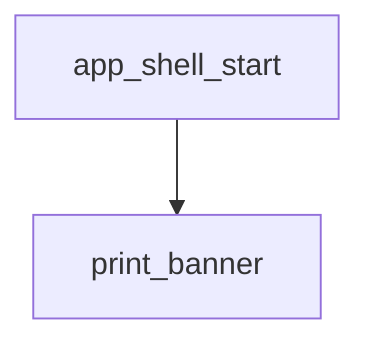

<!-- generated documentation — edit the source, not this file -->
# `ports/esp32-matter/main/app_shell.cpp`

ESP32-IDF console shell for the Aliro Matter door lock app: registers status, range, aliro, lock/unlock, codes, factoryreset, and clear commands and runs the REPL.

**depends on** [`ports/esp32-matter/main/app_shell.h`](app_shell.h.md), [`ports/esp32-matter/main/lock/door_lock_manager.h`](../ports.esp32-matter.main.lock/door_lock_manager.h.md)

## API

### `static const char *col(const char *c)`
`ports/esp32-matter/main/app_shell.cpp:44`

Return the ANSI color escape code c, or an empty string if linenoise is in dumb-terminal mode.

**called by** `cmd_status`, `print_banner`

### `static void print_banner(void)`
`ports/esp32-matter/main/app_shell.cpp:50`

Prints the shell's startup banner: app name, version, IDF version, and a one-line usage hint.

**called by** `app_shell_start`  ·  **calls** `col`

### `static int cmd_status(int argc, char **argv)`
`ports/esp32-matter/main/app_shell.cpp:67`

Shell command handler: prints the current Matter door lock state, fabric count, and (when Aliro BLE/UWB is enabled) the last measured and last trusted UWB ranges in cm, or "none" if unavailable. Always returns 0.

**calls** `col`

### `static int cmd_range(int argc, char **argv)`
`ports/esp32-matter/main/app_shell.cpp:108`

Shell handler for the "range" command; prints the last measured UWB range in cm, or "no range yet"
if none has been recorded. Always returns 0.

### `static int cmd_aliro(int argc, char **argv)`
`ports/esp32-matter/main/app_shell.cpp:125`

Shell handler for the "aliro" command. Subcommands: "prov" prints reader provisioning info;
"trust" adds the last-presented credential to the trust store and persists it to NVS, reporting
whether a credential was actually available to trust or whether the store/NVS write failed.
Any other or missing argument prints usage. Always returns 0.

### `static int cmd_lock(int argc, char **argv)`
`ports/esp32-matter/main/app_shell.cpp:150`

Both bolt commands hop to the Matter task: BoltLockMgr drives cluster
attributes + emits events, which is only safe there.

### `static int cmd_unlock(int argc, char **argv)`
`ports/esp32-matter/main/app_shell.cpp:163`

Shell handler for the "unlock" command; schedules a manual bolt unlock on the Matter work queue
and confirms the request was submitted. Always returns 0.

### `static int cmd_codes(int argc, char **argv)`
`ports/esp32-matter/main/app_shell.cpp:176`

The boot log scrolls away long before you need to pair; this puts the QR URL
and manual code back on demand.

### `static int cmd_factoryreset(int argc, char **argv)`
`ports/esp32-matter/main/app_shell.cpp:188`

Shell handler for the "factoryreset" command; erases persisted config and reboots the device via
esp_matter::factory_reset(). Always returns 0 (the reboot happens before returning is meaningful).

### `static int cmd_clear(int argc, char **argv)`
`ports/esp32-matter/main/app_shell.cpp:198`

Shell handler for the "clear" command; clears the terminal screen. Always returns 0.

### `void app_shell_start(void)`
`ports/esp32-matter/main/app_shell.cpp:206`

Register commands and start the console REPL (own task, pinned to core 0).

**calls** `print_banner`
