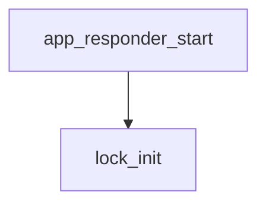

<!-- generated documentation — edit the source, not this file -->
# `ports/esp32/apps/reader/main/app_shell.c`

ESP32-IDF console shell for the standalone Aliro UWB responder bench app: registers status, range, aliro-start/stop, provisioning, trust, and clear commands and runs the linenoise-based REPL.

**depends on** [`ports/esp32/apps/reader/main/app_shell.h`](app_shell.h.md)

## API

### `static const char *col(const char *c)`
`ports/esp32/apps/reader/main/app_shell.c:30`

Returns the given ANSI color code, or an empty string when linenoise is in dumb-terminal mode.

**called by** `cmd_status`, `print_banner`

### `static void print_banner(void)`
`ports/esp32/apps/reader/main/app_shell.c:36`

Prints the shell's startup banner: app name, version, IDF version, and a one-line usage hint.

**called by** `app_shell_start`  ·  **calls** `col`

### `static void lock_init(void)`
`ports/esp32/apps/reader/main/app_shell.c:75`

Lazily creates the s_lock mutex on first call; subsequent calls are a no-op. Not thread-safe against concurrent first calls.

**called by** `app_responder_start`, `app_responder_stop`

### `int app_responder_start(void)`
`ports/esp32/apps/reader/main/app_shell.c:82`

Start the demo CCC DS-TWR responder (canned URSK/cfg). Serialized by mutex.
Returns 0 on success, 1 if already running, negative on facade failure.

**called by** `cmd_aliro_start`  ·  **calls** `lock_init`

### `void app_responder_stop(void)`
`ports/esp32/apps/reader/main/app_shell.c:99`

Stop the demo responder and unbind the CCC shim. No-op if already stopped.

**called by** `cmd_aliro_stop`  ·  **calls** `lock_init`

### `bool app_responder_up(void)`
`ports/esp32/apps/reader/main/app_shell.c:110`

True while the demo responder is up.

**called by** `cmd_status`

### `static int cmd_status(int argc, char **argv)`
`ports/esp32/apps/reader/main/app_shell.c:121`

Shell command handler: prints the demo responder's up/down status and the last measured and last trusted UWB ranges in cm, or "none" if unavailable. Always returns 0.

**calls** `app_responder_up`, `col`

### `static int cmd_range(int argc, char **argv)`
`ports/esp32/apps/reader/main/app_shell.c:142`

Shell command handler: prints the last measured UWB range in cm via woz_uwb_last_range_cm, or "no range yet" if none is available. Always returns 0.

### `static int cmd_aliro_start(int argc, char **argv)`
`ports/esp32/apps/reader/main/app_shell.c:156`

Shell command handler: starts the Aliro UWB responder via app_responder_start. Prints "busy" if a responder is already running (rc == 1), otherwise reports ok/FAILED with the return code. Always returns 0 to the shell.

**calls** `app_responder_start`

### `static int cmd_aliro_stop(int argc, char **argv)`
`ports/esp32/apps/reader/main/app_shell.c:170`

Shell command handler: stops the Aliro UWB responder via app_responder_stop and prints confirmation. Always returns 0.

**calls** `app_responder_stop`

### `static int cmd_aliro_prov(int argc, char **argv)`
`ports/esp32/apps/reader/main/app_shell.c:180`

Shell command handler: prints the current Aliro reader provisioning state. Always returns 0.

### `static int cmd_clear(int argc, char **argv)`
`ports/esp32/apps/reader/main/app_shell.c:189`

Shell command handler: clears the terminal screen via linenoiseClearScreen. Always returns 0.

### `static int cmd_aliro_trust(int argc, char **argv)`
`ports/esp32/apps/reader/main/app_shell.c:198`

Shell command handler: trusts the last-presented Aliro credential and persists it to NVS via aliro_reader_trust_last. Prints success, "nothing to add" (no credential presented or already trusted, rc == 1), or failure (trust store full or NVS error, other nonzero rc). Always returns 0 to the shell.

### `void app_shell_start(void)`
`ports/esp32/apps/reader/main/app_shell.c:215`

Register commands and start the UART console REPL (own task).

**calls** `print_banner`
