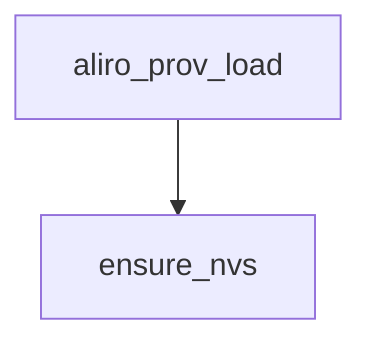

<!-- generated documentation — edit the source, not this file -->
# `ports/esp32/components/aliro_reader/aliro_prov_nvs.c`

NVS-backed persistence for Aliro reader provisioning: loads and stores the serialized reader
identity and trust store built by aliro_prov.c.
Lazily initializes NVS on first use; safe to call alongside aliro_ble's own nvs_flash_init.

**discussed in** [`docs/porting-esp32-phase3.md`](../../porting-esp32-phase3.md), [`docs/porting.md`](../../porting.md), [`ports/esp32/components/aliro_reader/README.md`](../../../ports/esp32/components/aliro_reader/README.md)

## API

### `static esp_err_t ensure_nvs(void)`
`ports/esp32/components/aliro_reader/aliro_prov_nvs.c:28`

Idempotent NVS bring-up. aliro_ble also calls nvs_flash_init() later; the
second call returns ESP_OK, so ordering between the two is irrelevant.

**called by** `aliro_prov_load`, `aliro_prov_store`

### `int aliro_prov_load(struct aliro_reader_identity *id, struct aliro_trust_store *ts)`
`ports/esp32/components/aliro_reader/aliro_prov_nvs.c:44`

Load the reader identity and trust store from NVS into id and ts.
On any failure to init NVS, open the namespace, read the blob, or deserialize it, falls back to the
default DEV identity (via aliro_prov_dev_default) and returns a nonzero status: 1 if no provisioning
was ever stored (namespace or key not found), -1 on any other NVS or deserialization error. Returns 0
on a successful load of previously stored provisioning.

**calls** `ensure_nvs`

### `int aliro_prov_store(const struct aliro_reader_identity *id, const struct aliro_trust_store *ts)`
`ports/esp32/components/aliro_reader/aliro_prov_nvs.c:94`

Serialize and persist the reader identity and trust store to NVS.
Returns 0 on success. Returns -1 if serialization overflows the blob buffer, NVS init fails, the
namespace can't be opened read-write, or the blob write/commit fails.

**calls** `ensure_nvs`
