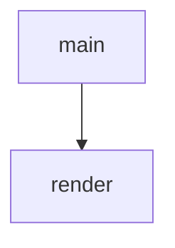

<!-- generated documentation — edit the source, not this file -->
# `scripts/flash_html.py`

Render a release FLASH.md into a self-contained FLASH.html.

The markdown file stays the single source of truth; this wraps its rendered
body in an embedded stylesheet (light + dark, no external assets) so the
bundle ships a guide that reads well in a browser. The output is committed
next to its source, so regenerate after editing a FLASH.md:

    pip install markdown==3.8
    python3 scripts/flash_html.py release/*/FLASH.md

Output is deterministic (no timestamps): it only changes when the source does.

Undocumented (2)

- `render`
- `main`

