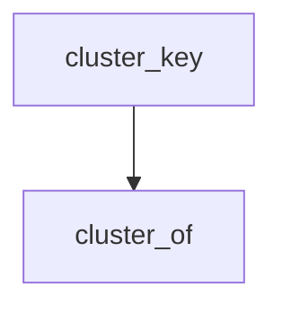

<!-- generated documentation — edit the source, not this file -->
# `tools/docs_graph.py`

Make the architecture page's dependency graph legible.

The page generator emits the module import graph as one flat flowchart and a
zoomable shell around it. At this repo's size that renders as an unreadable
crop: dozens of modules, self-loop artifacts (a module importing its own
header), and a natural width several times the shell's, so the default 1:1
view shows two boxes and a tangle of splines.

This pass restructures the presentation, deriving everything from the page
itself so nothing is hand-curated to drift:

  * self-loop edges are dropped — at module level they are import artifacts,
    not information.
  * each module is assigned to its source directory, read from the page's own
    per-module headings, and the flat graph becomes clustered subgraphs.
  * a subsystem-level overview graph — one node per directory cluster, one
    arrow per aggregated dependency — goes above it. Small enough to be
    crisp at natural size, it answers the layering question at a glance.
  * every page with diagrams gets two script shims around the generator's
    nav.js: one tightens mermaid's layout spacing and bumps its font before
    the first render, the other clicks each diagram's own Fit control when
    the rendered graph overflows its shell, so big graphs open showing their
    whole shape instead of a random crop.

Idempotent for the same reason docs_media.py is: when the page generator is
not configured, the earlier passes run over a site/ kept from a previous
build, so a page may already carry the injections. Run from the repo root,
after docs_github.py and before the link pass.

## API

### `stem_dirs(page: str) -> dict[str, str]`
`tools/docs_graph.py:94`

module name -> its source directory, from the page's file headings.

A stem can exist both in modules/ and in a port's copy; the shared core
is the one the import graph describes, so modules/ wins.

**called by** `figures`

Undocumented (5)

- `parse_edges`
- `cluster_of`
- `figures`
- `cluster_key`
- `main`

