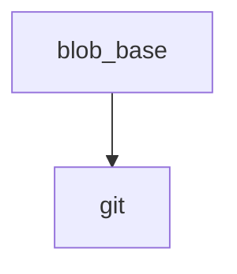

<!-- generated documentation — edit the source, not this file -->
# `tools/docs_links.py`

Repair cross-document links in the rendered site, then assert none are left broken.

The guide pages are authored as markdown that must also read correctly on GitHub,
so they link to other documents as `other.md` and to sources as `../modules/x.c`.
Neither form resolves once the pages are rendered into site/:

  * `other.md`            -> `other.html`, when that page was rendered
  * `../modules/x.c`      -> the file on GitHub, since sources are not published

Anything still unresolved after the rewrite is a genuine broken link and fails
the build. Run from the repo root, after both generators.

## API

### `blob_base() -> str`
`tools/docs_links.py:29`

github.com/<owner>/<repo>/blob/<branch> for the current remote, or '' if none.

**called by** `main`  ·  **calls** `git`

### `_entries(directory: Path) -> dict[str, str]`
`tools/docs_links.py:56`

{lowercased name: real name} for a directory, cached. macOS is
case-insensitive, so `Path.exists()` happily confirms `ARCHITECTURE.html`
when the file on disk is `architecture.html`; a case-sensitive web host
then serves a 404. Every existence check here goes through this map so the
case a link claims is the case that actually exists.

**called by** `_exact`, `_real`

### `_real(path: Path) -> Path | None`
`tools/docs_links.py:70`

`path` with the casing it actually has on disk, or None when absent.

**called by** `fix`  ·  **calls** `_entries`

### `_exact(path: Path) -> bool`
`tools/docs_links.py:76`

True only when `path` exists with exactly this casing.

**called by** `main`  ·  **calls** `_entries`

Undocumented (3)

- `git`
- `main`
- `fix`

