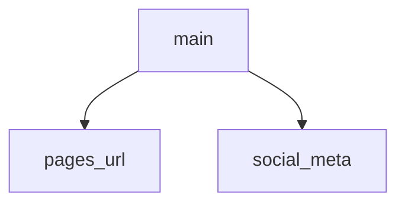

<!-- generated documentation — edit the source, not this file -->
# `tools/docs_media.py`

Add the repo's imagery to the rendered site: demo screenshots and a share card.

The page generator renders prose, navigation and reference pages; it does not
publish images. This repo has three it wants on the site:

  * assets/grid-demo-light.webp / assets/grid-demo-dark.webp — one demo grid of
    the lock in use, in a light and a dark rendering (the README keeps its own,
    separate grid in assets/grid-demo.webp). Injected into the landing
    page as a figure that follows the site's theme: the toggle's `data-theme`
    attribute wins, the OS preference is the fallback — the same precedence
    the site's own stylesheet uses.
  * assets/social-preview.png — the share card. Every top-level page gets
    Open Graph / Twitter meta pointing at it, with an absolute URL derived
    from the origin remote (link scrapers ignore relative image URLs).

Idempotent on purpose: when the page generator is not configured, the earlier
passes run over a site/ kept from a previous build, so a page may already carry
the injections. Run from the repo root, after the generators and before the
link pass.

## API

### `pages_url() -> str`
`tools/docs_media.py:71`

https://<owner>.github.io/<repo> for the origin remote, or '' if none.

**called by** `main`

### `social_meta(page: bytes, base: str) -> bytes`
`tools/docs_media.py:88`

The og/twitter block for one page, titled from its own <title>.

**called by** `main`

Undocumented (1)

- `main`

