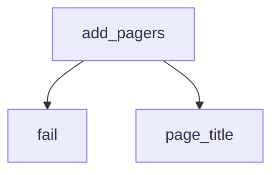

<!-- generated documentation — edit the source, not this file -->
# `tools/docs_nav.py`

Give the rendered site one curated reading order.

The generator ranks the guide list by keyword buckets, which is a reasonable
default and a poor journey: install and configure material was scattered, and
a reader finishing one page got no pointer to the next. This pass owns the
order in one place:

  * the landing page's Guides section is rebuilt into curated buckets
    (Set up first, deep dives after) — and because the sidebar shim mirrors
    the landing page's buckets, the sidebar follows automatically,
  * every page on the journey gets a prev/next pager, so there is always a
    next page and it is always the right one,
  * each guide's hero eyebrow names its bucket instead of the generic
    "Guide".

The buckets and the journey are the same list, so they cannot drift apart.
A guide added without a place in it fails the build here, on purpose: the
author decides where it belongs, or this pass would silently undo the point
of having a curated order.

Run from the repo root, after docs_start.py (start.html must exist to lead
the journey) and before docs_graph.py (whose sidebar shim reads the landing
page's buckets as rebuilt here).

## API

### `curate_index(index: Path) -> int | None`
`tools/docs_nav.py:90`

Rebuild the Guides section into the journey's buckets.

**called by** `main`  ·  **calls** `fail`

Undocumented (4)

- `fail`
- `page_title`
- `add_pagers`
- `main`

