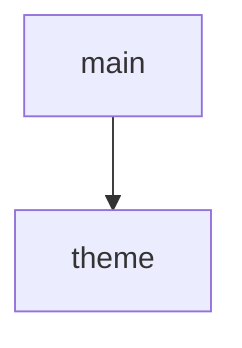

<!-- generated documentation — edit the source, not this file -->
# `tools/docs_theme.py`

Retheme the rendered site: warm paper surfaces, serif display headings.

The page generator ships a neutral blue-on-gray look. This pass restyles the
rendered output — never the generator — into the warm editorial style the
project wants: ivory paper backgrounds, near-black ink, a terracotta accent,
tan links in dark mode, and a serif display face over the headings. Two files
carry the whole theme:

  * site/style.css — every generated page links it, and every earlier pass
    styles its injections through the sheet's custom properties (--ground,
    --ink, --accent, …). Appending a redefinition of those properties at the
    end of the sheet wins the cascade everywhere at once, so the sidebar, the
    landing cards, the command chips and the search palette all follow without
    touching a single HTML file. A short component layer after the variables
    covers what variables cannot express: heading typefaces and the always-dark
    code panels.
  * site/api/doxygen-awesome.css — the reference tree's stylesheet exposes the
    same kind of seam (--page-background-color, --primary-color, …), so the
    API pages get the matching palette and headline face.

The display face is Source Serif 4 from Google Fonts, pulled with @import —
which CSS requires ahead of every rule, so the import is prepended while the
overrides are appended. Body text stays on the system sans stack.

Idempotent like the other passes: a marker comment guards both files, so
re-running over a kept site/ changes nothing. Run from the repo root, any time
after the generators; it edits only the two stylesheets, no page markup.

## API

### `theme(sheet: Path, css: str) -> str`
`tools/docs_theme.py:212`

Prepend the font import and append the overrides; report what happened.

**called by** `main`

Undocumented (1)

- `main`

