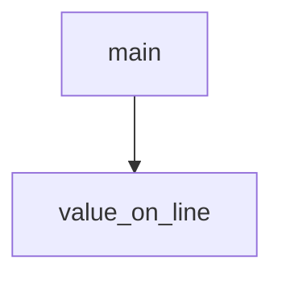

<!-- generated documentation — edit the source, not this file -->
# `web-twin/check_constants.py`

*No module docstring. First commit: "web: add the walk-up digital twin as an interactive page".*

**discussed in** [`web-twin/README.md`](../../../web-twin/README.md)

Undocumented (2)

- `value_on_line`
- `main`

